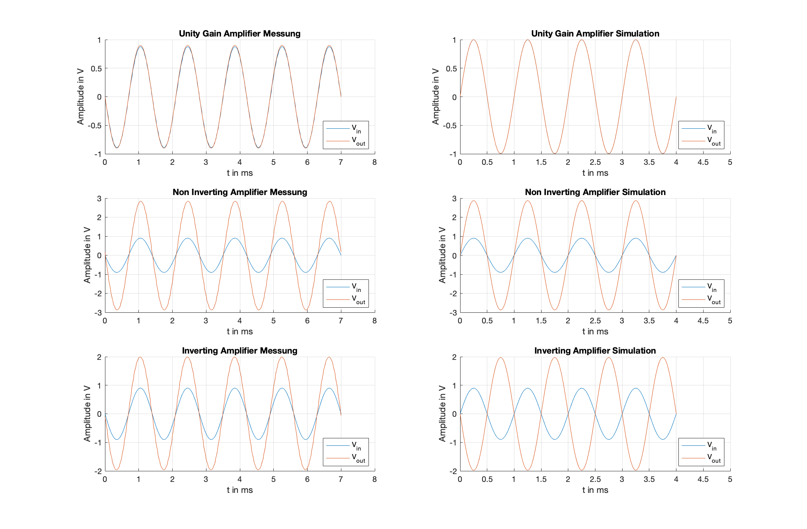
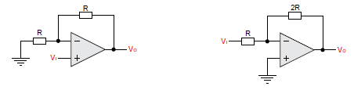

Experiment 1: Gegenkopplungsverstärker und Instrumentenverstärker
=================================================================

.. _Matlab: https://de.mathworks.com/products/matlab.html 
.. _RedPitaya: https://www.redpitaya.com/
.. _slew rate: https://en.wikipedia.org/wiki/Slew_rate

In diesem Experiment sollen drei Grundschaltungen eines
Operationsverstärkers untersucht werden. Zu diesen gehören ein

- Impedanzwandler/Spannungsfolger
  
- invertierender Verstärker

- nicht-invertierender Verstärker.
  

Grundsätzlich wird bei der Berechnungen von OP-Schaltungen die
Operationsverstärker (Opamp) für erste Näherungen idealisiert
angenommen. Das heißt, dass die Opamps einen unendlich hohen
Verstärkungfaktor sowie Eingangswiderstand aufweisen. Dazu kommt ein
unendlich große Bandbreite. Der Ausgangswiderstand wird mit :math:`0\,\Omega` angenommen.
Geht man in die Praxis über, stellt man sehr schnell fest, dass
alle genannten Werte endlich sind und bei einem Schaltungsentwurf  unterschiedliche
Probleme verursachen können. Das Ziel dieses Experiments ist eine
messtechnische Untersuchung der Grundschaltungen eines Opams und ein
Gewinn an Wissen und Erfahrung beim Umgang mit diesen elektronischen
Bauelementen.

UnityGain - Schaltung
---------------------

Eine UnityGain-Schaltung, auch Impedanzwandler oder Spannungsfolger genannt, ist ein Operationsverstärker
dessen Ausgang mit dem invertierendem Eingang kurzgeschlossen ist :numref:`01_fig_02`. 

.. figure:: img/Experiment_01/Experiment_01_fig_02.png
	 :name: 01_fig_02
	 :align: center

	 Schematische Darstellung einer UnityGain-Schaltung

Aufgrund dieser Beschaltung kann man eine Übertragungsfunktion des UnityGain ermitteln. 

Aus der Theorie wissen wir, dass der Ausgang eines unberschaltetenen Opams gleich dem
Verstärkungsfaktor :math:`A_0` multipliziert mit der Differenz der beiden Eingänge :math:`U_+` und :math:`U_-` ist.
Dabei ist :math:`U_+` der nichtinvertierende und :math:`U_-` der invertierende Eingang des Operationsverstärkers.  
Damit ergibt sich allgemein für den unbeschalteten Operationsverstärker:

.. math::
   :label: 01_eq_01

   U_{OUT} = A_0 \cdot (U_+ - U_-)

Aufgrund der erwähnten *Rückkopplung* kann UnityGain als eine Regelstrecke betrachtet werden. Systemtheoretisch
ist nun das Verhältnis von Ausgang zu Eingang eine Übertragungsfunktion :math:`H(s)` (:eq:`01_eq_02`).

.. math::
   :label: 01_eq_02

   \frac{U_{OUT}}{U_{IN}} = \frac{A_0}{1+A_0}

Aufrund der direkten Rückkopplung (ohne andere Bauteile zwischen) kann, augfgrund der Idealisierung,
angenommen werden, dass :math:`A_0` gegen Unendlich strebt.
Durch diese Annahme folgt nach dem Kürzen der :eq:`01_eq_02` das Übersetzungverhältnis für eine UnityGain-Schaltung:

.. math::
   :label: 01_eq_03

   \frac{U_{OUT}}{U_{IN}} = 1

Mit diese Erkenntnis kann man nun den Nutzen des UnityGain in Frage stellen. Tatsächlich ist es eine sehr
nützliche Beschaltung eines Operationsverstärkers. Wie bereits erwähnt, kann diese Beschaltung auch als ein
Spannungsfolger oder Impedanzwandler genannt werden. Die Namen werden aus der grundlegenden Funktion dieser Schaltung
abgeleitet. **Ein UnityGain liefert am Ausgang die vom Eingang vorgegebene Spannung. Diese ist Lastunabhängig.** 
Durch diese Eigenschaft kann der UnityGain als Spannungsstabilisator oder als Entkoppler zweier Teilsystemen eingeetzt werden.
Nach :eq:`01_eq_03` ist die Übertragungsfunktion des UnityGain gleich 1. Das heißt, dass die Ausgangsspannung gleich der Differenz der Eingangsspannungen :math:`U_+` und :math:`U_-` ist.
Die Simulations- und Messergebnisse sind in der :numref:`01_fig_03` (oben) dargestellt. Daraus ist ersichtlich,
dass sich die beiden Signale überlagern, was einer Übertragung von 1 entspricht. 

	    Simulationen und Messungen der Ein- und Ausgangsspannungen der 3 grundlegenden Beschaltungsarten
	    eines Oparationsverstärkers [UnityGain(oben), Non-Inverter (mitte), Inverter (unten)]

Nichtinvertierende- und invertierende Operationsverstärkerschaltungen
---------------------------------------------------------------------
   
Zwei weitere grundlegende Schaltungen des Operationsverstärkers sind die sogennante
nichtinvertierende- und invertierende Beschaltung.

	 Nichtinvertierende (links) und invertierende (rechts) Verstärker

Sowohl bei dem nichtinvertierenden sowie dem invertierenden Verstärker hängt der Verstärkungsfaktor :math:`A_0`
von dem Verhältnis der beiden Widerstände. Für den nichtinvertieren Verstärker ergibt sich 

.. math::
   :label: 01_eq_04

   \frac{U_{OUT}}{U_{IN}} = 1 + \frac{R_2}{R_1}

Nach Ausmultiplikation egibt sich für die Ausgangsspannung :math:`U_{OUT}`

.. math::
   :label: 01_eq_05

   U_{OUT} = U_{IN} + \frac{R_2}{R_1} \cdot U_{IN}
   

Dabei ist :math:`R_1` der Widerstand der an dem invertierenden Eingang :math:`U_-` anliegt und :math:`R_2` der zwischen
dem Ausgang :math:`U_{OUT}` und dem invertierenden Eingang liegt (:numref:`01_fig_04`). :math:`U_{IN}` ist die Eingangsspannung, die an einem der Eingänge des OPAMS anliegt.
Aus der :numref:`01_fig_03` ist ersichtlicht, dass bei einem nichtinvertierenden Verstärker die
Eingangsspannung nach :eq:`01_eq_05` verstärkt wird. Die Ausgangsspannung liegt mit der Eingangsspannung in Phase.  

Für den invertierenden Verstärker ist das Verhältnis von Ausgangsspannung zu Eingangsspannung gegeben als

.. math::
   :label: 01_eq_06

   \frac{U_{OUT}}{U_{IN}} = -\frac{R_2}{R_1}

Nach Ausmultiplikation ergibt sich für die Ausgangsspannung :math:`U_{OUT}`

.. math::
   :label: 01_eq_07

   U_{OUT} = -\frac{R_2}{R_1} \cdot U_{IN}

Nach :eq:`01_eq_07` bekommt man eine um :math:`\pi` gedrehete und um das Widerstandsverhältnis
verstärkte Ausgangsspannung :math:`U_{OUT}`. Diese ist in :numref:`01_fig_03` (unten) graphisch dargestellt.  

Messtechnische Untersuchung der Grenzbereiche
---------------------------------------------

Wie oben beschrieben unterliegt eine Opams-Schaltung physikalischen Grenzen. Diese Grenzen sollen hier untersucht werden.

Bandbreite
__________

Zunächst soll die Bandbreite und ihre Abhängigkeit von der Verstärkung untersucht werden. Die kann z.B. mit Hilfe von RedPitaya
und der sich darauf befindenden App "Bode-Analyser" durchgeführt werden. Aufgrund von unzureicheder Datenexportmöglichkeiten,
wurde an dieser Stelle eine Programm zur Bodeplottdarstellung entwickelt. Gundsätzlich wird das Programm zur Messautomatisierung des Redpitayas eingesetzt und ist ohne weiteres nur mit diesem Kompatibel.

.. literalinclude:: skripte/01_Amplitudengangmessung.py
   :language: python
   :linenos:
   :name: Freqmessung

Mit Hilfe des Programms konnten die Bandbreiten der jeweiligen Schaltung ermittelt werden. Um eine fundierte Aussage über die Messgenauigkeit treffen zu können wurden die Amplitudengänge der entsprechenden Schaltungen
simuliert. Diese sind zusammen mit den Messungen in :numref:`01_fig_06` dargestellt.

.. figure:: img/Experiment_01/amplitudengang_messung_simulation.png
   :name: 01_fig_06
   :align: center

   Mit LTSpice simulierte Ergebnisse für die Bandbreite
   
Die Simulationsergebnisse zeigen prinzipiell das gleiche Tiefpassverhalten, wie die Messergebnisse, an.
Die Bandbreiten weichen allerdings deutlich von einander ab. Dies hat mehrere Ursachen. Aus der
theoretischen Sicht sind die Bauteile für die Simulationen nicht angepasst worden.
Messtechnisch können die Ergebnisse durch die kapazitive Eigenschaten der Messspitzen [#]_ bei hohen
Frequenzen deutlich verfälscht werden.

Mit Hilfe von Matlab_ können die :math:`-3\,dB` - Grenzen der
jeweiligen gemssenen Schaltungen ermittelt werden.

Es ergeben sich für:

- UnityGain = :math:`3,16 \cdot 10^6\,Hz`

- Nichtinvertierender Verstärker = :math:`1,05 \cdot 10^6\,Hz`

- Invertierender verstärker = :math:`1,05 \cdot 10^6\,Hz`

Diese Information liefert eine wichtige Erkenntniss. Die Bandbreite der Operationsverstärker hängt scheinbar mit dem
Verstärkungsfaktor :math:`A_0` zusammen. Je größer der Verstärkungsfaktor, desto schmaller ist die Bandbreite des Opams.
Diese Erkenntniss ist wichtig für die Auslegung hochfrequenter Schaltung mit einer Verstärkung. Auf eine mathematische Herleitung
der Bandbreite wird an dieser Stelle verzichtet.

Maximale Verstärkung
____________________

Nun soll der verstärkungsfakor :math:`A_0` auf seinen maximalen und minimalen Wert untersucht werden. Abgeleitet aus :eq:`01_eq_05`
und :eq:`01_eq_06`, besteht die Ahnhängigkeit zwischen dem Verstärkungsfaktor :math:`A_0`, der Eigangsspannungdifferenz
:math:`U_{IN}` und der Ausgangsspannung :math:`U_{OUT}`.

.. math::
   :label: 01_eq_08

   U_{OUT} = A_0 \cdot U_{IN}

Da theoretisch die Eigangsspannung und der Verstärkungsfaktor variable sind, wird hier die Ausgangsspannung des
Opams auf ihre Grenzen überprüft. Dazu wird ein DC - Sweep durchgeführt. Zu diesem Zweck wurde ein weiteres Programm erstellt.

.. literalinclude:: skripte/03_DCsweep.py
   :language: python
   :linenos:
   :name: DCsweep

Es sollen mit Hilfe des nichtinvertierenden Verstärkers ein Gleichspannungsdurchlauf durchgeführt werden. Für die
Ausgangsspannung ergibt sich ein Spannungsverlauf nach :numref:`01_fig_07`.

.. figure:: img/Experiment_01/DCsweep.png
   :name: 01_fig_07
   :align: center

   Grenzmessung der Ausgangsspannung
   
Das Ergebniss zeigt, dass die Ausgangsspannung bei ca. :math:`9 \, Volt` ihren Maximum und bei ca. :math:`-9 \, Volt`
ihren Minimum aufweist. Hier wird der Zusammenhang zwischen der Ausgangsspannung und der Versorgungsspannung des
Operationsverstärkers deutlich. Die maximalwerte der Ausgangsspannung sind gleich der OPAMS - Versorgungsspannung [#]_.
Die Flankensteilheit ist abhängig von dem verstärkungsfaktor. 

Fazit und Beispiele
-------------------

Mit Hilfe der durchgeführten Messungen konnten die grundlegende Funtionen und die reelen Grenzen eines Operationsverstärkers
aufgezeigt werden. Der Einsatz des RedPitaya_ Messlabors erwies sich für hohen Frequenzbereich eher unzuverlässig. Des Weiteren
verdrehte der RedPitaya je nach Päriodenauflösung die Phase, sodass der Datenexport oft fehlerhaft war. Trotzdessen ist
die möglichkeit der Messautomatisierung von großem Vorteil. Daher bietet sich der Eisatz von SCPI-fähigen Geräten bei
diesen Messungen an.  

Beispiele
_________

Als erstes wird ein sogenannter "Negativ-Rückgekoppelter-Verstärker" betrachtet. Prinzipiell ist das eine
Kaskadierung (Hintereinanderschaltung) der drei Grundschaltungen :numref:`01_fig_08`. 

.. figure:: img/Experiment_01/negative_feedback.png
   :name: 01_fig_08
   :align: center

   Negativ-Rückgekoppelter-Verstärker
   
Hier wird statt einem Sinussignal ein Rechtecksignal eingespeist. Die Ausgänge der Schaltung sind in :numref:`01_fig_09`
graphisch dargestellt.

.. figure:: img/Experiment_01/Verstaerker_Rueckkopplung_neu.png
   :name: 01_fig_09
   :align: center

   Messergebnisse der Ausgangsspannungen des Negativ-Rückgekoppelten-Verstärkers
   
Aus der Messung ist zu entnehmen, dass die bei einem Rechteckeingangssignal, die Ausgangssignale bei den Grenzübergängen eine
Abrundung aufweisen. Dieses Phänomen bezeichnet man als `slew rate`_ und ist auf die kapazitive Eigeschaften des OPAMS
zurück zu führen.  

Als zweites Beispiel wird ein Instrumentenverstärker betrachtet. Diese kann aus zwei oder drei Operationsverstärkern
:numref:`01_fig_10` aufgebaut werden und wird oft, aufgrund seiner Eigenschaften, in der Medizintechnik eingesetzt.   

.. figure:: img/Experiment_01/Instrumentenverstaerker.png
   :name: 01_fig_10
   :align: center

   Instrumentenverstärker mit drei Opams (links) und zwei Opams (rechts)

Aus der Abbildung wird deutlich, dass die Verstärkung lediglich von dem Widerstand :math:`nR` abhängt. Dies erleichtert
die Einstellung des Instumentenverstärkers.
Als Beispiel wurde ein ein Instrumentenverstärker aus zwei Operationsverstärkern aufgebaut und der Ausgang gemessen. Die Messergebnisse sind in der :numref:`01_fig_11` graphisch dargestellt.

.. figure:: img/Experiment_01/Instrumenten.png
   :name: 01_fig_11
   :align: center

   Eingangs- und Ausgangssignale eines Instrumentenverstärkers aus 2 Opams

Aufgrund der Darstellung kann festgestellt werden, dass hier die Differenz der Eingangsspannungen verstärkt wird. Dies bezieht
sich nun auf zwei Eingangssignale gegeneinander und nicht ein Signal gegen die Masse. 

.. [#] Datenblätter befinden sich im Labor
.. [#] Die Angaben sind aus den jeweiligen Datenblättern zu entnehmen

  

