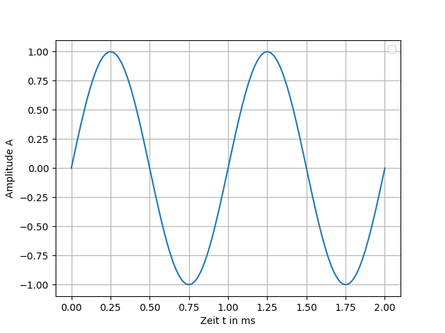

Kurze Theorie und Motivation
============================

Studieren Sie die Charaktersistik von rückgekoppelten Verstärkern und
den Entwurf von Instrumentenverstärkern.

Unity Gain Verstärker
---------------------

.. math::
   :label: 01_eq_1
	   
   f(t) = \sin(\omega t + \theta)
   
Der Wert von :math:`\theta` ist gleich 0 in der Funktion, die in
:numref:`01_fig_01` dargestellt ist. Aufgrund von :math:`sin(0) = 0`
beginnt die Funktion im Koordinatenursprung bei 0. Dies ist eine
einfache Sinuswelle ohne Zeitversatz, also ohne Phaseverschiebung.
Beachte, wenn man :math:`\omega t` in Radianten in einem Bereich von 0
bis :math:`2 \pi` oder in Gradzahlen von 0 bis :math:`360^{\circ}`
verwendet, erhält man die in :numref:`01_fig_01` dargestellte
Sinuswelle.

   
   2 Zyklen von :math:`\sin(t)`.  

Nicht-invertierender Verstärker
-------------------------------

Invertierender Verstärker
-------------------------

Aufbau
======

Messungen
=========

Was dokumentiert werden soll
============================

Zugehörige IC's
===============
