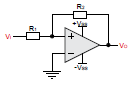
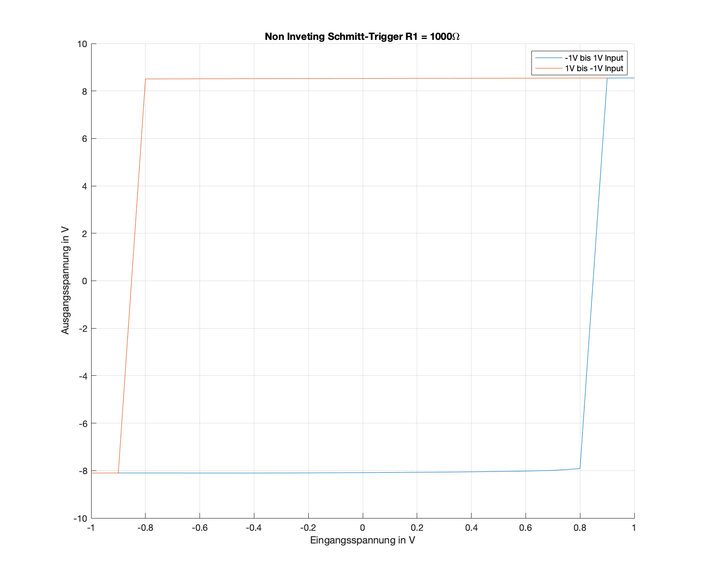
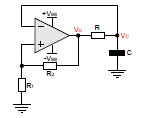
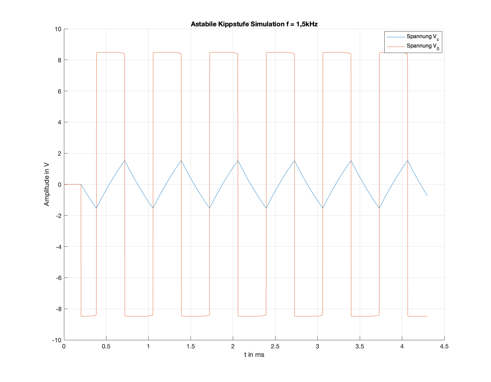
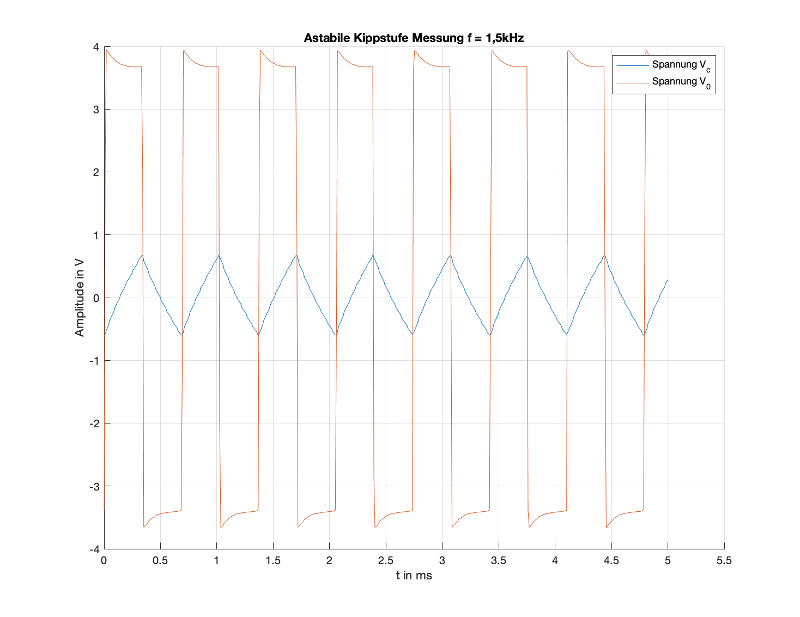

Experiment 2: Regenerative Rückgekoppelte Systeme und design Astabiler und monostabiler Kippstuffen
===================================================================================================

Kurze Theorie und Motivation
----------------------------

Als Grundlage regenerativer rückgekoppelter Systeme gilt ein sogenanntes Schmitt-Trigger system. Bei diesen Systemen fallen die
Ein- und Ausschaltschwellen nicht zusammen, sondern sind um eine Schalthysterese gegeneinander versetzt. Dadurch kann der
Ausgang :math:`V_{OUT}` nur zwei Zustände annehmen. Durch diese Eigenschaften kann der Schmitt-Trigger zu einer Mixed-Mode Schaltung zugeordnet werden. Der Einsatzgebiet dieser Schaltung ist vielfältig (MOSFET-Treiber als Switch-Controller etc.). 

Messungen Schmitt-Trigger
-------------------------

Zunächst soll ein nicht-invertierender :numref:`02_fig_01` und ein invertierender Schmitt-Trigger :numref:`02_fig_02`
betrachtet werden.

   Nicht-invertierende Schmitt-Trigger Schaltung

.. figure:: img/Experiment_02/Inv_schmitt.png
   :name: 02_fig_02
   :align: center

   Invertierende Schmitt-Trigger Schaltung

Bei dem nicht-invertierendem Schmitt-Trigger geht der Zustand von logisch 0 auf logisch 1 bei der positiven
Schwellspannung über und von logisch 1 auf logisch 0 bei der negativen Schwellspannung. Für den invertierenden Schmitt-Trigger
verhalten sich die Zustandänderung invers. Für das Verhälnis der Ausgangs- zu Eingangsspannung ergibt sich:

.. math::
   :label: 02_eq_01
   
   \frac{V_{OUT}}{V_{IN}} = - A_0 \cdot \frac {1}{1-A_0 \cdot \beta}

wobei

.. math::
   :label: 02_eq_02

   \beta = \frac{R_1}{R_1 + R_2}

Das heißst, dass die Schwellspannungen mit Änderung des Wertes für :math:`\beta` eingestellt werden können.
Zur Untersuchung dieser These wurde der nicht-invertierende Schmitt-Trigger simuliert und gemessen. Die Erbebnisse sind
in :numref:`02_fig_03` und :numref:`02_fig_04` enstprechend graphisch dargestellt.

.. figure:: img/Experiment_02/Non_inverting_Schmitt_Simulation.png
   :name: 02_fig_03
   :align: center

   Simulation des nicht-invertierenden Schmitt-Triggers für Verschiedene :math:`\beta`

   Messung des nicht-invertierenden Schmitt-Triggers für Verschiedene :math:`\beta`

Aus den Darstellung ist ersichlich, dass die Annahme der Abhängigkeit der Schwellspannung von dem :math:`\beta` richtig ist.

Messungen Astabile- und Monostabile Kippstiffen
-----------------------------------------------

Astabile Kippstuffe :numref:`02_fig_05` arbeitet nach dem Prinzipp des Schmitt-Triggers. Sie wechselt periodisch
zwischen zwei Zuständen.

   Astabiler Multivibrator (Kippstuffe)

Der Periodendauer der Astabilen Kippstufe ist gegeben durch:

.. math::
   :label: 02_eq_03

   T = 2 \cdot RC \cdot ln(\frac{1 + \beta}{1 - \beta})

Die Astabile Kippstuffe ist eine selbsttreibende Schaltung die die Zustände zwischen den Versorgungsspannungen des Opams wechselt.
Die Simulations- und Messergebnisse sind in :numref:`02_fig_06` und :numref:`02_fig_07` entsprechend graphisch dargestellt.

   Astabiler Multivibrator (Kippstuffe) Sumulation

   Astabiler Multivibrator (Kippstuffe) Messung

Eine weiterer Einsatz des Schmitt-Triggers ist die Monostabile Kippstufe(Multivibrator) :numref:`02_fig_08`. Aus dem Namen kann die
Funktion bereits abgeleitet werden. 

.. figure:: img/Experiment_02/monostab_multi.png
   :name: 02_fig_08
   :align: center

   Monostabile Kippstufe (Multivibrator)
   
Die Monostabile Kippstufe hat einen stabilen Zustand. Die Zustandänderung wird mit Hilfe eines Trigger-Signals
am Eingang "erzwungen". Aufgrund der Beschaltung ändert sich der Zustand der Monostabilen Kippstufe nur bei negativer
Flanke in negative Richtung. Die Dauer :math:`\tau` der Zustandsänderung ist definiert durch:

.. math::
   :label: 02_eq_04

   \tau =  RC \cdot ln(\frac{1}{1 - \beta})

Nach der Erreichen des negativen Peaks kehrt die Kippstufe in ihren sabilen Zustand zurück. Aufgrund der Kapazitäten in der Schaltung
ist die Rückkehr zum stabilen Zustand mit einem Zeitaufwand verbunden. Das heißt, dass nach einer negativen
Triggerflanke zum Zeitpunkt :math:`t` die nächste negative Flanke zum Zeitpunkt :math:`t + \tau '` eingeleitet werden darf.

.. math::
   :label: 02_eq_05

   \tau' = RC \cdot ln(\frac{1 + \beta}{\beta})

Die Simulation der Monostabilen Kippstufe ist in :numref:`02_fig_09` graphisch dargestellt. Das bereits beschrieben Signalverlauf
ist deutlich zu erkennen. 

.. figure:: img/Experiment_02/monostabile_kippstufe_Simulation.png
   :name: 02_fig_09
   :align: center

   Simulation Monostabile Kippstufe mit einem Triggersignal
   
Leider konnte das Triggersignal aus der Simulation nicht für die Messung aufbereitet werden. Daher wurde eine Rechteckspannung
eingesetzt um das Arbeitsprinzip zu verdeutlichen. Die Messung ist in :numref:`02_fig_10` dargestellt.

.. figure:: img/Experiment_02/monostabile_kippstufe_Messung.png
   :name: 02_fig_10
   :align: center

   Messung Monostabile Kippstufe mit einem Rechecksignal
