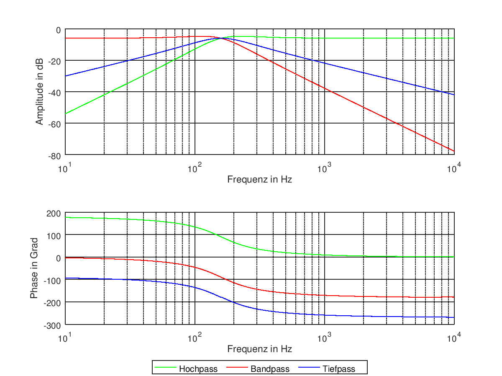

Experiment 4: Analoge Filter
============================

Kurze Theorie und Motivation
----------------------------
In der Nachrichtentechnik ist der Einsatz von Filtern unerlässlich. Gerade beim Einsatz höhergradige Filter geht, kommt es zu Problemen. 
Passive Filter, also RLC-Schaltungen werden gerade bei höheren Frequezen aufgrund der den Spulen eigenen Eigenschaften häufig sehr groß und ungenau.
Um dem entgegenzuwirken verwendet man aktive Filter aus Operationsverstärkern, Kondensatoren und Widerständen. 
Diese Bauteile lassen sich deutlich genauer bestimmen und herstellen als das bei Spulen möglich ist. 
Die Spulen weren hierbei durch Integriererschaltungen ersetzt. 

Spezifikation
-------------

.. figure:: img/Experiment_04/Experiment_04_Schaltbild.png
	 :name: 04_fig_01
	 :align: center
	 
	 Schaltbild KHN-Biquad-Filter

Es soll der Filter mit einer Güte :math:`Q = 1` und einer Kreisfrequenz :math:`\omega = 1\,kHz` realisiert werden.
Zur Dimensionierung der Bauteile wurden folgende Formeln verwendet:

.. math:: 
	:label: 04_eq_01
	
	\omega = \frac{1}{RC}

.. math:: 
	:label: 04_eq_02
	
	Q = \frac{R_1R_2 + R_1R_3 + R_2R_3}{2R_1R_3}

Mithilfe der :eq:`04_eq_01` wurde R berechnet, dafür wurde eine Kapazität :math:`C = 100\,nF` gewählt.
R beträgt :math:`10\,k\Omega`.
:eq:`04_eq_02` wurde zur Berechnung von R2 genutzt. Für R1 und R3 wurde je ein Widerstandswert von :math:`1\,k\Omega` gewählt. Die beiden Widerstände wurden gleichgroß gewählt, da sie am Eingang 
des Operationsverstärkers einen Spannungsteiler bilden. Für R4 wurden :math:`10\,k\Omega` ausgewählt. R2 beträgt :math:`500\,\Omega`.   

Die gewählten Werte wurden im Verlauf der Dimensionerung verändert, die berechneten Werte entsprechend angepasst. Die hier angegebenen Werte sind die, mit denen die beste Simulaiton erfolgt ist. 

Simulation
----------
Die Simulation wurde mit LTspice XVII durchgeführt.
Dafür musste zuerst das Model für den tl082 eingebunden werden. Die Schaltung wurde nach :numref:`04_fig_01` implemtiert.

.. figure:: img/Experiment_04/Exp_04_SpiceKHN.png
     :name:04_fig_02
	 :align: center
	 
	 Schaltungsaufbau des KHN-Biquad-Filter in LTspice

In :numref:`04_fig_03` sind die Ergebnisse der Simulation zu sehen.

	 
	 Simulation Amplituden- und Phasengang KHN-Biquad-Filter
	 
Nach der Simulation des KHN-Biquad-Filter wurde auch der Universalfilter simuliert.

.. figure:: img/Experiment_04/Exp_04_SpiceUniversal.png
	 :name: 04_fig_04
	 :align: center
		
	 Schaltungsaufbau des Universalfilters in LTspice

Messungen
---------
