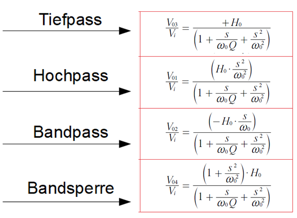
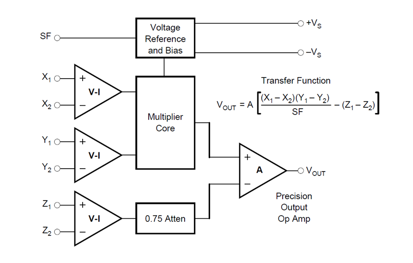

###############################
Experiment 5: Self-Tuned Filter
###############################

.. |nbsp| unicode:: 0xA0
   :trim:

********
Abstract
********

Wenn es um die Signalverarbeitung geht sind Filter unumgänglich, egal ob es die analoge oder die digitale
Signalverarbeitung ist. Die Vorgänger der digitalen Signalverarbeitung waren schon immer die analoge
Signalverarbeitung. Mit der Zeit haben sich die digitalen Systeme immer mehr etabliert. Die Pioniere der digitalen
Filter verließen sich auf die Techniken der analogen Vorgänger. Auch heute noch profitieren einige digitale Filter von
der Simulation der analogen Filtern, denn die analogen Filter enthalten wichtige Eigenschaften. 

Die Filter, die auf eine Eingangssteuerspannung mit der Änderung der Resonanzfrequenz reagieren werden "self-tuning"
Filter genannt. Oftmals verfügen diese Filter über eine Gegenkopplungsschaltung mit einen analogen Multiplizierer oder
Phasendetektor. Die "self-tuning" Filter ermöglichen eine automatische Abstimmung der Bandbreite, des Qualitätsfaktors
und/oder der Mittenfrequenz (:cite:`Sasikala2019`). 

**********
Einleitung
**********

Das vorliegende Experiment bietet einen Überblick über den analogen "self-tuning" Filter aus theoretischer und
praktischer Sicht. Das umfasst von Implementierung der Schaltung in ein Simulationsmodel, aufbau der Schaltung auf dem
"Analog System Lab Kit PRO" board und Analyse der Messdaten. Es enthält Erkenntnisse über die Funktionsweise der
"self-tuning" Filter, deren Bausteine, aus denen sie implementiert werden. 

Das "self-tuning" Filter ist ein Sonderfall von analogen Filtern in elektronischen Schaltungen. Deren Aufgabe ist es
Signale mit unerwünschten Frequenzen oder Rauschen die das gewünschte Signal überlagern, zu blockieren oder zu
dämpfen. Die scharfe Unterscheidung wird erreicht, indem die Resonanzfrequenz des Filters der Grundfrequenz des
Eingangssignals folgt. Der Gesamtaufbau besteht aus zwei Hauptblöcken, einmal aus dem spannungsgesteuerten Filter und
dem analogen Phasendetektor. Die Funktionsweise dieser Blöcke wird in den kommenden Abschnitten beschrieben.

***************************
Theoretische Vorbetrachtung
***************************

      
Universeller Aktivfilter (Experiment 4)
=======================================

Der "Selftuned Filter" baut auf dem Ergebnis aus Experiment 4 auf. Daher werden die Grundlagen noch einmal
wiederholt. Der universelle Aktivfilter (vgl. :numref:`Universeller_Aktivfilter`) ist ein Aktivfilter, welcher die vier
Grundfilterarten (Tiefpass [LPF], Hochpass [HPF], Bandpass [BPF] und Bandsperre [BSF]) in sich vereint. Wie in der
selben Abbildung zu sehen, lassen sich die Verstärkung und der Q-Faktor mit den Widerständen unten in der Mitte
dimensionieren. Die Mittenfrequenz des Filters lässt sich mit den Widerständen "R" und den Kondensatoren "C" einstellen
(vgl. :eq:`05_eq_Exp4_UAF`). 

.. figure:: img/Experiment_05/Aufbau_Exp4.PNG
   :name: Universeller_Aktivfilter
   :align: center
   :scale: 40%

   Universeller Aktivfilter (:cite:`RaoJune2012`)

   
.. math::
   :label: 05_eq_Exp4_UAF

   \omega_0 = \frac{1}{RC}

   
Es lässt sich zeigen, dass die Übertragungsfunktionen der einzelnen Teilfilter, wie in Abbildung
:numref:`Übertragungsfunktionen_Exp4` zu sehen beschrieben werden können. Diese werden sich beim Umbau in den
"Self-tuned Filter" nicht ändern. :math:`\omega_0` wird beim Umbau zeitabhängig. 

   Übertragungsfunktionen des universellen Aktivfilters (:cite:`RaoJune2012`)

   
Integrator
==========

Wie in :numref:`Integrator` zu erkennen, besteht ein Integrator aus einem Eingang :math:`V_{in}`, einem Widerstand,
einem Kondensator, einem Operationsverstärker und einem Ausgang :math:`V_{out}`. Ein Integrator hat die Eigenschaft ein
Eingangssignal integrieren zu können.

.. figure:: img/Experiment_05/Integrator.png
   :name: Integrator
   :align: center
   :scale: 120%

   Integrator

In der folgenden Gleichung :eq:`Integrator_Herleitung` wird die Übertragungsfunktion eines Integrators
hergeleitet. Hierbei wird davon ausgegangen, dass sich an „+“ ein virtuelles GRD-Potenzial befindet. 

.. math::
   :label: Integrator_Herleitung
	
   0 &= I_{in} + I_{f} \\ \\
   0 &= \frac{V_{in}}{R_{in}} + C \frac{d V_{out}}{dt} \\ \\
   C \frac{d V_{out}}{dt} &= - \frac{V_{in}}{R_{in} }\\ \\
   \frac{d V_{out}}{dt}  &= - \frac{V_{in}}{R_{in} C }\\ \\
   V_{out} &= - \frac{1}{R_{in} C }\int V_{in} dt \\

Ebenfalls hat ein Integrator Tiefpasseigenschaften, welche im Idealfall mit der Grenzfrequenz :eq:`TP_Integrator`
beschrieben werden können. Diese beiden Eigenschaften (Integrieren und Tiefpass) sind für die Rückführung am Ende der
Schaltung (vgl. :numref:`Aufbau_Selftuned_Filter`) sehr wichtig. 

.. math::
   :label: TP_Integrator

   \omega_0 = \frac{1}{RC}

   
Multiplizierer
==============

In :numref:`Aufbau_Multiplizierer` ist der Aufbau eines Multiplizierers, sowie seine Transferfunktion, zu sehen. SF
(später :math:`U_{SF}`) ist der Eingang für die Referenzspannung, welche gleichzeitig die Versorgungsspannung
darstellt. Die Eingänge X, Y und Z sind jeweils in zwei Eingänge eines Operationsverstärkers aufgeteilt. Hierbei gibt
der Index 1 immer den positiven und der Index 2 den negativen Eingang an. Der Ausgang :math:`V_{OUT}` ist der Ausgang
des Multiplizierers. Die anderen beiden Ausgänge (:math:`+V_S` und :math:`–V_S`) stellen die Versorgungsspannung dar und
sind bereits intern verbunden. Diese sind daher für uns nicht von Bedeuteung. 

   Aufbau des benutzten Multiplizierer "MPY634" :cite:`Incorporated2020`

   
Ein vereinfachte Version des Multiplizierers ist in :numref:`Einfacher_Multiplizierer` zu sehen. Im Vergleich zu
:numref:`Aufbau_Multiplizierer` sind die negativen Eingänge von X, Y und Z geerdet und :math:`V_{OUT}` ist mit
:math:`Z_1` verbunden. Letzteres wurde experimentell entdeckt und kann daher nicht weiter begründet werden. Die
Referenzspannung :math:`U_{SF}` wird nur noch mathematisch betrachtet. Hieraus ergibt sich die
vereinfachte Transferfunktion, welche in :eq:`Einfacher_Multiplizierer` zu sehen ist. Es ist nur zu
beachten, dass der Betrag von X und Y nicht über :math:`U_{SF}` fallen sollte, da der Multiplizierer nur
in diesem Bereich arbeitet. 

.. figure:: img/Experiment_05/Einfacher_Multiplizierer.png
   :name: Einfacher_Multiplizierer
   :align: center
   :scale: 80%

   Einfacher Multiplizierer

.. math::
	:label: Einfacher_Multiplizierer

	V_Z = \frac{V_X V_Y}{U_{SF}} \\

Spannungsgesteuerter Tiefpass (Integrator)
------------------------------------------

Baut man einen Multiplizierer, wie in :numref:`Spannung_TP` gezeigt, in einen Integrator vor den Kondensator ein, dann
kann man den Integrator mithilfe der Kontrollspannung :math:`V_C` steuern. Dies hat direkten Einfluss auf die
Transferfunktion des Integrators und damit auf die Grenzfrequenz der Tiefpasseigenschaft des Integrators. 

.. figure:: img/Experiment_05/Spannung_TP.png
   :name: Spannung_TP
   :align: center
   :scale: 80%

   Spannungsgesteuerter Tiefpass

Die Herleitung der Grenzfrequenz des spannungsgesteuerten Integrators ist in :eq:`Spannung_TP_Herleitung`  zu
sehen. Hierbei ist für uns insbesondere die Grenzfrequenz von Bedeutung, dann die Grenzfrequenz des Universellen
Aktivfilters aus Experiment 4 entspricht der Grenzfrequenz der beiden verbauten Integratoren, weshalb man diese auch
immer gleich dimensionieren sollte. 

.. math::
   :label: Spannung_TP_Herleitung

   0 &= I_{in} + I_{f} \\
   0 &= \frac{V_{in}}{R_{in}} + \frac{C \frac{d V_{out}}{dt}  V_C}{U_{SF}} \\
   \frac{C \frac{d V_{out}}{dt}  V_C}{U_{SF}} &= - \frac{V_{in}}{R_{in} } \\
   \frac{d V_{out}}{dt}  &= - \frac{V_{in} U_{SF}}{R_{in} C V_C} \\
   V_{out} &= - \frac{ U_{SF}}{R_{in} C V_C}\int V_{in} dt \\

   Daraus\ folgt: \\
   \omega_0 &= \frac{ U_{SF}}{RC V_C} \\

	
Phasendetektor mit einem Multiplizierer
---------------------------------------

Um diesen Phasendetektor zu verstehen, betrachtet man zunächst erstmal einen vereinfachten Aufbau des
Phasendetektors. Wie in :numref:`Phasendetektor` zu sehen, wird hierzu ein Tiefpass hinter den Multiplizierer
geschaltet. Die Eingangssignale sind zwei phasenverschobene Sinussignale.

.. figure:: img/Experiment_05/Phasendetektor.png
   :name: Phasendetektor
   :align: center
   :scale: 100%

   Phasendetektor

.. _Link:  https://github.com/mimeiners/ASLK_PRO/blob/master/math/Experiment_05/Selftuned%20Filter.pptx

In :numref:`Herleitung_Phasendetektor` ist die Herleitung des Ausgangssignals des Multiplizierers zu sehen. Dieses Bild
ist einer eigenen Power Point Präsentation entnommen, welche unter dem `Link`_ zu finden ist. 

.. figure:: img/Experiment_05/Herleitung_Phasendetektor.PNG
   :name: Herleitung_Phasendetektor
   :align: center
   :scale: 50%

   Herleitung Phasendetektor

Setzt man nun wie in :numref:`Phasendetektor` einen Tiefpass hinter den Multiplizierer werden alle Frequenz abhängigen
Anteile herausgefiltert, wenn die Grenzfrequenz des Tiefpasses klein genug ist. Daraus ergibt sich die :eq:`Mult_TP`. 

.. math::
   :label: Mult_TP

   V_{Out,TP} = \frac{V_X V_Y}{2U_{SF}} cos(\phi)

Wird der Tiefpass nun mit einem Integrator ersetzt (vgl. :numref:`Mult_Integrator`), dann lässt sich die Spannung aus
:eq:`Mult_TP` in die Transferfunktion des Integrators (vgl. :eq:`Integrator_Herleitung`) einsetzten. Zusätzlich ist nun
auch die Betriebsspannung des benutzten Operationsverstärkers zu betrachten, da die Transferfunktion des Integrators
da drauf addiert wird. Der auf dem ALSK PRO Board eingebaute „tl082“ hat eine Betriebsspannung bei 82% der
Versorgungsspannung (:math:`U_{AMP}`). In :eq:`Phase_Int_Herleitung` ist die resultierende Spannungsgleichung zu
sehen. 

.. figure:: img/Experiment_05/Mult_Integrator.png
   :name: Mult_Integrator
   :align: center
   :scale: 80%

   Phasendetektor mit Integrator

.. math::
   :label: Phase_Int_Herleitung

   V‘_{out} &= - \frac{1}{R_{in} C }\int V_{Out,TP} dt \\
   V‘_{Out,Integrator} &= - \frac{1}{RC } \int \frac{V_X V_Y}{2U_{SF}} cos(\phi) dt \\

   Bei\ Betrachtung\ der\ Betriebsspannung:\\
   V‘_{Out,Integrator} &= 0,82\ U_{AMP} - \frac{1}{RC } \int \frac{V_X V_Y}{2U_{SF}} cos(\phi) dt \\

Dieser Phasendetektor ist in einem Regelkreislauf sehr gut um eine Phase von 90° einzustellen, da die Spannung des
Integrators sinkt, wenn die Phase unter 90° ist und steigt wenn sie über 90° ist. Bei genau 90° Phasendifferenz wird
sich die Spannung am Ausgang des Integrators nicht mehr ändern.

Phase des Universellen Aktivfilters
-----------------------------------
In :numref:`Bandpass` ist das Bode-Diagramm des Bandpass-Ausgangs eines Universellen Aktivfilters zu sehen. Zu erkennen
ist, dass bei einer Phasenverschiebung von -180° zum Eingangssignal das Betragsspektrum am größten ist. Das ist die
Grenzfrequenz des universellen Aktivfilters. 

.. figure:: img/Experiment_05/Bandpass.png
   :name: Bandpass
   :align: center
   :scale: 80%

   Bandpass des universellen Aktivfilters :cite:`Matlab`

Betrachtet man nun den Hochpass (vgl. :numref:`Hochpass`) des Universellen Aktivfilters an der gleichen Frequenz, ist
eine Phsenverschiebung von 90° zum Eingangssignal zu erkennen. Diese Phasenverschiebung lässt sich mit dem zuvor
beschriebenen Phasendetektor einstellen. 

.. figure:: img/Experiment_05/Hochpass.png
   :name: Hochpass
   :align: center
   :scale: 80%

   Hochpass des universellen Aktivfilters :cite:`Matlab`

   
Aufbau des Selftuned Filters
============================
In :numref:`Aufbau_Selftuned_Filter` ist der Aufbau des Selftuned Filters zu sehen. Im Vergleich zum Aufbau des
Universellen Aktivfilters (vgl. :numref:`Universeller_Aktivfilter`) ist zu erkennen, dass spannungsgesteuerte
Integratoren statt normale Integratoren verbaut wurden. Da die Mittenfrequenz des Universellen Aktivfilters von der
Grenzfrequenz der Integratoren abhängt, lässt sich auf diese Weise die Mittenfrequenz des Universellen Aktivfilters
steuern. Ebenfalls fällt auf, dass mithilfe des Phasendetektors ein Regelkreislauf aufgebaut ist. Als Eingänge des
Phasendetektors wurden der Hochpass und das Eingangssignal gewählt. Zusätzlich wurde noch ein Bias mit einem
Spannungsteiler ans Ende des Phasendetektors gesetzt. Damit lässt sich die Kontrollspannung für den spannungsgesteuerten
universellen Aktivfilter voreinstellen.

.. figure:: img/Experiment_05/Aufbau_Selftuned_Filter.PNG
   :name: Aufbau_Selftuned_Filter
   :align: center
   :scale: 50%

   Aufbau des Selftuned Filters :cite:`RaoJune2012`

Regelkreislauf des Selftuned Filters
====================================
Um den Regelkreislauf des "Selftuned Filters" zu erklären, wurde in :numref:`Regelkreislauf_Selftuned_Filter` die
Schaltung des "Self-tuned Filters" (vgl. :numref:`Aufbau_Selftuned_Filter`) als Blockschaltbild zusammengefasst.

Zu Beginn des Kreislaufs wird das Eingangssignal durch den VCF (Voltage Controlled Filter, hier: Spannungsgesteuerter
universeller Aktivfilter) mit dem Hochpass gefiltert. Das Hochpasssignal wird im Phasendetektor mit dem Eingangssignal
verglichen. Ist die Phasendifferenz unter 90°, sinkt die Kontrollspannung (:math:`V_C`) des VCFs und ist sie über 90°,
steigt die Kontrollspannung. So schwingt die Kontrollspannung sich auf die Spannung ein, bei der die Phasendifferenz
zwischen Hochpass und Eingangssignal genau 90° beträgt und somit die Mittenfrequenz des VCFs auf die Trägerfrequenz des
Eingangssignals eingestellt ist.

.. figure:: img/Experiment_05/Regelkreislauf_Selftuned_Filter.PNG
   :name: Regelkreislauf_Selftuned_Filter
   :align: center
   :scale: 80%

   Regelkreislauf eines Selftuned Filters

Die initiale Kontrollspannung (:math:`V_{C0}`) lässt sich mit folgender Formel (vgl. :eq:`Mult_Int`) berechnen. Hierbei
Sind :math:`R_{10}, R_{11}` und :math:`V_3` in :numref:`Aufbau_Selftuned_Filter` eingezeichnet und :math:`U_{Amp}` ist
die Versorgungsspannung von :math:`U_4` der selben Abbildung.

.. math::
   :label: Mult_Int

   V_{C0} = 0,82 \cdot U_{Amp} \frac{R_{10}}{R_{10}+R_{11}} +V_3 \frac{R_{11}}{R_{10}+R_{11}}

**********
Simulation
**********

Für die Simulation der Schaltung standen zwei Simulationssoftware, Tina-TI von Texas Instruments und LTspice von Analog
Devices, zur Verfügung, welche auch im Laufe des Projektes verwendet wurden. Mit der Letzterer wurden die
Hauptsimulationen durchgeführt. Zunächst wurde die Schaltung aus dem Experiment 04 in der Simulation aufgebaut und
Simuliert, um die Funktionsweise des Filters besser zu verstehen. In der :numref:`SchaltungausExperiment4` ist der
Schaltplan dargestellt.

.. figure:: img/Experiment_05/Schaltung_aus_Experiment_04.png
   :name: SchaltungausExperiment4
   :align: center
   :scale: 60%

   Schaltung aus Experiment 04 :cite:`SelbstLTSpice`

   
Gespeist wird über :math:`V_{in}` ein Sinussignal mit der Frequenz 1 kHz und der Amplitude 1 V. An den jeweiligen
Ausgängen werden die Filterausgänge abgegriffen, welche in der :numref:`SimulationderSchaltung` dargestellt werden.  

.. figure:: img/Experiment_05/Simulation_der_Schaltung.png
   :name: SimulationderSchaltung
   :align: center
   :scale: 40%

   Simulation der Schaltung :cite:`SelbstLTSpice`

   
Die Grenzfrequenzen werden mit der Formel :eq:`5_eq_grenzfrequenzen` bestimmt.

.. math::
   :label: 5_eq_grenzfrequenzen

   f_0 &= \frac{1}{2 \cdot \pi \cdot R \cdot C}  \\

   
Da in der Schaltung nur die beiden Kondensatoren frequenzabhängig sind, wird die Grenzfrequenz über die Zeitkonstante
:math:`\tau,(\tau = R \cdot C)` eingestellt. Über den Widerstand R7 wird die Güte Q eingestellt und R8 dient dazu, den
Verstärkungsfaktor einzustellen. All die anderen Widerstände haben denselben Wert wie der Widerstand R1. 

Wesentliche Änderung im Experiment 5 zum Experiment 4 besteht darin, dass nun sich die Schaltung automatisch auf die
Grenzfrequenz einstellen soll. Dazu werden mehrere analoge Multiplizierer benötigt, sowie eine Phasendetektorschaltung,
die mit Hilfe eines Integrators realisiert wird. In :numref:`SchaltungausExperiment05`  wird der Schaltplan abgebildet.

.. figure:: img/Experiment_05/Schaltung_aus_Experiment_05.png
   :name: SchaltungausExperiment05
   :align: center
   :scale: 50%

   Schaltung aus Experiment 05 :cite:`SelbstLTSpice`

   
Gespeist wird ein 1 kHz Rechtecksignal mit der Amplitude 100 mV. Für die bessere Übersicht wurden einige Komponente wie
Widerstände oder auch Spannungsquellen parametrisiert. Über die Widerstände R10 und R11 wird die Range (Bandbreite)
eingestellt, in der sich das Filter Einstellen kann. Über die Spannungsquelle V3 wird die Referenzspannung
eingestellt. Die maximale Spannung liegt bei 10 V, was auf die Referenzspannung der Multiplizierer zurück zu führen ist
(beträgt auch 10 V).

*******
Messung
*******

Für den Aufbau der Schaltung wurde das ASLK PRO Board verwendet. In der :numref:`MessaufbauaufdemASLKPRO`   ist der
Aufbau abgebildet.

.. figure:: img/Experiment_05/Messaufbau_auf_dem_ASLK_PRO.png
   :name: MessaufbauaufdemASLKPRO
   :align: center
   :scale: 80%

   Messaufbau auf dem ASLK PRO

   
Wie in der :numref:`MessaufbauaufdemASLKPRO`  zu sehen ist, wurden fast alle Bauteile, die auf dem ASLK PRO Board
verbaut sind, für den Schaltungsaufbau verwendet. Da die Bauteile einzeln auf dem Board vorhanden sind, wurde die
Bauteile mit Hilfe von Jumper-Wire verbunden. Durch die Verwendung der Drähte konnte am Anfang keine stabile Messung
durchgeführt werden. Nach kleineren Fehlerbehebungen konnten Messungen durchgeführt werden. In den nachfolgenden
Abbildungen sind die gemessenen und die theoretisch ermittelten Signalverläufe dargestellt.

.. figure:: img/Experiment_05/Messung_im_Labor.png
   :name: MessungimLabor
   :align: center
   :scale: 80%

   Messung im Labor

Grüne Linie -> Eingangssignal

Blaue Linie -> Bandpasssignal

Orangene Linie -> Bandsperre

.. figure:: img/Experiment_05/ Messergebnis_aus_der_Simulation.png
   :name: MessergebnisausderSimulation
   :align: center
   :scale: 50%

   Messergebnis aus der Simulation

Auf den Bildern ist deutlich zu erkennen, dass die Simulation mit den gemessenen Werten übereinstimmt. Bei weiteren
Messungen zur Verifikation der Schaltung kamen immer wieder Probleme mit der Verdrahtung der Schaltung. So konnten nicht
alle Messungen aus dem Aufgabenblatt durchgeführt werden. Für die weitere Verifizierung der Schaltung wurde
vorgeschlagen die Platine neu zu ätzen, um die Problematik mit der Verdrahtung auszuschließen.

*****
Fazit
*****
Das Experiment baut auf dem Experiment 4 auf. Es wurden verschiedene Bestandteile untersucht, dazu gehört der
Integrator, der Multiplizierer, der spannungsgesteuerte Integrator und der Phasendetektor. Das grundsätzliche Verhalten
vom "self-tuning" Filter wurde ersichtlich. Es wurde festgestellt, dass der Filter von Phase und Mittenfrequenz abhängig
ist. 

Trotzdem kam es zu Abweichungen der Messergebnisse von den simulierten Daten. Es ist darauf zu schließen, dass der
Schaltungsaufbau mit einem riesigen Kabelmanagement auf dem ASLK PRO Board daher geht. 

********
Ausblick
********

Die Schaltung aus Experiment 05 könnte auf eine Platine gelötet werden, um mögliche Schaltungsfehler zu
minimieren. Weiterhin könnte zu dem Multiplizierer noch ein Offset hinzugefügt werden, um negative Offsets
auszugleichen. Außerdem kam die Frage auf „Warum muss das Ausgangssignal an Z zurückgeführt werden?“  
Sowie zur Beschreibung der Rückkopplung am Ende der Schaltung könnte eine Formel erstellt werden, die das Verhalten
beschreibt. 

********************
Literaturverzeichnis
********************

.. bibliography:: Experiment_00.bib
   :style: plain
