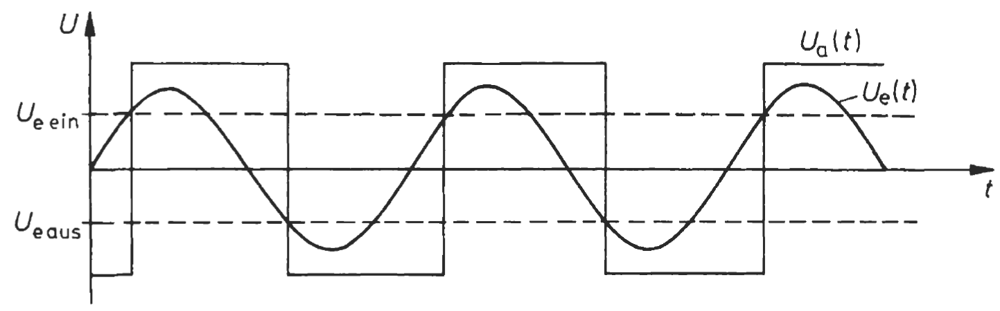
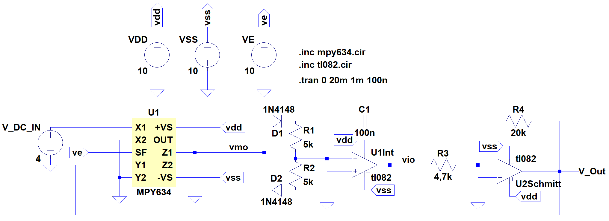
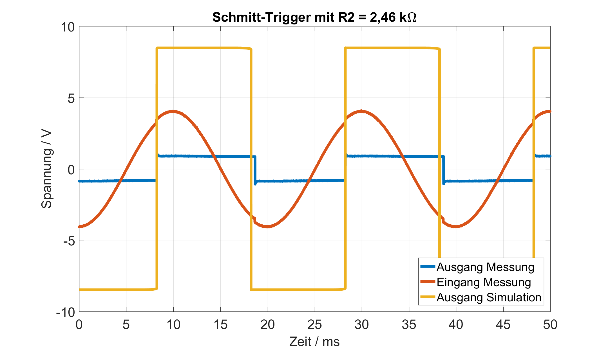
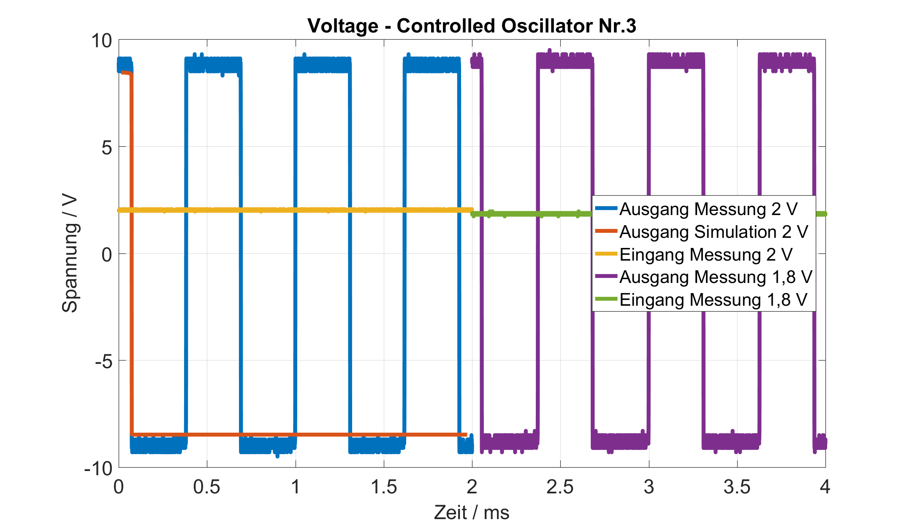

Experiment 6: Voltage controlled oscillator (VCO)
=====================================================

Theorie und Motivation
----------------------
Voltage controlled oscillator sind Schaltungen, die die Frequenz der Ausgangsspannung in Abhängigkeit der Eingangsspannung ändern. Bekannt ist auch die Wirkung als Funktionsgenerator mit einem Rechtecksignal am Ausgang.
In der Praxis kann die Schaltung in der elektronischen Musik als Synthesizer, bei Motorregelungen, als Funktionsgenerator und beim  Sendersuchlauf in Verbindung mit PLL genutzt werden.

Ein VCO kann mit Hilfe eines Multiplizierers, eine Integrierers und eines nicht invertierenden Schmitt-Triggers realisiert werden.
Als erstes wird das Schmitt-Trigger-Glied versuchstechnisch genauer unter die Lupe genommen. Dazu ändert sich der Rückführungswiderstand und die Wirkungsweise wird in Abhängigkeit eines Sinus-Signals analysiert. Dafür liegt eine Spice-Simulation vor, die anschließend in die Realität umgesetzt und messtechnisch aufgenommen wird. Anschließend werden die simulierten Werte mit den Gemessenen unter Zuhilfenahme von Matlab verglichen.

Als zweiten Versuch wird die gesamte VCO-Schaltung untersucht. Die Eingangsgleichspannung wird von 1V bis 10V variiert und die Ausgangsspannung gemessen. Ein Matlabprogramm legt nun beide Ausgangskurven eingerückt übereinander und setzt sie in Verbindung mit der Eingangsspannung. Für einen gleichmäßigen High- und Low-Pegel muss eine kleine Anpassschaltung das Ausgangssignal leicht manipulieren. Die Veränderung dieser Anpassschaltung wird mit der Frequenz der Ausgangsspannung in einen Grafen und mit der Eingangsspannung in einen anderen Grafen aufgetragen.

Spezifikation
-------------

Schaltungsaufbau Schmitt-Trigger
-------------------------------
Der Schmitt Trigger besteht in diesem Fall aus 3 Bauelementen:

- 2 Widerstände
  
- Operationsverstärker

Die Abbildung zeigt den Aufbau eines nicht invertierenden Schmitt-Triggers mit einer Versorgungsspannung des Operationsverstärkers von +/-10 V. Die Schaltung arbeitet wie ein Komparator, bei dem der Ein- und Ausschaltpegel nicht den selben Wert haben. Das heißt eine Schalthysterese (zweite Abbildung) des Komparators wird erzielt. Ausschaltpegel :math:`U_{e, aus}` beziehungsweise Einschaltpegel :math:`U_{e, ein}` lassen sich berechnen und als Schalthysterese :math:`\Delta U_{e}` zusammenfassen. Es lassen sich also gut analoge Signale in digitale Signale umwandeln. Für den Versuch wird der Schmitt-Trigger eingangsseitig mit einer Sinus-Wechelspannung (4 V Amplitude) gespeist. Die dritte Abbildung zeigt das beispielhafte Verhalten des Schmitt-Triggers. 

.. role:: raw-math(raw)
    :format: latex html

:raw-math:`$$ U_{e, aus}=-\frac{R_1}{R_2}U_{a, max} $$`
	  
:raw-math:`$$ U_{e, ein}=-\frac{R_1}{R_2}U_{a, min} $$`
	  
:raw-math:`$$ \Delta U_{e}=\frac{R_1}{R_2}(U_{a, max}-U_{a, min}) $$`

	  

.. figure:: img/Experiment_06/Voltage_Controlled_Oscillator_Schaltplan_Schmitt_Trigger.png
	    :name:  06_fig_01
	    :align: center
	    :scale: 30%

	    Schmitt Trigger Schaltplan

	    
.. figure:: img/Experiment_06/Schmitt_Trigger_Titze_Kennlinie.PNG
	    :name:  06_fig_02
	    :align: center
	    :scale: 30%

	    Schmitt Trigger Hysteresekurve, Tietze/Schenk

	    Schmitt Trigger Beispiel, Tietze/Schenk

	    
Schaltungsaufbau VCO
-------------------------------
Der VCO besteht aus 3 wichtige Komponenten:

- Multiplizierer
  
- Integrierer
  
- Schmitt-Trigger
  
Als Anpassungsschaltung dient hier eine kleine Dioden-Widerstand-Schaltung. Versorgt werden die Operationsverstärker sowie der Multiplizierer mit +/-10V. Eingangsseitig sorgt ein Gleichsignal mit verschiedenen Spannungsleveln von 1-10 V für eine beispielhafte Beschaltung.

Für den  Multiplizierer (hier: MPY 634, roter Kasten) lässt sich das Ausgangssignal berechnen. X1/ X2 stellen dabei Eingang 1, Y1/ Y2 Eingang 2 dar. Über SF lässt sich der Skalierungsfaktor steuern und  an VS gehört die Versorgungsspannung. Z1 wird meist gegen Ground oder sehr hochohmig angeschlossen, Z2 erlaubt einen Offset am Ausgang. 

:raw-math:`$$ V_{out} = A \cdot \frac{(X1-X2)(Y1-Y2)}{SF}(Z1-Z2) $$`
  

	    VCO Schaltplan

Für den Integrierer mit vorgeschalteter Anpassschaltung (gelber Kasten), bestehend aus 2 Dioden und 2 Widerständen, gilt für eine konstante Eingangsspannung: 

:raw-math:`$$ U_a=-\frac{U_e}{RC}t+U_{a, Anfang} $$`

:raw-math:`$$ U_{a, Anfang}= \frac{Q_{Anfang}}{C} $$`

Dazu kann die Anpassschaltung mit einem einzelnen Widerstand R ersetzt werden. Je nach Größe des Eingangswiderstandes lädt sich der Kondensator schneller auf. Die Schaltung arbeitet invertierend, das heißt es gilt:

	  
:raw-math:`$$ Q(R)\sim U_C(R,C)=-U_a(R,C) $$`

Die Anpassschaltung, im Versuchsaufbau mit einem Trimmer realisiert, bestimmt flexibel welcher Strom in den Integrator rein-/ zurückfließt. Damit lassen sich variabel die High-/ und Lowzeiten des Ausgangssignal der VCO beeinflussen. 
	  
Mit einer Wechselspannung am Eingang ergibt sich folgende Gleichung:

:raw-math:`$$ |U_a|=\frac{U_e}{2\pi fCR} $$`

Der grüne Kasten entspricht dem schon gezeigten Schmitt-Trigger. 
	    

Schmitt-Trigger Messung und Auswertung
-------------------------------
Die Abbildungen zeigen in rot das gemessene Sinus-Eingangssignal mit einer Amplitude von 4 V und einer Frequenz von 50 Hz. In blau ist das gemessene Ausgangssignal dargestellt und mit dem simulierten Ausgangssignal(Orange) an der ersten steigenden Flanke mit Matlab übereinander gelegt. Mit :math:`R2=9,5k \Ohm`  zeigen sich kleine Differenzen in der Periodendauer, sowie ein komplett anderer Ausgangspegel. Möglicherweise ist bei der Simulation ein gröberer Fehler unterlaufen, der das Ausgangssignal verlustfrei statt verlustbehaftet ausgibt. 

.. figure:: img/Experiment_06/Schmitt_Trigger_9_5k_Diagramm.png
	    :name:  06_fig_06
	    :align: center
	    :scale: 30%

	    Schmitt Trigger Messung+Simulation mit :math:`R2=9,5k \Ohm`

Mit einem kleineren R2 Widerstand erfolgt der Umschaltzeitpunkt später als mit dem größeren Widerstand. Im Moment des Umschaltens erfolgt außerdem eine deutliche Überspannung des Ausgangssignals, wobei die Versorgungsspannung kurzzeitig leicht einbricht. Während des Umschaltens sinkt die Ausgangsspannung zusätzlich für den Bruchteil einer Millisekunde auf 0V ab. 

	    Schmitt Trigger Messung+Simulation mit :math:`R2=2,46k \Ohm`

VCO Messung und Auswertung
-------------------------------

\begin{table}[h]
    \centering
    \caption{test}
    \begin{tabular}{lcr}
        test1 & test2 \\
        \hline
        a & b  \\
	c & d  \\
    \end{tabular}
    \label{tab:testblabla}
\end{table}

.. figure:: img/Experiment_06/Voltage_Controlled_Oscillator_Nr_1.png
	    :name:  06_fig_06
	    :align: center
	    :scale: 30%

	    Spannungsgesteuerter Osczillator Diagramm 1

.. figure:: img/Experiment_06/Voltage_Controlled_Oscillator_Nr_2.png
	    :name:  06_fig_07
	    :align: center
	    :scale: 30%

	    Spannungsgesteuerter Osczillator Diagramm 2

	    Spannungsgesteuerter Osczillator Diagramm 3

.. figure:: img/Experiment_06/Voltage_Controlled_Oscillator_Nr_4.png
	    :name:  06_fig_09
	    :align: center
	    :scale: 30%

	    Spannungsgesteuerter Osczillator Diagramm 4

.. figure:: img/Experiment_06/Voltage_Controlled_Oscillator_Nr_5.png
	    :name:  06_fig_10
	    :align: center
	    :scale: 30%

	    Spannungsgesteuerter Osczillator Diagramm 5

.. figure:: img/Experiment_06/Widerstandsanpassung_Spannung.png
	    :name:  06_fig_11
	    :align: center
	    :scale: 30%

	    Widerstandsanpassung - Spannung

.. figure:: img/Experiment_06/Widerstandsanpassung_Frequenz.png
	    :name:  06_fig_12
	    :align: center
	    :scale: 30%

	    Widerstandsanpassung - Frequenz

Fazit
-----

cceferfrefre
