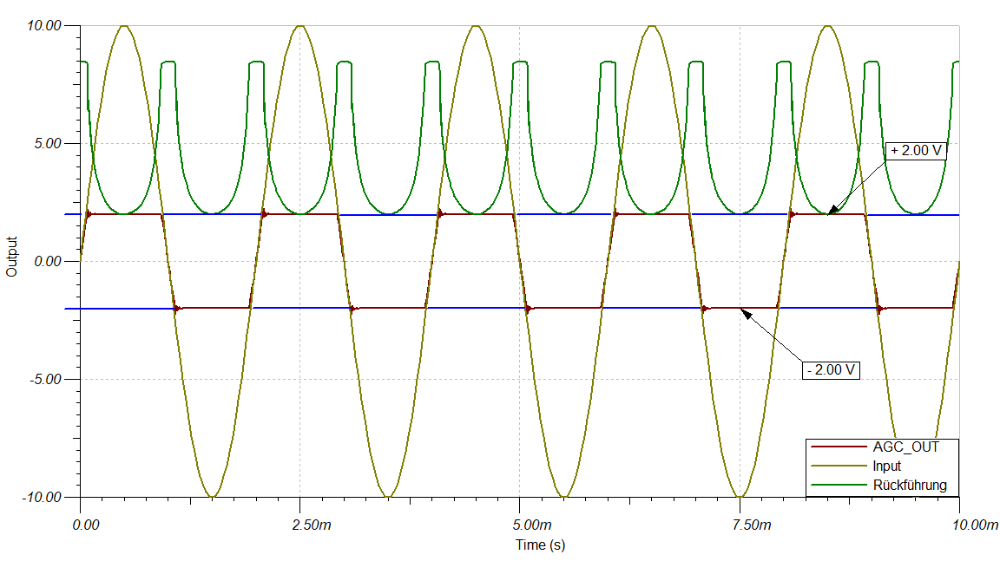
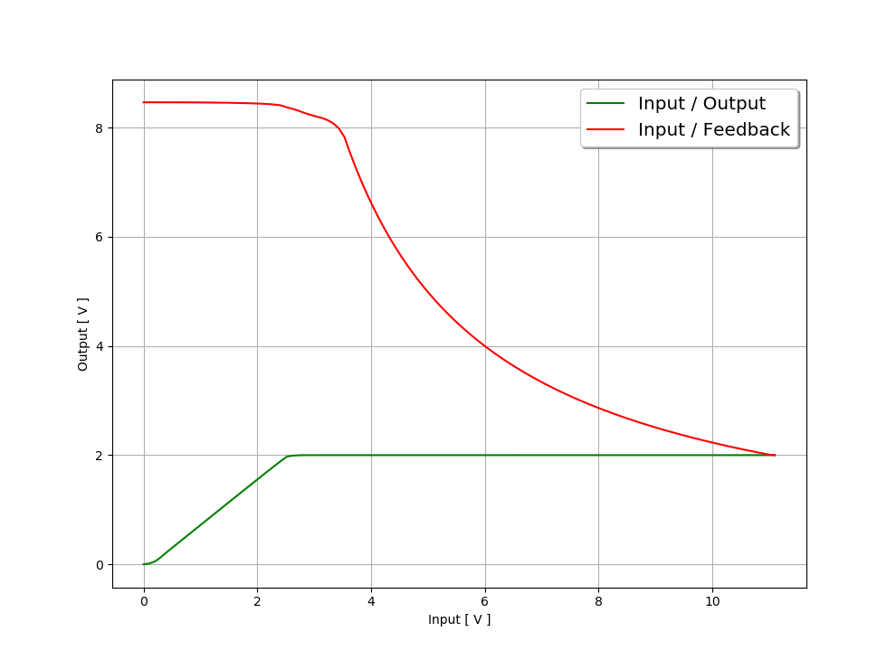
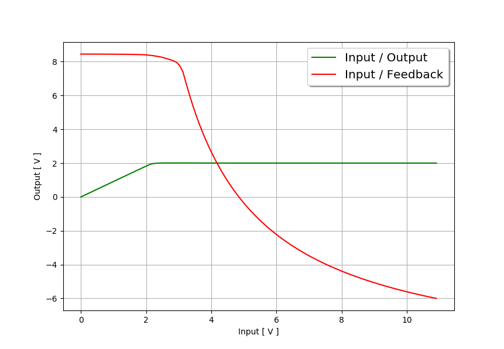
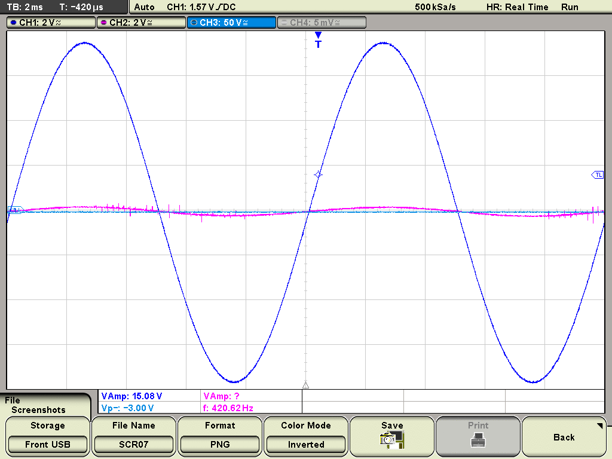
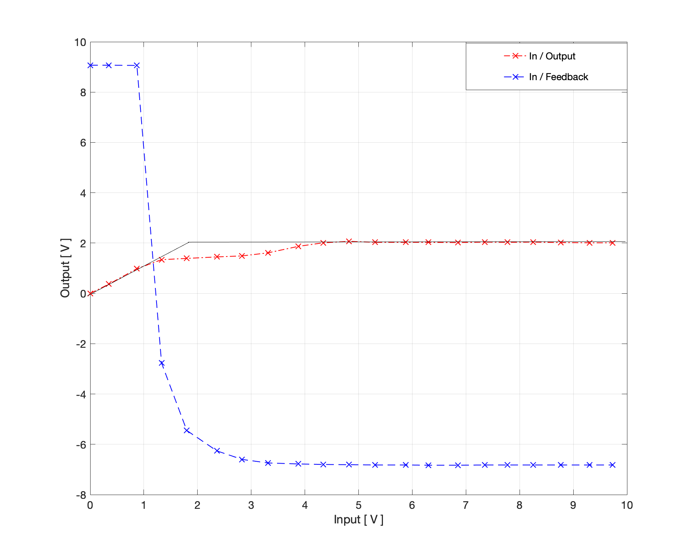

Experiment 6: Voltage controlled oscillator (VCO)
=====================================================

Theorie und Motivation
----------------------
Voltage controlled oscillator sind Schaltungen, die die Frequenz der Ausgangsspannung in Abhängigkeit der Eingangsspannung ändern. Bekannt ist auch die Wirkung als Funktionsgenerator mit einem Rechtecksignal am Ausgang.
In der Praxis kann die Schaltung in der elektronischen Musik als Synthesizer, bei Motorregelungen, als Funktionsgenerator und beim  Sendersuchlauf in Verbindung mit PLL genutzt werden.
Ein VCO kann mit Hilfe eines Multiplizierers, eine Integrierers und eines nicht invertierenden Schmitt-Triggers realisiert werden.
Als erstes wird das Schmitt-Trigger-Glied versuchstechnisch genauer unter die Lupe genommen. Dazu ändert sich der Rückführungswiderstand und die Wirkungsweise wird analysiert in Abhängigkeit eines Sinus-Signals. Dafür liegt eine Spice-Simulation vor, die anschließend messtechnisch aufgenommen wird. Anschließend werden die simulierten Werte mit den Gemessenen unter Zuhilfenahme von Matlab verglichen. 
Als zweiten Versuch wird die gesamte VCO-Schaltung untersucht. Die Eingangsgleichspannung wird von 1V bis 10V variiert und die Ausgangsspannung gemessen. Ein Matlabprogramm legt nun beide Ausgangskurven eingerückt übereinander und setzt sie in Verbindung mit der Eingangsspannung. Für einen gleichmäßigen High- und Low-Pegel muss eine kleine Anpassschaltung das Ausgangssignal leicht manipulieren. Die Veränderung dieser Anpassschaltung wird mit der Frequenz der Ausgangsspannung in einen Grafen und mit der Eingangsspannung in einen anderen Grafen aufgetragen.

Spezifikation
-------------

Schaltungsaufbau Comparator AGC 
-------------------------------
Der Comparator AGC besteht im Grunde aus vier Komponenten. 
- Multipizierer
- Quadrierer
- Tiefpass Filter
- Comparator

Diese sind so mit einander verknüpft, dass das Eingangssignal zunächst in den Multiplizierer mit einer Rückführung 
des Comparators eingegeben wird. Dieses Ergebnis wird daraufhin an den Quadrierer übergeben, welcher das Sinussignal
in Betrag setzt und somit zwei positive Halbwellen erzeugt. Folgend auf den Quadrierer wird das Signal noch in den 
Tiefpass-Filter eingegeben, in welchem es nochmal geglättet und somit in ein DC Signal überführt wird.
Dieses DC Signal wird nun in den invertierenden Eingang des Comparators eingegeben und mit einer Referenzgleichspannung, 
welche am nicht invertierenden Eingang des Comparators eingegeben ist, verglichen. Das Ergebnis dieses Vergleiches zwischen 
Soll- und Ist-Wert sorgt nun durch seine Rückführung an den Multiplizierer für eine Skalierung des Eingangssignals.
Sodass hierdurch das Eingangssignal am eingestellten Referenzwert
regelt bzw. limitiert wird. Es ist hierbei der Ausgang des AGC´s am
ersten Multiplizierer anzunehmen. 

.. figure:: img/Experiment_08/Comparator.png
	    :name:  08_fig_01
	    :align: center
	    :scale: 70%

	    Comparator Blockschaltbild
		

Schaltungsaufbau Integrator AGC 
-------------------------------
Der Integrator AGC besteht aus fünf Komponenten.
- Multiplizierer
- Quadrierer
- Schwellstromknoten
- Integrierer
- Rückführungs- Vorspannung

Das Prinzip des Integrators ist ähnlich dem des Comperators. Jedoch wird hier der Vergleich des Referenz-Sollwertes
mit der zu regelnden Größe nicht mehr über einen Operationsverstärker,
sondern mittels eines Schwellstroms realisiert. Die Umsetzung erfolgt
hier über eine negativ vorgespannten Spannungsquelle am Knotenpunkt
des invertierenden Eingangs des Operationsverstärkers. Diese bewirkt
nun, dass wenn der Schwellstrom überschritten wurde, dass der
Kondensator des Integrierers geladen und somit ein herabsetzen
(Reglung) über die Rückführung des Integrierers hervorgerufen wird. 
Außerdem fällt hier der Tiefpassfilter weg, da dieser im Integrierer implementiert ist. 
Zuletzt erweitert sich die Schaltung noch um eine positiv Vorgespannte Spannungsquelle an der Rückführtung des Integrators. 
Diese bewirkt in Summe mit der negativ aufintegrierten Übersteuerung
in der Rückführung, dass der Skalierfaktor SF des Multiplizierers das
Eingangssignal mit jeder Periode herabsetzt, bis zuletzt im
ausgeregelten Zustand eine konstante Rückführung die Regelgröße in den
eingestellten Zielbereich regelt.  

.. figure:: img/Experiment_08/Integrator.png
	    :name:  08_fig_02
	    :align: center
	    :scale: 70%

	    Integrator Blockschaltbild
		
		
Simulation des AGC 
------------------

Zur Implementierung der zu verwendenden Komponenten in die Simulation,
mussten zunächst für eine realitätsnahe Abbildung im
Simulationsprogramm Tina die passenden Makro Modelle für den
Multiplizierer MPY634 und den Operationsverstärker TL082  
eingebunden werden. Für den TL082 ließen sich diese relativ schnell finden, für den Multiplizier jedoch nicht. 
Nach einigen Recherchen zeigte sich, das weder TI.com noch andre Hersteller dieses Bauteil in Form einer Libary oder eines 
Makros zur Verfügung stellen. Jedoch ließ sich nach längerem
Durchforsten von Foren für den MPY634 ein Makro-Eignenbau auf Basis
dessen Datenbattes finden und implementieren. 

Es folgt der implementierte Multiplizierer (MPY634) folgender Gleichung:

.. role:: raw-math(raw)
    :format: latex html

:raw-math:`$$ V_{out} = A \cdot \frac{(X1-X2)(Y1-Y2)}{SF}(Z1-Z2) $$`
   
 

Tina Schaltbilder Comperator und Integrator AGC
-----------------------------------------------

Nachdem sämtliche Komponenten eingebunden und mit einander verschaltet
wurden, ließ sich folgende Schaltbilder für den Comperator und
Integrator AGC erstellen. 

.. figure:: img/Experiment_08/Schaltbild1_Tina.png
	    :name:  08_fig_03
	    :align: center
	    :scale: 35%

	    Comparator AGC Schaltbild Tina
		
		
.. figure:: img/Experiment_08/Schaltbild2_Tina.png
	    :name:  08_fig_04
	    :align: center
	    :scale: 35%

	    Integrator AGC Schaltbild Tina
		
		
Messkurven und Kennlinien aus Simulation
----------------------------------------

		

	    Messkurven des Comparator AGC´s 
		
.. figure:: img/Experiment_08/Integrator_Out.png
	    :name:  08_fig_06
	    :align: center
	    :scale: 50%

	    Messkurven des Integrator AGC´s 

Es zeigt sich nun aus den Messungen der beiden AGC Schaltungen, dass im Falle des Comparators 
die Ausgangsspannung auf den eingestellten Bereich limitiert wird, wohingegen die Ausgangsspannung
des Integrators nicht limitiert sondern Stück für Stück herabgesetzt wird. Es bleibt somit im Falle des 
Integrator AGC's die Sinuswelle erhalten.

	    Kennlinie des Comparator AGC´s 
		
		

	    Kennlinie des Integrator AGC´s 		

Aus der Kennlinie des Comparator AGC`s ist nun das erwartete Ein- zu Ausgangsverhalten eines AGC´s
zu erkennbar. Diese zeigt, dass mit steigender Eingangsspannung die entworfene Regelschleife ab 2,50 V 
die Ausgangsspannung konstant bei 2,00 V limitiert. 
Die Kennlinie des Integrator AGC´s zeigt nun zusätzlich typisches Verhalten einer Regelstrecke. Beispielsweise 
ist zu erkennen das der Ausgang ebenso wie zuvor zunächst dem Eingang bis zu einem Schwellwert (hier 2.00 V) folgt, 
jedoch dann übergeht in ein Reglertypischen Überschwinger mit folgender Ausreglung auf einen eingestellten 
Ausgangszielwert. (hier 1,45 V)

Messung
-------

Folgend sollten die gewonnenen Erkenntnisse aus der Simulation mit Messwerten des Integrator AGC´s 
verglichen, und die Funktion dieser Schaltung verifiziert werden.
Hierfür wurde die Schaltung entsprechend der Schematik des Simulationsprogramms Tina aufgebaut, ein 
Referenzzielwert der Ausgangsspannung von 3,00 V eingestellt, und folgend hierauf die Schaltung für 
unterschiedliche Eingangsamplituden betrachtet. 

.. figure:: img/Experiment_08/animiertes_gif_1.gif
	    :name:  08_fig_09
	    :align: center
	    :scale: 55%

	    Messung des Integrator AGC' mit unterschiedlichen Eingangsamplituden 
		
Dabei zeigt sich aus den Darstellungen, dass trotz der sich ändernden Amplitude der Eingangsspannung (blau) 
sich die Ausgangsspannung (magenta) konstant im Bereich der eingestellten Zielamplitude von 3,00 V aufhält. 
Wodurch also gezeigt ist, dass eine einstellbare Reglung der Eingangsspannung über die Schaltung des 
Integrator AGC´s im vollen Umfang gegeben ist. 

	    Messung des Integrator AGC´mit unterschiedlichen Eingangsamplituden 
		
Eine Änderung der Referenzspannung zeigt ebenfalls in allen Fällen gleiches Regelverhalten mit einer
konstanten Sinus Ausgangs-Zielamplitude.

Betrachtet mann nun auch die charakteristische Kennlinine des Integrator AGC's, so zeichnet sich hieraus 
ebenfalls das typische Reglerverhalten des Integrierers aus der Rückführung der Regelschleife heraus.

	    Input/Output Kennline des Integrator AGC´s 
		

Diese bewirkt nun, dass die Ausgangsspannung mit einer höher werdenden Eingangsspannung ab einem Schwellwert 
von 1,40 V zunächst einbricht und daraufhin nach einer stückweise Annährung in eine Konstante 
Ausgangsspannung von 2,00 V übergeht und somit ausgeregelt wird.

Fazit
-----

Es lässt sich damit zeigen, das sich der Comparator oder Integrator AGC gleichermaßen gut für eine Reglung eines 
Eingangsignals in einen gewünschten Zielbereich eignet. Jedoch muss für die Anwendung bei der Auswahl des AGC`s
abgewogen werden, ob der Wert in einer hohe Regelzeit-Performance oder aber in einem Erhalt der eingegebenen 
Sinusamplitude liegt.

