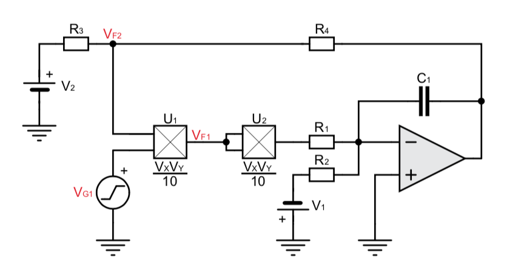

Experiment 8: Automatic Gain/Volume Control (AGC/AVC)
=====================================================

Kurze Theorie und Motivation
----------------------------
AGC´s sind Automatische Verstärkungsreglungen die in elektronischen Geräten dazu verwendet werden, 
das ein Ausgangssignal bzw. ein Ausgangspegel unabhängig vom Eingangssignal unterhalb eines gesetzten 
Schwellpegels limitiert oder geregelt wird. Somit werden also über diese Schaltungen eingangsseitige 
Übersteuerungen oder aber starke Variationen der Eingangsamplitude mittels regelschleifen am Ausgang 
in Form einer Konstanten Amplitude mit gleicher frequenz ausgeben. Für die Umsetzung solcher regelschleifen 
sind unterschiedliche Herangehensweisen möglich. Beispielsweise lassen sich diese entweder über komplizierte 
Operations Verstärkerschaltungen oder aber wie in diesem Experiment behandelt, mittels eines Comperator 
Soll- / Istwert vergleiches oder eines Integriergliedes in Verbindung mit Multiplikatoren realisieren.

Im ersten Teil des Experiments ist zunächst die allgemeine Regelschleife eines Comparators in Verbindung mit 
Multiplikatoren zu betrachten. Diese sollte zunächst analysiert und folgend hierauf ein Design mit Hilfe
des Simulations Programmes (LTspice oder Tina) entworfen werden, in dem eine Sinusspannung beliebiger 
Amplitude auf eine Ausgangsamplitude von 2V geregelt wird. 

Nachdem dies erfolgt ist, soll nun das Systemverhalten (In- zu Output) im Bezug auf die Eingangsspannung 
dargestellt, die Eingangsspannung an der die Zielamplitude erreicht wird bestimmt und zuletzt die Ergebnisse 
der Simulation mit gemessenen Werten eines Schaltungsaufbaus verglichen werden.

Im zweiten Teil des Experiments ist nun eine Regelschleife eines Integriergliedes zu betrachten. Hierbei ist 
ebenso zunächst die Schaltung zu analysieren und folgend hierauf ein Design zu entwerfen, welches eine beliebige 
Eingangsamplitude in eine Ausgangsamplitude von 2V gleicher Frequenz regelt. 

Ist dies ebenfalls erfolgt, so sind auch hierfür das Systemverhalten und die Schwellspannung der Zielamplitude 
zu bestimmen, sowie die Ergebnisse der Simulation mit den gemessen Werten eines Schaltungsaufbaus zu vergleichen.

Spezifikation
-------------

Funktionsaufbau Comparator AGC 
------------------------------
Der Comparator AGC besteht im Grunde aus vier Komponenten. 
- Multipizierer
- Quadrierer
- Tiefpass Filter
- Comparator

Diese sind so mit einander verknüpft, dass das Eingangssignal zunächst in den Multiplizierer mit einer Rückführung 
des Comparators eingegeben wird. Dieses Ergebnis wird daraufhin an den Quadrierer übergeben, welcher das Sinussignal
in Betrag setzt und somit zwei positive Halbwellen erzeugt. Folgend auf den Quadrierer wird das Signal noch in den 
Tiefpass Filter eingegeben, in welchem es nochmal geglättet und somit in ein DC Signal überführt wird.
Dieses DC Signal wird nun in den invertierenden Eingang des Comparators eingegeben und mit einer Referenzgleichspannung, 
welche am nicht invertierenden Eingang des Comparators eingegeben ist, verglichen. Das Ergebnis dieses Vergleiches zwischen 
Soll- und Ist-Wert sorgt nun durch seine Rückführung an den Multiplizierer für eine Skalierung des Eingangssignals.
Somit passt sich also die Schaltung stetig an wodurch also das Eingangssignal am eingestellten Referenzwert 
regelt bzw. limitiert wird. Es ist hierbei der Ausgang des AGC´s am ersten Multiplizierer abzugreifen.

.. figure:: img/Experiment_08/Comparator.png
	    :name:  08_fig_01
	    :align: center
	    :scale: 40%

	    Comparator Blockschaltbild
		

Funktionsaufbau Integrator AGC 
------------------------------
Der Integrator AGC besteht aus fünf Komponenten.
- Multiplizierer
- Quadrierer
- Schwellstromknoten
- Integrierer
- Rückführungs- Vorspannung

Das Prinzip des Integrators ist ähnlich dem des Comperators. Jedoch wird hier der Vergleich des referenzsollwertes
mit der zu Regelnden Größe nicht mehr über einen Operationsverstärker sondern mittels eines Schwellstrom vergleichs umgesetzt. 
Realisiert wird dies über eine negativ vorgespannten Spannungsquelle am Knotenpunkt des invertierenden Eingangs des Operationsverstärkers. Des weiteren fällt hier der Tiefpassfilter weg, da dieser durch den Integrierer implementiert ist. 
Zuletzt erweitert sich die Schaltung noch um eine positiv Vorgespannte Spannungsquelle an der Rückführtung des Integrators. 
Diese bewirkt in Summe mit der negative aufintegrierten Übersteuerung in der Rückführung, dass der Skalierfaktor SF des Multiplizierers das Eingangssignal mit jeder periode herabsetzt, bis zuletzt im ausgeregelten Zustand eine konstante Rückführung 
die Regelgröße in den eingestellten Zielbereich regelt. 

	    Integrator Blockschaltbild
		
		
Simulation des AGC 
------------------

Zur Implementierung der zu verwendenden Komponenten in die Simulation mussten zunächst für eine realitätsnahe Abbildung im Simulationsprogramm Tina die passenden Makro Modelle für den Multiplizierer MPY634 und den Operationsverstärker TL082 
eingebunden werden. Für den TL082 ließ sich das relativ schnell finden, für den Multiplizier jedoch nicht. 
Nach einigen Recherchen zeigte sich, das weder TI.com noch andre Hersteller dieses Bauteil in Form einer Libary oder eines 
Makros zur Verfügung stellen. Jedoch ließ sich nach längerem durchforsten einiger Foren für den MPY634 auf Basis 
dessen Datenbattes ein Makro-Eignenbau finden und Inplementieren.

Es folgen hierbei die implementierten Multiplizierer (MPY634) folgender Gleichung:

.. math::
   :label: 08_eq_01

  V_out = A \cdot \frac{(X1-X2)(Y1-Y2)}{SF}(Z1-Z2)

Tina Schaltbilder Comperator und Integrator AGC
-----------------------------------------------

Nachdem sämtliche Komponenten eingebunden und mit einander verschaltet wurden, ließ sich folgendes Schaltbild des mit Tina 
designten Comperator und Integrator AGC´s erstellen.

.. figure:: img/Experiment_08/Schaltbild1_Tina.png
	    :name:  08_fig_03
	    :align: center
	    :scale: 40%

	    Comparator AGC Schaltbild Tina
		
		
.. figure:: img/Experiment_08/Schaltbild2_Tina.png
	    :name:  08_fig_04
	    :align: center
	    :scale: 40%

	    Integrator AGC Schaltbild Tina
		
		
Kennlinien aus Simulation
-------------------------

Messungen
---------
