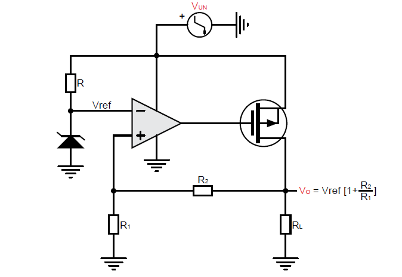
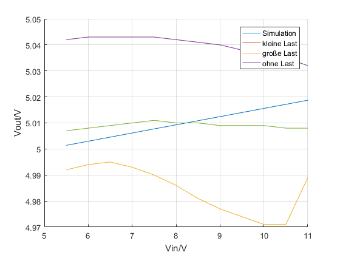
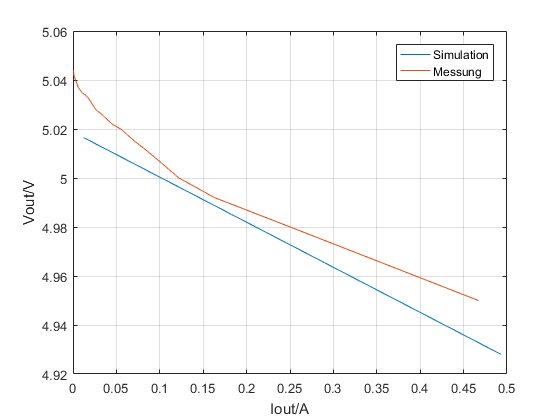

Experiment 11: Parameterstudie eines LDO's
==========================================

Kurze Theorie und Motivation
----------------------------
Ziel dieses Experiments ist es, die Parameter des Low Dropout Regulator (LDO) IC TPS7250 zu verstehen.
Der TPS7250 ist ein Linearregler von Texas Instruments und kann einen Ausgangsstrom von 200 mA bei einer festen 
Ausgangsspannung von 5 V liefern. Er zeichnet sich aus durch einen niedrigen Ruhestrom, geringes Rauschen, 
hohe PSRR, schneller LDO-Start mit ausgezeichnetem Einschwingverhalten. Der Versorgungsspannungsdurchgriff,
(Power supply rejection ratio) gibt an, wie stark sich die Ausgangsspannung eines Verstärkers ändert, 
wenn sich die Versorgungsspannung verändert. Die Dropout-Spannung definiert als die Differenz zwischen 
den Eingangs- und den Ausgangsspannungen zu dem Punkt, zu dem ein weiterer Abfall der Eingangsspannung dazu führt, 
dass die Regelung der Ausgangsspannung fehlschlägt.
Unterschied zu anderen Spannungsreglern. Die minimal erforderliche Differenz zwischen Ein- und 
Ausgangsspannung liegt bei 0,1 V bis 1 V, statt 1,5 V bis 3 V bei anderen Reglern..

Funktionsweise
--------------

	   

	    LDO Prizip

Der LDO besteht im Prinzip aus einer Referenzspannung, einem Operationsverstärker, einem Durchgangselement 
und einem Widerstand am Ausgang. Eine einfache Referenzspannungsquelle kann mit einem Widerstand, 
sowie einer Z-Diode erzeugt werden. Als Durchgangselements wurde ein MOSFET gewählt. Er ist dafür da, 
die Ausgangsspannung durch Änderung des Kanalstromes anzupassen. Er zeichnet sich dadurch aus, dass er 
eine kleinere Dropout-Spannung hat. Da es sich bei dem PMOS-Durchlasselement um ein spannungsgesteuertes 
Gerät handelt, ist der Ruhestrom sehr niedrig (maximal 300 µA) und über den gesamten Bereich des 
Ausgangslaststroms (0 mA bis 200 mA) stabil. Der Operationsverstärker vergleicht die Spannung, 
welche durch den Spannungsteiler am Ausgang gebildet wird, mit einer Referenzspannung. 
Je nach Eingangsspannungsdifferenz stellt sich eine höhere oder niedrigere Ausgangsspannung am 
Operationsverstärker ein, so dass die Spannung zwischen Gate und Source des Transistors anwächst oder 
kleiner wird. Dadurch fließt mehr oder weniger Strom zum Regler Ausgang.

Aufbau der Schaltung
--------------------
.. figure:: img/Experiment_11/Schematic_diagram_of_on_board_evaluation_module.png
	    :name:  11_fig_02
	    :align: center	 

	    on-board Schaltung

-Eingangsspannung: 5,5-11V
-Ausgangsspannung: 5V
-Der Kondensator C102 verbessert die Übergangfunktion des Reglers. 
-Der Kondensator C101 hilft, die Störungen am Eingang zu reduzieren, wenn die Zuleitungen zu lang sind.
-Der Kondensator C103 am Ausgang dient als Speicher und definiert meist auch die Bandbreite bzw. die Reaktionszeit des LDO.
-Die Diode zeigt, dass der Chip Funktionsfähig ist

Aufgabe
-------
Ermitteln der Leitungsregelung: 
die Ausgangsspannung als Funktion der Eingangsspannung für eine feste Ausgangslast. 

Unter Leitungsregelung versteht man die Änderung der Ausgangsspannung bei einer 
vorgegebenen Änderung der Eingangsspannung. Bei linearen Spannungsreglern sollte die Ausgangsspannung 
möglichst unabhängig von der Eingangsspannung sein. In der Praxis existiert jedoch eine kleine Abhängigkeit
zwischen der Ein- und der Ausgangsspannung. Diese Abhängigkeit hängt stark vom Verstärkungsfaktor des 
Operationsverstärkers ab. Bei der Wahl des Verstärkungsfaktors muss darauf geachtet werden, 
dass die Verstärkung nicht zu groß ist. Ein zu großer Verstärkungsfaktor kann die Stabilität des Reglers 
beeinflussen.

Ermitteln der Lastregelung: 
Lastregelung wird definiert als die Änderung der Ausgangsspannung bei einer vorgegebenen Laständerung. 

Wie bei der Leitungsregelung muss ein Regler auch bei einem Lastwechsel in der Lage sein, 
eine konstante Ausgangsspannung zur Verfügung zu stellen. Dieser Strom wird aber nicht immer 
konstant bleiben und schwanken. 

Leitungsregelung: Schaltungsaufbau - Simulation
------------------------------------------------
Mithilfe der Software LTSpice XII ist es möglich, den Schaltungsaufbau
zu simulieren. Die Schaltung wird hierbei nach dem Schema aus
:numref:`11_fig_02` entworfen. 

.. figure:: img/Experiment_11/Simulation_der_SchaltungTeil1.png
	    :name:  11_fig_03
	    :align: center	   

	    Simulation Leitungsregelung

Leitungsregelung: Vergleich Messung & Simulation
------------------------------------------------
Nachdem die Simulationen für die Schaltung durhcgeführt sind, werden
die Messungen am Texas Instruments Board durchgeführt. Hierdurch kann
ein klarer Vergleich zur Simulation hergestellt werden. 

	    

	    Leitungsregelung: Vergleich Messung & Simulation

Die :numref:`11_fig_04` zeigt das Verhältnis der Spannungen
:math:`V_{in}` zu :math:`V_{out}`. Die Messung wurden jeweils für eine große Last, 
eine kleine Last und ohne Last druchgeführt. Die Simulation erfolgte auch ohne Last. 

Lastregelung: Schaltungsaufbau - Simulation
-------------------------------------------
.. figure:: img/Experiment_11/Simulation_Teil2.png
	    :name:  11_fig_05
	    :align: center	    

	    Schaltungsaufbau - Simulation

Lastregelung: Vergleich Messung & Simulation
------------------------------------------------

	    

	    Lastregelung: Vergleich Messung & Simulation