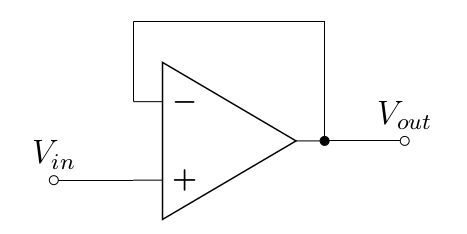
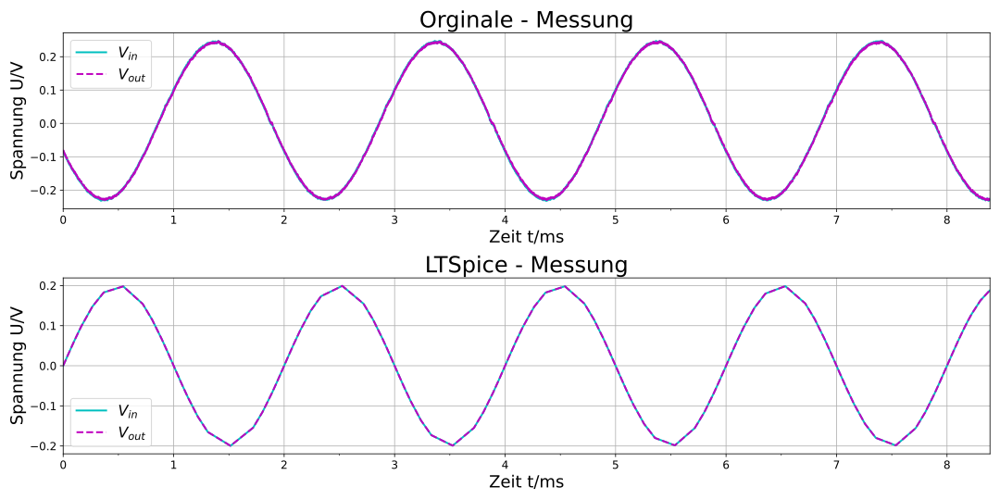
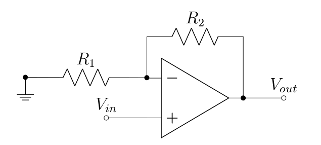
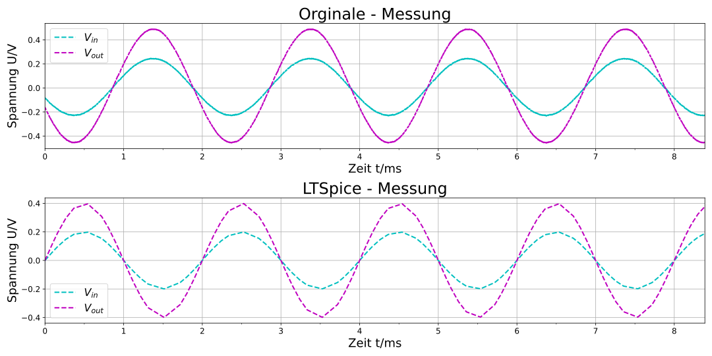
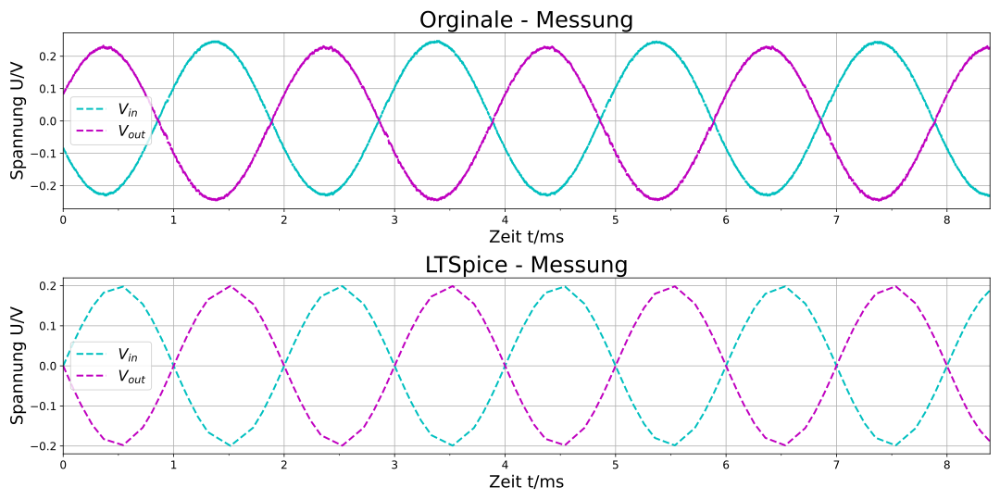
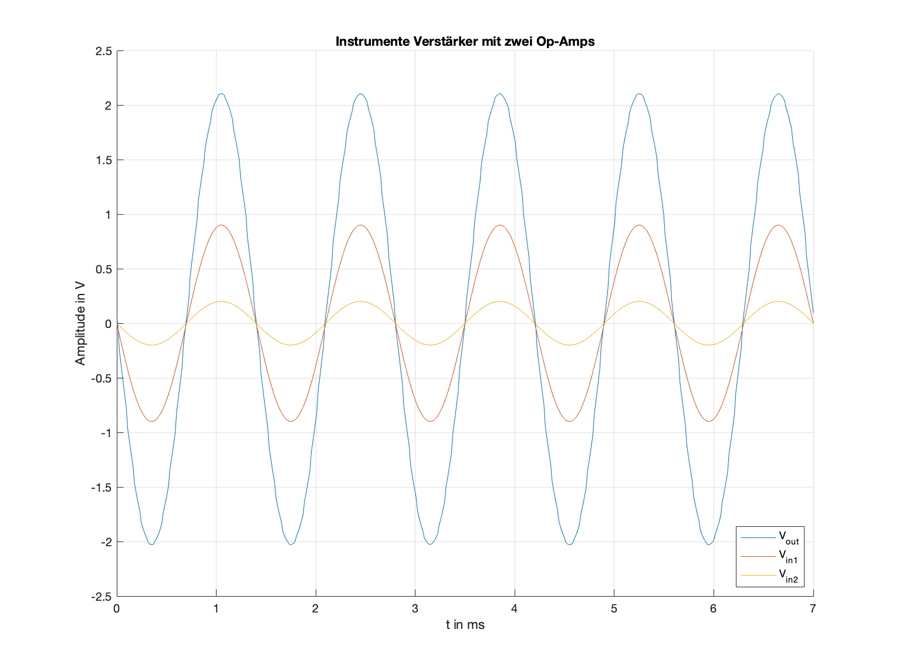

# Experiment 1 - Grundschaltungen des OPV

## Einleitung
In diesem Experiment sollen drei Grundschaltungen eines Operationsverstärkers untersucht werden. Zu diesen gehören:

-   Impedanzwandler / Spannungsfolger
-   nicht-invertierender Verstärker
-   invertierender Verstärker

Grundsätzlich werden beim Schaltungsentwurf mit Operationsverstärkern (häufig auch bezeichnet als OP, OV, OPV oder auch OpAmp, wobei Letzteres die Abkürzung für die englische Bezeichnung Operational Amplifier ist[⁰¹]) die Eingengschaften idealisiert betrachtet. 

Ein idealer Operationsverstärker hat einen unendlich großen Verstärkungsfaktor V, einen unendlich großen Eingangswiderstand Re, einen Ausgangswiderstand Ra gleich Null und einen Frequenzbereich von Null bis unendlich. Außerdem ist der ideale Operationsverstärker vollkommen symmetrisch. Gleiche Spannungen an den beiden Eingängen ergeben einen Ausgangsspannung Ua von Null. Der Grund ist die Differenz UPN zwischen den Eingangsspannungen, die Null ist. Vorausgesetzt die Amplitude und Phasenlage sind gleich. Man spricht dann von Gleichtaktaussteuerung. Die Verstärkung heißt dann Gleichtaktverstärkung. Sie ist gleich Null.
Das Verhältnis zwischen dem Verstärkungsfaktor V und der Gleichtaktverstärkung wird Gleichtaktunterdrückung genannt. Sie ist unendlich groß. Verzerrungen oder Rauschen, sowie die Abhängigkeit von der Umgebungstemperatur gibt es beim idealen Operationsverstärker nicht. Und zwischen Eingangs- und Ausgangsspannung besteht ein linearer Zusammenhang.[⁰¹]

Geht man in die Praxis über, stellt man sehr schnell fest, dass alle soeben aufgeführten Werte endlich sind und beim Schaltungsentwurf unterschiedliche Probleme verursachen können. Das Ziel dieses Experiments ist eine messtechnische Untersuchung der Grundschaltungen eines Opamps und ein Gewinn an Wissen und Erfahrung beim Umgang mit diesen elektronischen Bauelementen.

## Notwendige Werkzeuge
Für das Durchführen des Experiments ist es sinnvoll, sich einiger Werkzeuge zu bedienen. Diesbezüglich ein paar Sätze zu den zu nutzenden Werkzeugen. Vor der eigentlichen Messung ist es ratsam, die Schaltung mit einem Programm zu simulieren. Dadurch wird einem klar, welcher Verlauf beim Messen zu erwarten ist. Das Programm LTspice ist eine leistungsfähige Software zur Simulation elektronischer Schaltungen. Die Messung wird anschließend mit einem RedPitaya durchgeführt. Hierbei handelt es sich um einen kleinen Microcomputer, mit dem es möglich ist, eine Messautomatisierung durchzuführen. 
Durch z.B. ein Python-Script, welches mittels SCPI-Protokoll von einem entfernten System an den Red Ptaya übertragen wird, kann eine Fernmessung durchgeführt werden. Die Messdaten, die ermittelt werden, können danach z.B. in einer CSV-Datei gesammelt werden.[⁰²]

## Unity Gain - Schaltung

Eine Unity Gain-Schaltung, auch Impedanzwandler oder Spannungsfolger genannt, ist ein Operationsverstärker, dessen Ausgang mit dem invertierenden Eingang kurzgeschlossen ist.

||
|:--:| 
| *Abbildung 01: Schematische Darstellung einer UnityGain-Schaltung* |

Aus der Theorie wissen wir, dass der Ausgang eines unberschaltetenen Opams gleich dem Verstärkungsfaktor A0 multipliziert mit der Differenz der beiden Eingänge U+ und U- ist. Dabei ist U+ der nicht-invertierende und U- der invertierende Eingang des Operationsverstärkers. Damit ergibt sich allgemein für den unbeschalteten Operationsverstärker:

$$U_{OUT} = A_0 \cdot (U_+ - U_-)$$

Aufgrund der erwähnten *Rückkopplung* kann die Unity Gain - Schaltung als eine Regelstrecke betrachtet werden. Systemtheoretisch ist nun das Verhältnis von Ausgang zu Eingang eine Übertragungsfunktion H(s).

$$H(s) = \frac{U_{OUT}}{U_{IN}} = \frac{A_0}{1+A_0}$$

Aufrund der direkten Rückkopplung (ohne andere Bauteile, Kurzschluss) kann idealisiert angenommen werden, dass A0 gegen Unendlich strebt. Durch diese Annahme folgt nach dem Kürzen der das Übersetzungverhältnis für eine Unity Gain-Schaltung:

$$H(s) = \frac{U_{OUT}}{U_{IN}} = 1$$

Mit dieser Erkenntnis könnte man nun den Nutzen der Unity Gain - Schaltung in Frage stellen. Tatsächlich ist sie aber eine sehr nützliche Schaltung eines Operationsverstärkers. Wie bereits erwähnt, wird diese Schaltung auch Spannungsfolger oder Impedanzwandler genannt. Die Namen werden aus der grundlegenden Funktion dieser Schaltung abgeleitet. **Eine Unity Gain - Schaltung liefert am Ausgang die vom Eingang vorgegebene Spannung. Diese ist lastunabhängig.** Durch diese Eigenschaft kann der Unity Gain als Spannungsstabilisator oder als Entkoppler zweier Teilsysteme eingesetzt werden. Die Übertragungsfunktion des Unity Gain ist 1. Das heißt, dass die Ausgangsspannung gleich der Differenz der Eingangsspannungen U+ und U- ist. 

||
|:--:| 
| *Abbildung 02: Messung und Simulation der Ein- und Ausgangsspannungen der Unity Gain - Schaltung* [⁰²]|

Die Mess- und Simulationsergebnisse sind in `Abbildung 02` dargestellt. Daraus ist ersichtlich, dass die beiden Signale nahezu identisch sind, was einer Übertragung von 1 entspricht.

## Nicht-invertierender Verstärker

Zwei weitere grundlegende Schaltungen des Operationsverstärkers sind die
sogenannten nicht-invertierenden und invertierenden Schaltung.

||
|:--:| 
| *Abbildung 03: Nicht-invertierender Verstärker[⁰²]* |

Sowohl beim nicht-invertierenden als auch beim invertierenden Verstärker
hängt der Verstärkungsfaktor A0 vom Verhältnis der beiden Widerstände
ab. Für den nicht-invertieren Verstärker ergibt sich:

$$\frac{U_{OUT}}{U_{IN}} = 1 + \frac{R_2}{R_1}$$

Nach Ausmultiplizieren egibt sich für die Ausgangsspannung UOUT

$$U_{OUT} = U_{IN} + \frac{R_2}{R_1} \cdot U_{IN}$$

Dabei ist R1 der Widerstand, der am invertierenden Eingang U-
anliegt und R2 der zwischen dem Ausgang UOUT und dem
invertierenden Eingang liegt. UIN ist die
Eingangsspannung, die an einem der Eingänge des Opamps anliegt.

||
|:--:| 
| *Abbildung 04: Messung und Simulation der Ein- und Ausgangsspannungen des Nicht-invertierenden Verstärkers[⁰²]* |

Aus `Abbildung 04` ist ersichtlicht, dass bei einem nicht-invertierenden Verstärker die Eingangsspannung verstärkt wird. Die Ausgangsspannung liegt mit der Eingangsspannung in Phase.

## Invertierender Verstärker

||
|:--:| 
| *Abbildung 05: Invertierender Verstärker[⁰²]* |

Für den invertierenden Verstärker ist das Verhältnis von Ausgangsspannung zu Eingangsspannung gegeben als

$$\frac{U_{OUT}}{U_{IN}} = -\frac{R_2}{R_1}$$

Nach Ausmultiplizieren ergibt sich für die Ausgangsspannung UOUT:

$$U_{OUT} = -\frac{R_2}{R_1} \cdot U_{IN}$$

Man bekommt eine um Pi gedrehete und um das Widerstandsverhältnis verstärkte Ausgangsspannung UOUT. Diese ist
in `Abbildung 06` graphisch dargestellt.

||
|:--:| 
| *Abbildung 06: Invertierender Verstärker[⁰²]* |

### Messtechnische Untersuchung der Grenzbereiche

Wie schon bereits beschrieben, unterliegt ein Operationsverstärker physikalischen realen Grenzen. Diese Grenzen sollen hier untersucht werden.

### Bandbreite

Zunächst soll die Bandbreite und ihre Abhängigkeit von der Verstärkung untersucht werden. Die kann z.B. mit Hilfe eines Red Pitayas und der sich darauf befindenden App "Bode-Analyser" durchgeführt werden. Aufgrund von unzureicheder Datenexportmöglichkeiten, wurde an dieser Stelle ein Programm zur Bode-Plot-Darstellung entwickelt. Gundsätzlich wird das Programm zur Messautomatisierung des Red Pitayas eingesetzt und ist ohne Weiteres nur mit diesem kompatibel.

[01_Amplitudengangmessung.py](./skripte/Experiment_01/01_Amplitudengangmessung.py "Python").

Mit Hilfe des Programms konnten die Bandbreiten der jeweiligen Schaltung ermittelt werden. Um eine fundierte Aussage über die Messgenauigkeit treffen zu können, wurden die Amplitudengänge der entsprechenden Schaltungen simuliert. Diese sind zusammen mit den Messungen in `Abbildung 07` dargestellt.

||
|:--:| 
| *Abbildung 07: Vergleich der Messungen mit den Simulationen* |

Die Simulationsergebnisse zeigen prinzipiell das gleiche Tiefpassverhalten wie die Messergebnisse. Der Amplitudengang der Messungen weicht kaum von den Simulationsergebnissen ab. Die Abweichungen liegen nur im hohen Frequenzbereich. Daher liegen die Fehlerquellen in den kapazitiven Eigenschaften der Messspitzen und den langen Leitung. Andererseits scheinen die Simulationsdaten des Operationsverstärkers sehr exakt zu sein, da die beiden Ergebnisse kaum von einander abweichen.

Mit Hilfe von [Matlab](https://de.mathworks.com/products/matlab.html)
können die -3dB - Grenzen der jeweiligen gemessenen Schaltungen ermittelt werden. Es ergeben sich für:

-   UnityGain = $$$3,16 \cdot 10^6\,Hz$$$
-   Nichtinvertierender Verstärker = $$$1,05 \cdot 10^6\,Hz$$$
-   Invertierender verstärker = $$$1,05 \cdot 10^6\,Hz$$$

Diese Information liefert eine wichtige Erkenntnis: Die Bandbreite der Operationsverstärker hängt scheinbar mit dem Verstärkungsfaktor A0 zusammen. Je größer der Verstärkungsfaktor, desto schmaler ist die
Bandbreite des Opamps. Diese Erkenntniss ist wichtig für die Auslegung
hochfrequenter Schaltung mit einer Verstärkung. Auf eine mathematische
Herleitung der Bandbreite wird an dieser Stelle verzichtet.

### Maximale Verstärkung

Nun soll der Verstärkungsfakor A0 auf seinen maximalen und minimalen Wert untersucht werden. Abgeleitet aus vorigen Übertragungsfunktionen, besteht die Abhängigkeit zwischen dem Verstärkungsfaktor A0, der Eigangsspannungdifferenz UIN und der Ausgangsspannung UOUT wie folgt:

$$U_{OUT} = A_0 \cdot U_{IN}$$

Da theoretisch die Eigangsspannung und der Verstärkungsfaktor variable sind, wird hier die Ausgangsspannung des Opamps auf ihre Grenzen überprüft. Dazu wird ein DC-Sweep durchgeführt. Zu diesem Zweck wurde ein weiteres Programm erstellt.

[02_DCsweep.py](./skripte/Experiment_01/02_DCsweep.py "Python").

Es soll mit Hilfe des nicht-invertierenden Verstärkers ein Gleichspannungsdurchlauf durchgeführt werden. Für die Ausgangsspannung ergibt sich ein Spannungsverlauf nach `Abbildung 08`.

||
|:--:| 
| *Abbildung 08: Grenzmessung der Ausgangsspannung* |

Das Ergebniss zeigt, dass die Ausgangsspannung bei ca. 9 Volt ihr Maximum und bei ca. -9 Volt ihr Minimum aufweist. Hier wird der Zusammenhang zwischen der Ausgangsspannung und der Versorgungsspannung des Operationsverstärkers deutlich. Die Maximalwerte der Ausgangsspannung sind gleich der Versorgungsspannung [⁰³]. Die Flankensteilheit ist abhängig vom Verstärkungsfaktor.

### Fazit und Beispiele

Mit Hilfe der durchgeführten Messungen konnten die grundlegenden Funktionen und die realen Grenzen eines Operationsverstärkers aufgezeigt werden. Der Einsatz des Red Pitaya Messlabors erwies sich für hohen Frequenzbereich eher als unzuverlässig. Des Weiteren verdrehte der Red Pitaya je nach Periodenauflösung die Phase, sodass der Datenexport oft fehlerhaft war. Trotzdessen ist die Möglichkeit der Messautomatisierung von großem Vorteil. Daher bietet sich der Einsatz von SCPI-fähigen Geräten bei diesen Messungen an.

### Beispiele

Als erstes wird ein negativ rückgekoppelter Verstärker betrachtet. Prinzipiell ist das eine Kaskadierung (Hintereinanderschaltung) der drei Grundschaltungen `Abbildung 09`.

||
|:--:| 
| *Abbildung 09: Negativ-Rückgekoppelter-Verstärker* |

Hier wird statt eines Sinussignals ein Rechtecksignal eingespeist. Die Ausgänge der Schaltung sind in `Abbildung 07` graphisch dargestellt.

||
|:--:| 
| *Abbildung 10: Messergebnisse der Ausgangsspannungen des Negativ-Rückgekoppelten-Verstärkers* |

Aus der Messung ist zu entnehmen, dass die Ausgangssignale bei einem Rechteckeingangssignal bei den Grenzübergängen eine Abrundung aufweisen. Dieses Phänomen bezeichnet man als [Slew Rate](https://en.wikipedia.org/wiki/Slew_rate) und ist auf die kapazitive Eigeschaften des OPAMS zurückzuführen.

Als zweites Beispiel wird ein Instrumentenverstärker betrachtet. Dieser kann aus zwei oder drei Operationsverstärkern `Abbildung 11` aufgebaut werden und wird oft, aufgrund seiner Eigenschaften, in der Medizintechnik eingesetzt.

||
|:--:| 
| *Abbildung 11: Instrumentenverstärker mit drei Opams (links) und zwei Opams (rechts)* |

Aus der Abbildung wird deutlich, dass die Verstärkung lediglich vom Widerstand nR abhängt. Dies erleichtert die Einstellung des Instumentenverstärkers. Als Beispiel wurde ein Instrumentenverstärker aus zwei Operationsverstärkern aufgebaut und der Ausgang gemessen. Die Messergebnisse sind in der `Abbildung 12` graphisch dargestellt.

||
|:--:| 
| *Abbildung 12: Eingangs- und Ausgangssignale eines Instrumentenverstärkers aus 2 Opams* |

Aufgrund der Darstellung kann festgestellt werden, dass hier die Differenz der Eingangsspannungen verstärkt wird. Dies bezieht sich nun auf zwei Eingangssignale gegeneinander und nicht ein Signal gegen die Masse.

##Quellen

[01]: https://www.elektronik-kompendium.de/sites/bau/0209092.htm - besucht am 21.03.2022
[02]: "ANS-Abschlussbericht SS21" von Michelangelo Lüters, Louis Lagona, Christopfer Stelling
[03]: Die Angaben sind aus den jeweiligen Datenblättern zu entnehmen
