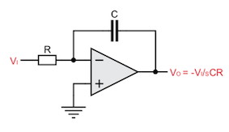
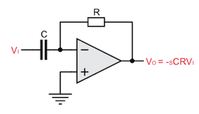

# Integrator und Differenzierer

In diesem Experiement sollen ein Intergrator
`03_fig_01`{.interpreted-text role="numref"} und ein Differenzierer
`03_fig_02`{.interpreted-text role="numref"} untersucht werden. Beide
Schaltungen können als Filterblock eingesetzt werden. Filter sind
Grundlegende Schaltungen in der Analogen Signalverarbeitung und
verbessern das Signal-Rausch-Abstand-Verhältnis(Signal to noise ratio).

{#03_fig_01
.align-center}

Untersucht werden die grundlegenden Funktionen dieser Schaltungen.
Hauptmerkmal der Untersuchung ist der Unterschied zwischen dem
Intergrator und dem Differenzierer und warum der letztere für den
analogen Filterentwurf so gut wie keine Verwendung findet.

{#03_fig_02
.align-center}

Zunächst wird der Frequenzgang der beiden Schaltungen untersucht. Zu
diesem Zweck wird das Programm aus dem Experiment 1 eingesetzt. Die
Simulationen und Messungen sind in `03_fig_03`{.interpreted-text
role="numref"} dargestellt. Diese zeigen ein klares Filterverhalten der
beiden Aufbaueten an.Der Intergrator zeigt ein tiefpassähnliches
Verhalten, kann aber auch als eine Art Bandsperre interpretiert werden.
Der Differenzierer hat ein hochpassähnliches Verhalten, kann aber auch
als Bandpass interprätiert werden. Beide Schaltungen zeigen ein
entgegengesetztes Verhalten.

{#03_fig_03
.align-center}

Aufgrund der Eingangsspannungsbegrenzung des RedPitayas entspricht die
Apmlitudengangmessung nicht exankt der Simulation.

## Intergrator

Die Funktion des Intergrators kann bereits aus dem Namen abgeleitet
werden. Matematisch gesehen, integriert die Schaltung das Eingangssignal
auf. Am Ausgang liegt das Ergebnis diese Intergration an. Da die
Eingangsspannung am negierenden Eingangs des OPAMS anliegt, ist das
Aufintegrieren um $\pi$ verdreht. Das heißt, dass bei einer negativen
Flanke aufintegriert und bei einer positiven Flanke \"abintergriert\"
wird. Der Verlauf ist in `03_fig_04`{.interpreted-text role="numref"}
graphisch dargestellt.

{#03_fig_04
.align-center}

Prinzipiell kann der Intergrationsverlauf mit Hilfe einer
Einheitssprungfunktions verdeutlicht werden. Der Verlauf ist in
`03_fig_05`{.interpreted-text role="numref"} graphisch dargestellt.
Systemtheoretisch kann der Verlauf als negative Intergration der stetig
steigenden Fläche beschrieben werden. Läuft der Einheitssprung ins
Unendliche wird dementsprechend bis ins unendliche Integriert
(idealisiert).

{#03_fig_05
.align-center}

## Differenzierer

Wie bei dem Intergrator kann bei dem Differenzierer die Funktionsweise
aus dem Namen abgeleitet werden. Die Eingangsspannung wird differenziert
und liegt als Ausgangsspannung an. Zum Vergleich wird entsprechend der
Intergratormessung ein Rechtecksignal an den Differenzierer angelegt.
Das Ergebnis ist in `03_fig_07`{.interpreted-text role="numref"}
graphisch dargestellt.

{#03_fig_07
.align-center}

Wie auch bei dem Intergrierer ist die Phase durch die negierten Eingang
um $\pi$ gedreht. Aufgrund der besseren numerischen Auflösung weicht das
Ergebnis der Simulation von der Messung ab. Aus der Messung wird
ersichtlich, dass der Differenzierer prizipiell negiert der
Eingangsspannung folgt, aber eine Einschwingzeit braucht. Die Dauer und
die Höhe des Einschwungs ist frequenzabhängig. Die Folgen dieses
Verhaltens machen einen Einsatz des Differenzierers in einer
Filterstruktur nahezu unmöglich.

Als weiteres Beispiel wird eine Dreieckspannung an den Eingang des
Differenzierers angelegt. Wie auch bei Rechtecksignal muss der
Differenzierer auch bei einem Dreiecksignal einschwingen. Die Simulation
und Messung ist in `03_fig_08`{.interpreted-text role="numref"}
graphisch dargestellt.

{#03_fig_08
.align-center}
