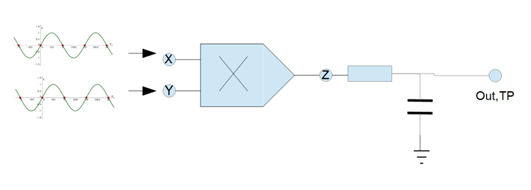

# Self-Tuned Filter

## Abstract

Wenn es um die Signalverarbeitung geht sind Filter unumgänglich, egal ob
es die analoge oder die digitale Signalverarbeitung ist. Die Vorgänger
der digitalen Signalverarbeitung waren schon immer die analoge
Signalverarbeitung. Mit der Zeit haben sich die digitalen Systeme immer
mehr etabliert. Die Pioniere der digitalen Filter verließen sich auf die
Techniken der analogen Vorgänger. Auch heute noch profitieren einige
digitale Filter von der Simulation der analogen Filtern, denn die
analogen Filter enthalten wichtige Eigenschaften.

Die Filter, die auf eine Eingangssteuerspannung mit der Änderung der
Resonanzfrequenz reagieren werden \"self-tuning\" Filter genannt.
Oftmals verfügen diese Filter über eine Gegenkopplungsschaltung mit
einen analogen Multiplizierer oder Phasendetektor. Die \"self-tuning\"
Filter ermöglichen eine automatische Abstimmung der Bandbreite, des
Qualitätsfaktors und/oder der Mittenfrequenz
(`Sasikala2019`{.interpreted-text role="cite"}).

## Einleitung

Das vorliegende Experiment bietet einen Überblick über den analogen
\"self-tuning\" Filter aus theoretischer und praktischer Sicht. Das
umfasst von Implementierung der Schaltung in ein Simulationsmodel,
aufbau der Schaltung auf dem \"Analog System Lab Kit PRO\" board und
Analyse der Messdaten. Es enthält Erkenntnisse über die Funktionsweise
der \"self-tuning\" Filter, deren Bausteine, aus denen sie implementiert
werden.

Das \"self-tuning\" Filter ist ein Sonderfall von analogen Filtern in
elektronischen Schaltungen. Deren Aufgabe ist es Signale mit
unerwünschten Frequenzen oder Rauschen die das gewünschte Signal
überlagern, zu blockieren oder zu dämpfen. Die scharfe Unterscheidung
wird erreicht, indem die Resonanzfrequenz des Filters der Grundfrequenz
des Eingangssignals folgt. Der Gesamtaufbau besteht aus zwei
Hauptblöcken, einmal aus dem spannungsgesteuerten Filter und dem
analogen Phasendetektor. Die Funktionsweise dieser Blöcke wird in den
kommenden Abschnitten beschrieben.

## Theoretische Vorbetrachtung

### Universeller Aktivfilter (Experiment 4)

Der \"Selftuned Filter\" baut auf dem Ergebnis aus Experiment 4 auf.
Daher werden die Grundlagen noch einmal wiederholt. Der universelle
Aktivfilter (vgl. `Universeller_Aktivfilter`{.interpreted-text
role="numref"}) ist ein Aktivfilter, welcher die vier Grundfilterarten
(Tiefpass \[LPF\], Hochpass \[HPF\], Bandpass \[BPF\] und Bandsperre
\[BSF\]) in sich vereint. Wie in der selben Abbildung zu sehen, lassen
sich die Verstärkung und der Q-Faktor mit den Widerständen unten in der
Mitte dimensionieren. Die Mittenfrequenz des Filters lässt sich mit den
Widerständen \"R\" und den Kondensatoren \"C\" einstellen (vgl.
`05_eq_Exp4_UAF`{.interpreted-text role="eq"}).

{#Universeller_Aktivfilter
.align-center}

$$\omega_0 = \frac{1}{RC}$$

Es lässt sich zeigen, dass die Übertragungsfunktionen der einzelnen
Teilfilter, wie in Abbildung
`Übertragungsfunktionen_Exp4`{.interpreted-text role="numref"} zu sehen
beschrieben werden können. Diese werden sich beim Umbau in den
\"Self-tuned Filter\" nicht ändern. $\omega_0$ wird beim Umbau
zeitabhängig.

{#Übertragungsfunktionen_Exp4
.align-center}

### Integrator

Wie in `Integrator`{.interpreted-text role="numref"} zu erkennen,
besteht ein Integrator aus einem Eingang $V_{in}$, einem Widerstand,
einem Kondensator, einem Operationsverstärker und einem Ausgang
$V_{out}$. Ein Integrator hat die Eigenschaft ein Eingangssignal
integrieren zu können.

{#Integrator
.align-center}

In der folgenden Gleichung `Integrator_Herleitung`{.interpreted-text
role="eq"} wird die Übertragungsfunktion eines Integrators hergeleitet.
Hierbei wird davon ausgegangen, dass sich an „+" ein virtuelles
GRD-Potenzial befindet.

Ebenfalls hat ein Integrator Tiefpasseigenschaften, welche im Idealfall
mit der Grenzfrequenz `TP_Integrator`{.interpreted-text role="eq"}
beschrieben werden können. Diese beiden Eigenschaften (Integrieren und
Tiefpass) sind für die Rückführung am Ende der Schaltung (vgl.
`Aufbau_Selftuned_Filter`{.interpreted-text role="numref"}) sehr
wichtig.

$$\omega_0 = \frac{1}{RC}$$

### Multiplizierer

In `Aufbau_Multiplizierer`{.interpreted-text role="numref"} ist der
Aufbau eines Multiplizierers, sowie seine Transferfunktion, zu sehen. SF
(später $U_{SF}$) ist der Eingang für die Referenzspannung, welche
gleichzeitig die Versorgungsspannung darstellt. Die Eingänge X, Y und Z
sind jeweils in zwei Eingänge eines Operationsverstärkers aufgeteilt.
Hierbei gibt der Index 1 immer den positiven und der Index 2 den
negativen Eingang an. Der Ausgang $V_{OUT}$ ist der Ausgang des
Multiplizierers. Die anderen beiden Ausgänge ($+V_S$ und $–V_S$) stellen
die Versorgungsspannung dar und sind bereits intern verbunden. Diese
sind daher für uns nicht von Bedeuteung.

{#Aufbau_Multiplizierer
.align-center}

Ein vereinfachte Version des Multiplizierers ist in
`Einfacher_Multiplizierer`{.interpreted-text role="numref"} zu sehen. Im
Vergleich zu `Aufbau_Multiplizierer`{.interpreted-text role="numref"}
sind die negativen Eingänge von X, Y und Z geerdet und $V_{OUT}$ ist mit
$Z_1$ verbunden. Letzteres wurde experimentell entdeckt und kann daher
nicht weiter begründet werden. Die Referenzspannung $U_{SF}$ wird nur
noch mathematisch betrachtet. Hieraus ergibt sich die vereinfachte
Transferfunktion, welche in `Einfacher_Multiplizierer`{.interpreted-text
role="eq"} zu sehen ist. Es ist nur zu beachten, dass der Betrag von X
und Y nicht über $U_{SF}$ fallen sollte, da der Multiplizierer nur in
diesem Bereich arbeitet.

{#Einfacher_Multiplizierer
.align-center}

$$\begin{aligned}
V_Z = \frac{V_X V_Y}{U_{SF}} \\
\end{aligned}$$

#### Spannungsgesteuerter Tiefpass (Integrator)

Baut man einen Multiplizierer, wie in `Spannung_TP`{.interpreted-text
role="numref"} gezeigt, in einen Integrator vor den Kondensator ein,
dann kann man den Integrator mithilfe der Kontrollspannung $V_C$
steuern. Dies hat direkten Einfluss auf die Transferfunktion des
Integrators und damit auf die Grenzfrequenz der Tiefpasseigenschaft des
Integrators.

{#Spannung_TP .align-center}

Die Herleitung der Grenzfrequenz des spannungsgesteuerten Integrators
ist in `Spannung_TP_Herleitung`{.interpreted-text role="eq"} zu sehen.
Hierbei ist für uns insbesondere die Grenzfrequenz von Bedeutung, dann
die Grenzfrequenz des Universellen Aktivfilters aus Experiment 4
entspricht der Grenzfrequenz der beiden verbauten Integratoren, weshalb
man diese auch immer gleich dimensionieren sollte.

$$\begin{aligned}
0 &= I_{in} + I_{f} \\
0 &= \frac{V_{in}}{R_{in}} + \frac{C \frac{d V_{out}}{dt}  V_C}{U_{SF}} \\
\frac{C \frac{d V_{out}}{dt}  V_C}{U_{SF}} &= - \frac{V_{in}}{R_{in} } \\
\frac{d V_{out}}{dt}  &= - \frac{V_{in} U_{SF}}{R_{in} C V_C} \\
V_{out} &= - \frac{ U_{SF}}{R_{in} C V_C}\int V_{in} dt \\
\end{aligned}$$$$\begin{aligned}
Daraus\ folgt: \\
\omega_0 &= \frac{ U_{SF}}{RC V_C} \\
\end{aligned}$$

#### Phasendetektor mit einem Multiplizierer

Um diesen Phasendetektor zu verstehen, betrachtet man zunächst erstmal
einen vereinfachten Aufbau des Phasendetektors. Wie in
`Phasendetektor`{.interpreted-text role="numref"} zu sehen, wird hierzu
ein Tiefpass hinter den Multiplizierer geschaltet. Die Eingangssignale
sind zwei phasenverschobene Sinussignale.

{#Phasendetektor
.align-center}

In `Herleitung_Phasendetektor`{.interpreted-text role="numref"} ist die
Herleitung des Ausgangssignals des Multiplizierers zu sehen. Dieses Bild
ist einer eigenen Power Point Präsentation entnommen, welche unter dem
[Link](https://github.com/mimeiners/ASLK_PRO/blob/master/math/Experiment_05/Selftuned%20Filter.pptx)
zu finden ist.

{#Herleitung_Phasendetektor
.align-center}

Setzt man nun wie in `Phasendetektor`{.interpreted-text role="numref"}
einen Tiefpass hinter den Multiplizierer werden alle Frequenz abhängigen
Anteile herausgefiltert, wenn die Grenzfrequenz des Tiefpasses klein
genug ist. Daraus ergibt sich die `Mult_TP`{.interpreted-text
role="eq"}.

$$V_{Out,TP} = \frac{V_X V_Y}{2U_{SF}} cos(\phi)$$

Wird der Tiefpass nun mit einem Integrator ersetzt (vgl.
`Mult_Integrator`{.interpreted-text role="numref"}), dann lässt sich die
Spannung aus `Mult_TP`{.interpreted-text role="eq"} in die
Transferfunktion des Integrators (vgl.
`Integrator_Herleitung`{.interpreted-text role="eq"}) einsetzten.
Zusätzlich ist nun auch die Betriebsspannung des benutzten
Operationsverstärkers zu betrachten, da die Transferfunktion des
Integrators da drauf addiert wird. Der auf dem ALSK PRO Board eingebaute
„tl082" hat eine Betriebsspannung bei 82% der Versorgungsspannung
($U_{AMP}$). In `Phase_Int_Herleitung`{.interpreted-text role="eq"} ist
die resultierende Spannungsgleichung zu sehen.

{#Mult_Integrator
.align-center}

$$\begin{aligned}
V‘_{out} &= - \frac{1}{R_{in} C }\int V_{Out,TP} dt \\
V‘_{Out,Integrator} &= - \frac{1}{RC } \int \frac{V_X V_Y}{2U_{SF}} cos(\phi) dt \\
\end{aligned}$$$$\begin{aligned}
Bei\ Betrachtung\ der\ Betriebsspannung:\\
V‘_{Out,Integrator} &= 0,82\ U_{AMP} - \frac{1}{RC } \int \frac{V_X V_Y}{2U_{SF}} cos(\phi) dt \\
\end{aligned}$$

Dieser Phasendetektor ist in einem Regelkreislauf sehr gut um eine Phase
von 90° einzustellen, da die Spannung des Integrators sinkt, wenn die
Phase unter 90° ist und steigt wenn sie über 90° ist. Bei genau 90°
Phasendifferenz wird sich die Spannung am Ausgang des Integrators nicht
mehr ändern.

#### Phase des Universellen Aktivfilters

In `Bandpass`{.interpreted-text role="numref"} ist das Bode-Diagramm des
Bandpass-Ausgangs eines Universellen Aktivfilters zu sehen. Zu erkennen
ist, dass bei einer Phasenverschiebung von -180° zum Eingangssignal das
Betragsspektrum am größten ist. Das ist die Grenzfrequenz des
universellen Aktivfilters.

{#Bandpass .align-center}

Betrachtet man nun den Hochpass (vgl. `Hochpass`{.interpreted-text
role="numref"}) des Universellen Aktivfilters an der gleichen Frequenz,
ist eine Phsenverschiebung von 90° zum Eingangssignal zu erkennen. Diese
Phasenverschiebung lässt sich mit dem zuvor beschriebenen Phasendetektor
einstellen.

{#Hochpass .align-center}

### Aufbau des Selftuned Filters

In `Aufbau_Selftuned_Filter`{.interpreted-text role="numref"} ist der
Aufbau des Selftuned Filters zu sehen. Im Vergleich zum Aufbau des
Universellen Aktivfilters (vgl.
`Universeller_Aktivfilter`{.interpreted-text role="numref"}) ist zu
erkennen, dass spannungsgesteuerte Integratoren statt normale
Integratoren verbaut wurden. Da die Mittenfrequenz des Universellen
Aktivfilters von der Grenzfrequenz der Integratoren abhängt, lässt sich
auf diese Weise die Mittenfrequenz des Universellen Aktivfilters
steuern. Ebenfalls fällt auf, dass mithilfe des Phasendetektors ein
Regelkreislauf aufgebaut ist. Als Eingänge des Phasendetektors wurden
der Hochpass und das Eingangssignal gewählt. Zusätzlich wurde noch ein
Bias mit einem Spannungsteiler ans Ende des Phasendetektors gesetzt.
Damit lässt sich die Kontrollspannung für den spannungsgesteuerten
universellen Aktivfilter voreinstellen.

{#Aufbau_Selftuned_Filter
.align-center}

#### Regelkreislauf des Selftuned Filters

Um den Regelkreislauf des \"Selftuned Filters\" zu erklären, wurde in
`Regelkreislauf_Selftuned_Filter`{.interpreted-text role="numref"} die
Schaltung des \"Self-tuned Filters\" (vgl.
`Aufbau_Selftuned_Filter`{.interpreted-text role="numref"}) als
Blockschaltbild zusammengefasst.

Zu Beginn des Kreislaufs wird das Eingangssignal durch den VCF (Voltage
Controlled Filter, hier: Spannungsgesteuerter universeller Aktivfilter)
mit dem Hochpass gefiltert. Das Hochpasssignal wird im Phasendetektor
mit dem Eingangssignal verglichen. Ist die Phasendifferenz unter 90°,
sinkt die Kontrollspannung ($V_C$) des VCFs und ist sie über 90°, steigt
die Kontrollspannung. So schwingt die Kontrollspannung sich auf die
Spannung ein, bei der die Phasendifferenz zwischen Hochpass und
Eingangssignal genau 90° beträgt und somit die Mittenfrequenz des VCFs
auf die Trägerfrequenz des Eingangssignals eingestellt ist.

{#Regelkreislauf_Selftuned_Filter
.align-center}

Die initiale Kontrollspannung ($V_{C0}$) lässt sich mit folgender Formel
(vgl. `Mult_Int`{.interpreted-text role="eq"}) berechnen. Hierbei Sind
$R_{10}, R_{11}$ und $V_3$ in
`Aufbau_Selftuned_Filter`{.interpreted-text role="numref"} eingezeichnet
und $U_{Amp}$ ist die Versorgungsspannung von $U_4$ der selben
Abbildung.

$$V_{C0} = 0,82 \cdot U_{Amp} \frac{R_{10}}{R_{10}+R_{11}} +V_3 \frac{R_{11}}{R_{10}+R_{11}}$$

## Simulation

Für die Simulation der Schaltung standen zwei Simulationssoftware,
Tina-TI von Texas Instruments und LTspice von Analog Devices, zur
Verfügung, welche auch im Laufe des Projektes verwendet wurden. Mit der
Letzterer wurden die Hauptsimulationen durchgeführt. Zunächst wurde die
Schaltung aus dem Experiment 04 in der Simulation aufgebaut und
Simuliert, um die Funktionsweise des Filters besser zu verstehen. In der
`SchaltungausExperiment4`{.interpreted-text role="numref"} ist der
Schaltplan dargestellt.

{#SchaltungausExperiment4
.align-center}

Gespeist wird über $V_{in}$ ein Sinussignal mit der Frequenz 1 kHz und
der Amplitude 1 V. An den jeweiligen Ausgängen werden die Filterausgänge
abgegriffen, welche in der `SimulationderSchaltung`{.interpreted-text
role="numref"} dargestellt werden.

{#SimulationderSchaltung
.align-center}

Die Grenzfrequenzen werden mit der Formel
`5_eq_grenzfrequenzen`{.interpreted-text role="eq"} bestimmt.

$$\begin{aligned}
f_0 &= \frac{1}{2 \cdot \pi \cdot R \cdot C}  \\
\end{aligned}$$

Da in der Schaltung nur die beiden Kondensatoren frequenzabhängig sind,
wird die Grenzfrequenz über die Zeitkonstante $\tau,(\tau = R \cdot C)$
eingestellt. Über den Widerstand R7 wird die Güte Q eingestellt und R8
dient dazu, den Verstärkungsfaktor einzustellen. All die anderen
Widerstände haben denselben Wert wie der Widerstand R1.

Wesentliche Änderung im Experiment 5 zum Experiment 4 besteht darin,
dass nun sich die Schaltung automatisch auf die Grenzfrequenz einstellen
soll. Dazu werden mehrere analoge Multiplizierer benötigt, sowie eine
Phasendetektorschaltung, die mit Hilfe eines Integrators realisiert
wird. In `SchaltungausExperiment05`{.interpreted-text role="numref"}
wird der Schaltplan abgebildet.

{#SchaltungausExperiment05.align-center}

Gespeist wird ein 1 kHz Rechtecksignal mit der Amplitude 100 mV. Für die
bessere Übersicht wurden einige Komponente wie Widerstände oder auch
Spannungsquellen parametrisiert. Über die Widerstände R10 und R11 wird
die Range (Bandbreite) eingestellt, in der sich das Filter Einstellen
kann. Über die Spannungsquelle V3 wird die Referenzspannung eingestellt.
Die maximale Spannung liegt bei 10 V, was auf die Referenzspannung der
Multiplizierer zurück zu führen ist (beträgt auch 10 V).

## Messung

Für den Aufbau der Schaltung wurde das ASLK PRO Board verwendet. In der
`MessaufbauaufdemASLKPRO`{.interpreted-text role="numref"} ist der
Aufbau abgebildet.

{#MessaufbauaufdemASLKPRO.align-center}

Wie in der `MessaufbauaufdemASLKPRO`{.interpreted-text role="numref"} zu
sehen ist, wurden fast alle Bauteile, die auf dem ASLK PRO Board verbaut
sind, für den Schaltungsaufbau verwendet. Da die Bauteile einzeln auf
dem Board vorhanden sind, wurde die Bauteile mit Hilfe von Jumper-Wire
verbunden. Durch die Verwendung der Drähte konnte am Anfang keine
stabile Messung durchgeführt werden. Nach kleineren Fehlerbehebungen
konnten Messungen durchgeführt werden. In den nachfolgenden Abbildungen
sind die gemessenen und die theoretisch ermittelten Signalverläufe
dargestellt.

{#MessungimLabor.align-center}

Grüne Linie -\> Eingangssignal

Blaue Linie -\> Bandpasssignal

Orangene Linie -\> Bandsperre

{#MessergebnisausderSimulation.align-center}

Auf den Bildern ist deutlich zu erkennen, dass die Simulation mit den
gemessenen Werten übereinstimmt. Bei weiteren Messungen zur Verifikation
der Schaltung kamen immer wieder Probleme mit der Verdrahtung der
Schaltung. So konnten nicht alle Messungen aus dem Aufgabenblatt
durchgeführt werden. Für die weitere Verifizierung der Schaltung wurde
vorgeschlagen die Platine neu zu ätzen, um die Problematik mit der
Verdrahtung auszuschließen.

## Fazit

Das Experiment baut auf dem Experiment 4 auf. Es wurden verschiedene
Bestandteile untersucht, dazu gehört der Integrator, der Multiplizierer,
der spannungsgesteuerte Integrator und der Phasendetektor. Das
grundsätzliche Verhalten vom \"self-tuning\" Filter wurde ersichtlich.
Es wurde festgestellt, dass der Filter von Phase und Mittenfrequenz
abhängig ist.

Trotzdem kam es zu Abweichungen der Messergebnisse von den simulierten
Daten. Es ist darauf zu schließen, dass der Schaltungsaufbau mit einem
riesigen Kabelmanagement auf dem ASLK PRO Board daher geht.

## Ausblick

Die Schaltung aus Experiment 05 könnte auf eine Platine gelötet werden,
um mögliche Schaltungsfehler zu minimieren. Weiterhin könnte zu dem
Multiplizierer noch ein Offset hinzugefügt werden, um negative Offsets
auszugleichen. Außerdem kam die Frage auf „Warum muss das Ausgangssignal
an Z zurückgeführt werden?" Sowie zur Beschreibung der Rückkopplung am
Ende der Schaltung könnte eine Formel erstellt werden, die das Verhalten
beschreibt.

## Literaturverzeichnis

::: {.bibliography style="plain"}
Experiment_00.bib
:::
