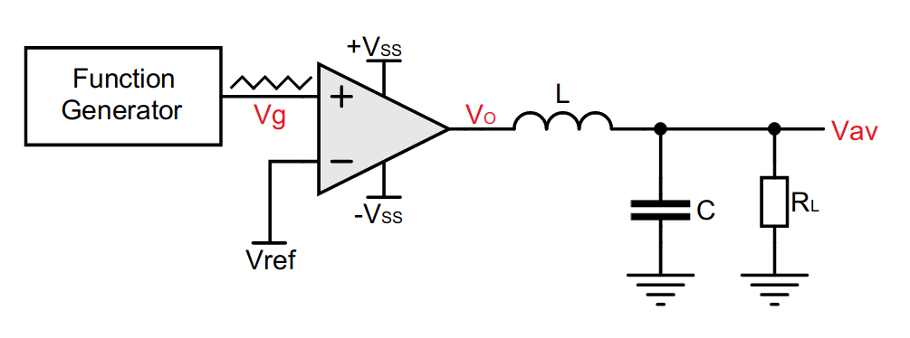
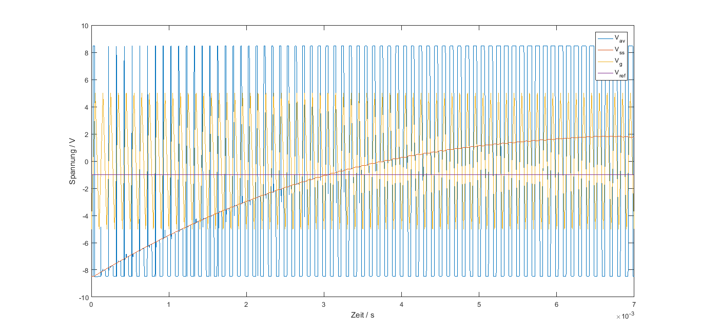

# DC-DC Wandler

## Kurze Theorie und Motivation

Ein DC-DC Wandler wird dazu genutzt, um eine DC-Spannung in eine andere
DC-Spannung umzuwwandeln. Hierbei kann die Spannung am Ausgang gegenüber
der Eingangsspannung in ihrer Größe verändert oder auch invertiert sein.
Die Ausgangsspannung und ihr Schaltverhalten ist hierbei abhängig von
den einhergehenden Größen des DC-DC-Wandlers.

Die einspeisende Gleichspannung $V_{ref}$ und die aus dem
Funktionsgenerator einfließende Dreiecksspannung $V_{g}$, dienen als
Referenzwert dazu, in welchem Takt der Operationsverstärker schaltet.
Die Ausgangsgröße des Operationsverstärkers $V_{o}$ bildet sich demnach
aus der einfließenden Dreiecksspannung, der einfließenden
Gleichspannung, sowie der Versorgungsspannung $V_{ss}$, welche die Größe
der Ausgangsspannung $V_{o}$ bestimmt. Ein abschließender
LC-Tiefpassfilter hinter dem Operationsverstärker wird zur
Stabilisierung und damit zur Glättung der Ausgangsspannung $V_{av}$
genutzt.

## Funktionsaufbau DC-DC Wandler

Für die nachfolgende Bearbeitung wird auf zwei unterschiedliche
Schaltungen eingegangen. Begonnen wird hierbei mit einem DC-DC Wandler,
welcher mithilfe eines aus einem Funktionsgenerator generierten Signals,
eine Ausgangsspannung erzeugen soll, dargestellt in
`09_fig_01`{.interpreted-text role="numref"}.

{##09_fig_01
.align-center}

Die eingespeiste Dreiecksspannung aus dem Funktionsgegenrator $V_{g}$,
zusammen mit der Referenzspannung $V_{ref}$ bestimmen das Tastverhältnis
des Komparators und geben so die Länge der Pulse an, in welchem die
Ausgangsspannung $V_{o}$ aus dem Operatonsverstärker austritt. Für das
Tastverhältnis ergibt sich folgende Referenz:

$$\frac{\tau}{T} = \frac{1}{2}(1-V_{ref}/V_{p})$$

T gibt hierbei die Periode des aus dem Funktionsgegenrator ausgehenden
Dreiecksignals an. Das Tastverhältnis ist hierbei proportional zur
Referenzsspannung $V_{ref}$. Die Größe der Ausgangsspannung ist hierbei
abhängig von der Betriebsspannung $V_{ss}$ des Operationsverstärkers und
der Referenzspannung $V_{ref}$. Mithilfe eines LC-Tiefpasses ist es
möglich, es stabiles Ausgangssignal $V_{av}$ zu erhalten.

## Simulation DC-DC Wandler

Mithilfe der Software LTSpice XII ist es möglich, den Schaltungsaufbau
zu simulieren. Die Schaltung wird hierbei nach dem Schema aus
`09_fig_01`{.interpreted-text role="numref"} entworfen.

{##09_fig_02 .align-center
.Simulation .der .Ein- .und .Ausgangsspannungen}

Die `09_fig_02`{.interpreted-text role="numref"} zeigt den Verlauf der
Spannungen $V_{ref}$, $V_{g}$, $V_{o}$ und $V_{av}$. Der steigende
Verlauf der Ausgangsspannung $V_{av}$ lässt sich auf die verbaute Spule
und den Kondensator zurückführen, welche durch die Lade- und
Entladezyklen den Verlauf der Kurve herbeiführen.

{##09_fig_03
.align-center}

Nach t = 6ms hat sich die Spannung $V_{av}$ auf einen Wert von ungefähr
U = 2V eingestellt. Aus der `09_fig_03`{.interpreted-text role="numref"}
lässt sich erkennen, dass sobald die Referenzspannung $V_{ref}$ größer
ist als die eingeführte Dreiecksspannung $V_{g}$, so schaltet der
Komparator auf die eingestellte Spannung $-V_{ss}$ um. Andersherum,
sollte $V_{ref}$ kleiner werden als $V_{g}$, so schaltet der Komparator
auf die Spannung $+V_{ss}$ um. Somit vergleicht der Operationsverstärker
diese Spannungen miteinander um anschließend einen Anstieg oder Abstieg
von $V_{o}$ herbeizuführen. Wird die Referenzspannung möglichst nah an
dem negativen Maximum der eingespeisten Dreiecksspannung gehalten, so
kommt es bei der Ausgabe von $V_{av}$ zu einer erhöhten Spannung, da der
Komparator durchgehend eine postive Spannung ausgibt und die daraus
resultierende Spannung $V{av}$ hiervon abhängig ist.

## Messungen des DC-DC Wandlers

Nachdem die Simulationen für die Schaltung durchgeführt sind, werden die
Messungen am Texas Instruments Board durchgeführt. Hierdurch kann ein
klarer Vergleich zur Simulation hergestellt werden.

{##09_fig_04
.align-center}

Die `09_fig_04`{.interpreted-text role="numref"} zeigt die Ergebnisse
für die unterschiedichen Spannungen aus den Messungen. Vergleichen wir
diese mit den Ergebnissen aus der `09_fig_03`{.interpreted-text
role="numref"}, so erkennt man die genauen Parallelitäten der
Abbildungen.

Wie schon zuvor erwähnt, kann mithilfe der eingehenden Dreiecksspannung
$V_{g}$ und der Referenzspannung $V_{ref}$, das Ausgangssignal varriert
werden. Somit findet der zuvor erwähnt Vergleich der Spannungen auch
hier in der Messung statt. Werden unterschiedliche Größen der
Referenzspanung eingestellt und die daraus resultierenden Plots
nacheinander angezeigt, so erkennt man den Ansteig der Ausgangsspannung
in abhängigkeit der Referenzspannung. Das eingehende Dreieckssignal
$V_{g}$ wurde hierbei nicht verändert. Auch dies kann varriert werden,
um ein entsprechendes Verhalten am Ausgangssignal zu erhalten. Dies ist
darauf zurückzuführen, dass durch die Größe, sowie die Pulsbreite des
Signals, die Abstastung über der Referenzspannung, ein unterschiedliche
Triggerverhalten des Operationsverstärkers auslösen würde.

::: only
html

{##09_fig_05
.align-center}
:::

::: only
latex

{##09_fig_05
.align-center}
:::

Sobald die grüne Kennlinie, welche die Referenzspannung anzeigt, die
Dreiecksspannung trifft, schaltet der Operationsverstärker durch. Das
Ausgangssignal, hier dargestellt als Dunkelblaue Kennlinie, ist in
seiner Größe davon abhängig, in welchen Abständen die Referenzspannung
auf das Dreieckssingal trifft. Desto größer die Abstände, umso größer
die ausgehende Rechteckspannung die daraus resultierende Geichspannung.

## Funktionsaufbau SMPS Schaltnetzteil

Das Ziel des SMPS Schaltnetzteils ist gleichzustellen mit dem zuvor
schon bearbeiteten Dc-Dc-Wandlers. Ein einhergehendes gepulstes
Eingangssignal, soll in eine stabile Gleichspannung als Ausgangssignal
umgewandelt werden. Nachdem ein Blick auf die Schaltung geworfen wird,
werden allerdings schon schnell die Schaltungstechnischen Unterschiede
klar.

{##09_fig_06
.align-center}

Die Schaltung aus der `09_fig_06`{.interpreted-text role="numref"}
beinhaltet vier wesentliche Elemente, welche zur Umsetzung des
Schaltnetzteils von Nöten sind. Das einhergehende Dreieckssignal
$V_{g1}$ wird auf den Minuseingang des ersten Operationsverstärkers
gegeben. Die Beschaltung dieses Opeartionsverstärkers ist eine besondere
Form, welche sich Schmitt-Trigger nennt. Die genauen Spezifikationen
eines Schmitt-Triggers finden sich in dem Experiment 02 wieder. Das auf
den positiven Eingang des Schmitt-Triggers eingehende Signal resultiert
aus dem Ausgangssignal $V_{F2}$, welches durch den zweiten
Opeartionsverstärker mit einer Referenzspannung verglichen wird. Somit
dient der untere Operationsverstäker als Komparator. Das anschließende,
aus dem unteren Operationsverstärker resultierende Signal läuft nun in
den positiven Eingang des Schmitt-Triggers.Das Ausgangssignal des
smith-Triggers ist ein Rechteckiges Signal, welches durch einen Tiefpass
noch gefiltert wird befor es als Ausgangs Signal verwendet wird. Die
vier wesentlichen Elemente sind also der Schmitt-Trigger, der
Komparator, der Tiefpass, sowie die eingebaute Regelstrecke, welche das
Ausgangssignal versuchen soll stabil zu halten. Ein genauerer Blick auf
die einzelenen Komponenten erleichtert das Verständnis für den Aufbau
und das genaue Zusammenwirken der einzelnen Komponenten.

{##09_fig_07
.align-center}

Die Abbildung `09_fig_07`{.interpreted-text role="numref"} beschreibt
die Eigenschaften des in der Schaltung integrierten Komparators. Das
restwellige Ausgangssignal schneidet die in den Operationsverstärker
einfliessende Gleichspannung (Referenzspannung). Sobald die
Ausgangsspannung einen Wert über den der Referenzspannung annimmt,
schaltet der Operationsverstärker auf seinen eingestellten, negativen
Spannungswert um. Sollte der Wert der Ausgangsspannung die
Referenspannung unterschreiten, so schaltet der Operationsverstärker auf
seine maximale Spannungsausgabe um. Durch das Verändern der
Referenzspannung in ihrerer Größe, kann somit der Trigger des
Operationsverstärkers verändert werden. Dies verhält sich ähnlich dem
Komparator aus dem ersten Aufgabenteil.

{##09_fig_08
.align-center}

Das hieraus resultierende gepulste Ausgangssignal wird dann über den
Schmitt-Trigger mit dem eingespeisten Dreieckssignal verglichen. Durch
die Beschaltung des Operationsverstärkers als Schmitt-Trigger, generiert
sich eine Hystherese, durch welche dann die ausgehende Pulsbreite der
Rechteckspannung bestimmt wird. Diese Schwellspannung, mit unterem
Schwellwert und oberem Schwellwert ist abhängig von der eingestellten
Größe des Spannungsteilers, bestehend aus $R_{3}$ und $R_{4}$. Diese
beiden Widerstandswerte haben Einfluss auf den Wert $\beta$, welcher
wiederum dazu genutzt werden kann, die Schwellspannung einzustellen. Der
genaue Versuch zum Schmitt-Trigger kann wie schon zuvor erwähnt, im
Experiment 02 recherchiert werden.

$$\beta = \frac{R_3}{R_3 + R_4}$$

{##09_fig_09 .align-center}

{##09_fig_10 .align-center}

Sind $R_{3}$ und $R_{4}$ in ihrer Größe deklariert, so gibt der
Schmitt-Trigger das gewünscht Signal aus. Hierbei wird das
Ausgangssignal aus dem Operationsverstärker gepulst an das positive,
sowie negative Maximum geschaltet. Durch die verwendung des
Smith-Trigger ist es somit möglich durch Veränderung der Widerstände,
das Ausgangssignal einzustellen. Dies ist davonabhängig, welche
Versorgungsspannung an dem Operationsverstärker anliegt. Der
nachfolgende Tiefpass sollte so ausgelegt werden, dass aus dem
Rechtecksignal eine möglichst stabile Gleichspannung erzeugt werden
kann. Die Restwelligkeit sollte hierbei so gering wie möglich sein.
Durch die Regelstrecke, ist die Ausgangsspannung bei Verschiedenem
Lastwiderstand ,mit geringe Abweichung, stets dieselbe. Sollte der
Spannungsabfall an der Last sich verändern, so regelt sich das System
durch den Komparator und des daraus entstehenden Eingangssignals am
Schmitt-Trigger erneut wieder ein.

## Messung des SMPS Schaltnetzteil

Nachdem die Simulationen für die Schaltung durchgeführt sind, werden die
Messungen am Texas Instruments Board durchgeführt. Hierdurch lassen sich
die Simulation Überprufen. Zuerst wird dass Ausgangssignal in
Abhängigkeit der Referenspannung untersucht.

{##09_fig_11 .align-center}

{##09_fig_12 .align-center}

Wobei Channel 1 (Dunkel Blau) der Positive Eingang des Sschmitt-Triggers
ist, Channel 2 (Pink) ist der Ausgang des Schmitt-Triggers, Channel 3
(Hell Blau) ist die Dreieckes Spannung und Channel 4 (ocker) ist das
Ausgangs Signal. Es ist zu erkennen, das bei einer höheren
Referenzspannung die Ausgangsspannung ebenfalls höher ausfällt. Wenn die
Ausgangsspannung abfällt und somit kleiner wird als die nicht gemessene
Referenzspannung wird der untere Operatiosverstärker auf seinen
Positiven Ausgabewert geschaltet. Desweiteren ist eine Restwelligkeit im
Ausgangssignal zusehen. Diese ensteht durch einen nicht optimale
Ausgelegten Filter, zeigt aber gut wie die Regelstrecke bei einen
Spannungsabfall wirkt.

> {##09_fig_13 .align-center}
>
> {##09_fig_14 .align-center}
>
> {##09_fig_15 .align-center}
>
> {##09_fig_16 .align-center}

Bei diesen Messungen wird der Schmitt-Trigger untersucht. Hierführ wird
der Widerstand R4 bei Konstanten Eingangsspannung variiert. Die kanal
Belegung des Oszilloskop ist die selbe wie bei der letzten Messung. Es
ist deutlich zu erkennen, das mit höheren Widerstand die Breite der
Ausgangs Pulse größer wird. Durch die änderung der Pulsbreite ändert
sich die Ausgangsspannung, welche in diesen fall bei größeren Widerstand
größer wird. Dieses Verhalten ist erwarten und entspricht denn verhalten
des Schmitt-Triggers.
