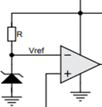
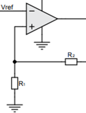
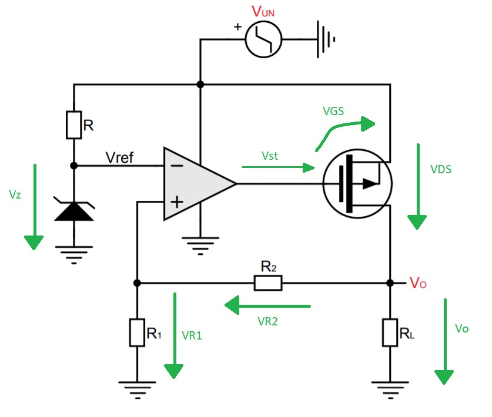
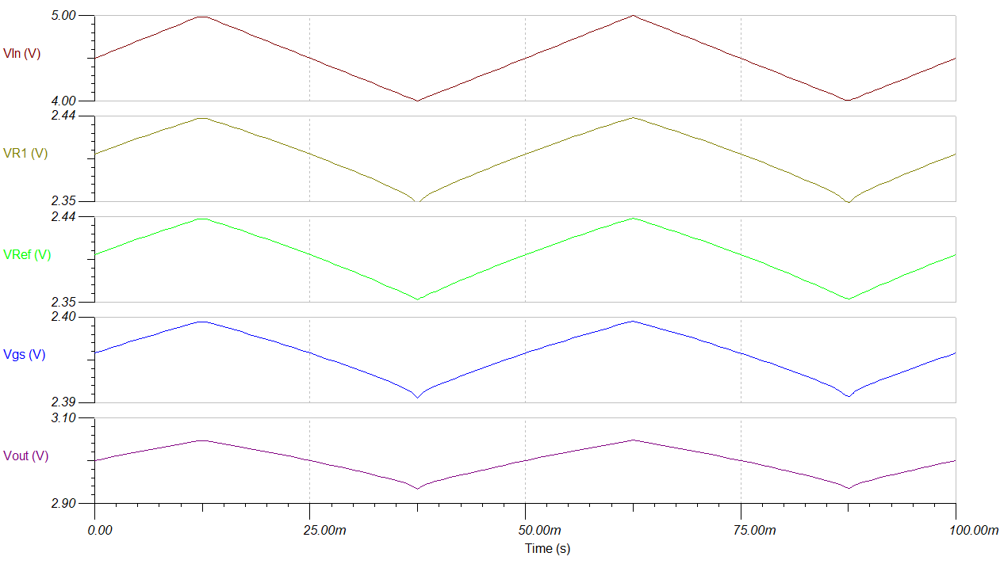
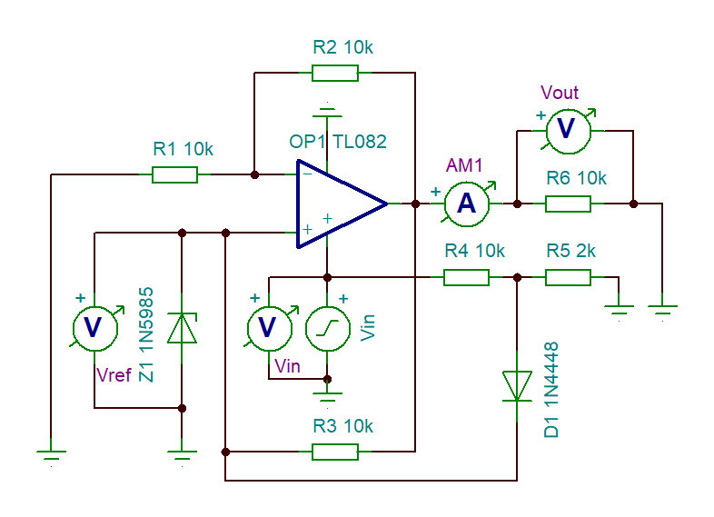
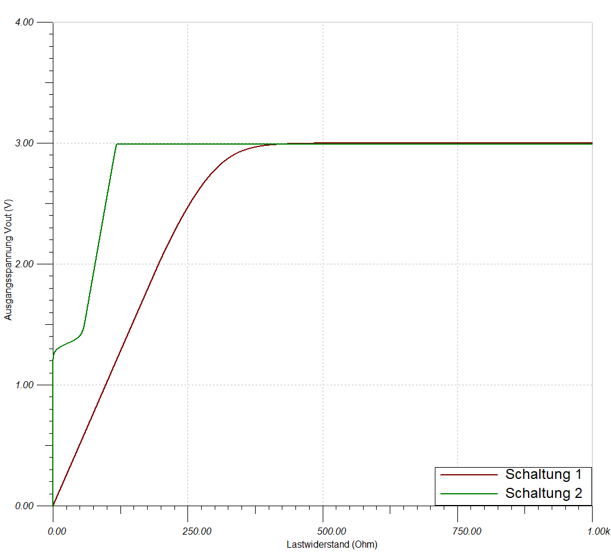
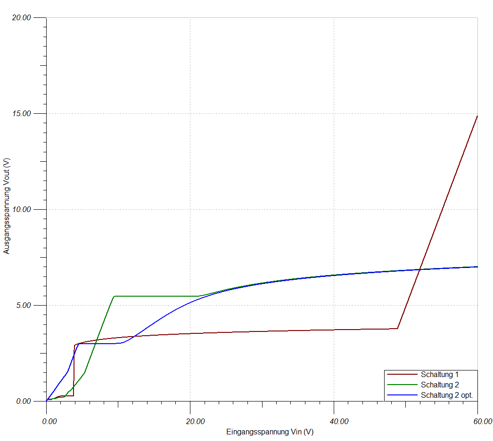
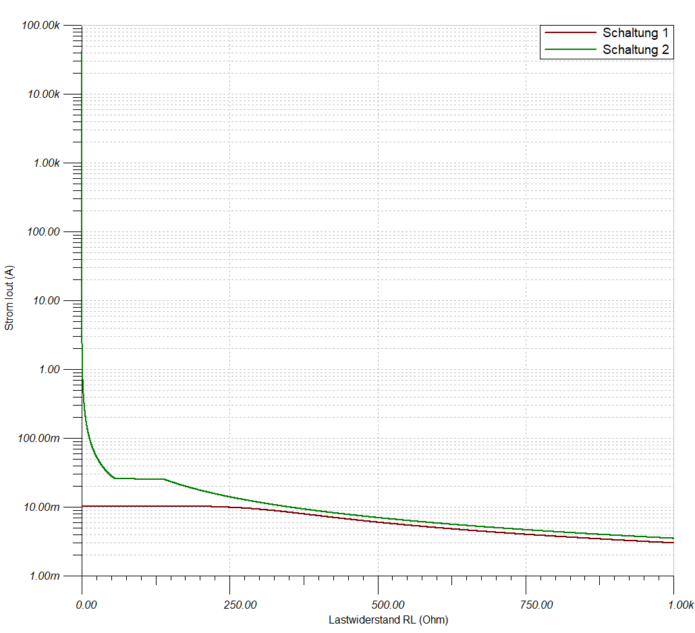

# Entwurf eines LDO Reglers

## Kurze Theorie und Motivation

Um eine feste, vorgegebene Spannung in eine beliebige Wunschspannung
umzuwandeln, werden Spannungsregler verwendet. Für niedrige Spannungen
kann ein \"Low Dropout Regler\" (LDO) verwendet werden. Dieser zeichnet
sich für seine hohe Effizienz und seine rauscharme Umwandlung aus.
Außerdem kann durch Anpassung der Ausgangsspannung des LDOs die
Effizienz der angeschlossenen Komponente gesteigert und damit einher die
Abwärme reduziert werden.

Gegenüber den DC/DC PWM gesteuerten Spannungswandlern hat der LDO keine
Welligkeit in der Ausgangsspannung. Außerdem werden nur wenige
zusätzliche Bauteile benötigt, was zusätzlich das Designen von Platinen
erleichtert.

### Dropout

Der Dropout entspricht der Differenzspannung zwischen dem Ein- und
Ausgang und fällt so über dem LDO ab. Eine Dropoutspannung fällt immer
an, sodass erst ab einer ausreichenden Eingangsspannung die gewünschte
Ausgangsspannung ausgegeben werden kann. Mit steigender Eingangsspannung
steigt die Dropoutspannung ebenfalls.

### Aufschluesselung der Funktionsgruppen

Anhand des ersten Versuchs soll ein Spannungsregler mit Hilfe eines
Operationsverstärkers, einem PMOS-FET und weiteren Bauteilen realisiert
werden. Das Ziel ist es eine Ausgangsspannung $V_{0}$ von $3V$ zu
erhalten, während die Eingangsspannung $V_{UN}$ zwischen $4V$ und $5V$
variiert. Zur Verfügung steht eine Schaltung mit unbekannten Variablen.
Diese gelten nun zu bestimmen. Die Schaltung sieht wie folgt aus
`10_fig_01`{.interpreted-text role="numref"}:

{##10_fig_01 .align-center
.LDO-Regulator .[1]}

Da auf dem ASLKpro-Board bestimmte Bauteile vorgegeben sind, setzen wir
bei dem Operationsverstärker auf den TL082 und bei dem P-MOS auf den
BS250P. Um die restlichen benötigte Bauteile zu bestimmen ist es hierzu
von Nöten die Aufgabe der einzelnen Bauteile zu kennen!

### Referenzspannung

Die Referenzspannung $V_{ref}$ wird durch die Zenerdiode und dem
Vorwiderstand $R$ bestimmt. Eine Zener-Diode wird verwendet um den
Zener-Effekt zu nutzen. Solange die Eingangsspannung größer als die
Durchbruchspannung der Zener-Diode ist, liegt die Durchbruchspannung an
der Zener-Diode an. Dies bedeutet, dass dort dauerhaft eine
gleichbleibende Spannung vorhanden ist, obwohl die Eingangsspannung
variieren kann. Die Spannungsdifferenz zwischen Eingangsspannung und
Durchbruchspannung fällt über den Vorwiderstand $R$ ab.

{##10_fig_02 .align-center
.Referenzspannung .[1]}

Um die Zenerdiode zu bestimmen, muss die Referenzspannung ausgerechnet
werden. Diese erhalten wir über die folgende Formel:

Herauszulesen ist, dass $V_{0}$ über die Referenzspannung und dem
Verhältnis der Widerstände $R_{2}$ zu $R_{1}$ eingestellt werden kann.
Durch das auflösen der Klammer wird nochmal verdeutlicht, dass $V_{ref}$
kleiner sein muss als $V_{0}$:

$$\begin{aligned}
V_{ 0 }= V_{ ref } + V_{ ref }\frac{ R_{ 2 } }{ R_{ 1 } } \\
\end{aligned}$$

Da in unserem Fall eine Ausgangsspannung von $V_{0} = 3V$ gefordert ist
ergibt sich hierfür folgendes Ergebnis:

Wie zuvor erwähnt, entspricht die Referenzspannung der
Durchbruchspannung der Zenerdiode. Daher ist nun eine Zenerdiode zu
wählen, deren Durchbruchspannung $U_{Z} < 3V$ entspricht. Hierfür kann
z.B. eine Zenerdiode mit $U_{Z} = 2,4V$ oder $U_{Z} = 2,7V$ verwendet
werden. In unserem Fall haben wir uns für eine Z-Diode mit
$U_{Z} = 2,4V$ entschieden. Daher entspricht $V_{ref} = 2,4V$

Nun wird der Vorwiderstand R bestimmt. Dieser dient dazu den
Durchbruchstrom einzuhalten, der im Datenblatt der Z-Diode zu finden
ist. In unserem Fall beträgt dieser $5mA$. Mit dem Ohmschen Gesetz kann
nun der Widerstand $R$ bestimmt werden:

$I_{-op}$ entspricht dem Strom, der in den Operationsverstärker
abgeführt wird. Da hier jedoch der Idealfall betrachtet wird, ist der
Eingangswiderstand unendlich groß und somit wäre $I_{-op} = 0A$. Daher
ergibt sich folgender Vorwiderstand:

### Spannungsteiler/Rückführgröße

Da bereits Vref gewählt wurde, kann nun das Verhältnis der Widerstände
$R_{2}$ zu $R_{1}$ bestimmt werden.

{##10_fig_03 .align-center
.Spannungsteiler ./ .Rückführgröße .[1]}

Durch einsetzen von $V_{ref} = 2,4V$ und $Vo = 3V$ ergibt sich folgendes
Verhältnis:

Somit muss $R_{1}$ viermal so groß wie $R_{2}$ gewählt werden. Außerdem
ist zu beachten, dass um so größer die Widerstände gewählt werden,
Toleranzen immer weniger eine Rolle spielen und so die Ausgangsspannung
$V_{0}$ stabiler wird. Daher haben wir uns für $R_{1} = 100k\Omega$ und
$R_{2} = 25k\Omega$ entschieden.

### PMOS

Wie schon erwähnt, können mit einem LDO Spannungen auf eine stabile
Spannung hochtransformiert werden. Beispielsweise von $3,3V$ auf $4V$.
Der PMOS ist so verbaut, dass die entstehende Spannung vom
Source-Anschluss zum Gate-Anschluss die $U_{DS}$ Spannung bildet. Diese
wiederum beeinflusst unsere Zielspannung $V_{0}$. $V_{0}$ ist die
Differenz aus der Eingangsspannung $V_{UN}$ und der Spannung $U_{SG}$,
die am PMOS anliegt und auch Dropout-Spannung genannt wird. Die Spannung
$U_{SG}$ reguliert den Stromfluss zwischen dem Source-Anschluss und dem
Drain-Anschluss. Somit steuert allgemein gesagt die Spannung $U_{SG}$
die Spannung $U_{SD}$. Da bei Beeinflussung des Stromes sich auch die
Spannung entsprechend ändert.

### Regelstrecke

Die Referenzspannung entspricht der Spannung von von $R_{1}$ die durch
den Spannungsteiler entsteht. Diese beiden Spannungen werden im OP
miteinander verglichen. $V_{ref}$ zu $V_{out}$ ist das gleich wie
$R_{1}$ zu ($R_{1}+R_{2}$). Vref muss kleiner als $V_{0}$ sein, daher
wurde als Diodenspannung $2,4V$ gewählt. An $R_{1}$ liegt die
Diodenspannung an und an $R_{2}$ die Differenz von Diode und $V_{0}$,
also ungefähr $0,6V$. Die Spannung an dem Widerstand $R_{1}$ ist die
Rückführgröße und diese wird permanent mit der Referenzspannung
verglichen. Da es sich ständig ändert (auch wenn minimal) entsteht eine
Frequenz, die in unserem Fall ca. $250kHz$ entspricht. Also um es
nochmal zu sagen, über den OP steuert man den Stromfluss am PMOS, der
von Source zu Drain fließt, welche somit auch die VDO Spannung dann
beeinflusst. Die Spannung die aus dem OP austritt steuert folglich dann
den Gate-Anschluss vom PMOS an.

{##10_fig_04 .align-center
.Darstellung .Regelstrecke .[1]}

### Stabilisierung der Spannung bei Änderung des Lastwiderstandes

Zusätzlich regelt die Regelstrecke für einen bestimmten
Widerstandsbereich für $R_{L}$ die Spannung $V_{0}$ auf konstant $3V$.
Wenn man $R_{L}$ jetzt kleiner dimensioniert dann wird der Strom $I_{L}$
größer. Dieser Strom fließt auch durch den PMOS also steigt folglich der
Source-Drain Strom auch. Nach den Regeln des Ohmschen Gesetzes muss auch
die Spannung $V_{SD}$ steigen. Dadurch sinkt dann die Spannung $V_{0}$.
Weil es gilt: $V_{IN} = V_{SD} + V_{0}$. Also wenn $V_{SD}$ größer wird
muss $V_{0}$ kleiner werden. Folge davon für den Rückführwert ist, dass
an $R_{1}$ nun eine kleinere Spannung anliegt. Somit ist am + Anschluss
des OP eine kleinere Spannung, sodass der Verstärker invertiert. Jetzt
liegt eine größere negative Spannung am Gate des PMOS an. Damit steigt
logischer Weise die Spannung $U_{GS}$ und dies führt dazu, dass ein
höherer Source-Drain Strom fließt. Denn je höher die Gate Source
Spannung ist, desto größer wird der Source-Drain Strom, da der
Widerstand $R_{SD}$ wird kleiner. Folge davon ist, dass die Spannung
$V_{SD}$ sinkt. Dann entsteht wieder durch das Verhältnis
$V_{IN} = V_{SD} + V_{0}`ein Ausgleich, weil die Spannung an :math:`V_{0}$
wieder ansteigt, da $V_{SD}$ gesunken ist. Somit werden konstant $3V$
für einen bestimmten Widerstandsbereich der Last gehalten.
Zusammengefasst kann man sagen, dass der Regelkreis für einen bestimmten
Lastbereich für $R_{L}$ unabhängig arbeitet und trotzdem $3V$ hält.

## [TinaSpice](https://www.ti.com/tool/TINA-TI) Simulationen

**10.4.1 Schaltung Nr.1**

Simuliert mit [TinaSpice](https://www.ti.com/tool/TINA-TI) schaut der
Aufbau wie folgt aus `10_fig_05`{.interpreted-text role="numref"}:

{##10_fig_05 .align-center
.Schaltung .1 .mit .TinaSpice .simuliert .[2]}

{##10_fig_06 .align-center
.Schaltung .1 .Messung .mit .TinaSpice .simuliert .[2]}

Anhand der Messung `10_fig_06`{.interpreted-text role="numref"} ist zu
erkennen, dass die Ausgangsspannung Vo (in lila dargestellt) leicht
variiert. Dies ist auf die Referenzspannung Vref (in grün dargestellt)
zurückzuführen. Da die Eingangsspannung um $+-0,5V$ variiert ändert sich
somit auch der Strom, der durch den Vorwiderstand $R$ eingestellt wurde.
Somit variiert die Durchbruchspannung um ungefähr $0,05V$. Effektiv
bleibt die Durchbruchspannung jedoch bei den gewählten $2,4V$. Durch
diesen Einfluss variiert auch am Ausgang die Spannung Vo um $+-0,05V$.
Mit Hilfe eines Kondensators kann bei Bedarf die Ausgangsspannung
geglättet werden. Hierzu muss dieser parallel zur Last angeschlossen
werden. Vgs entspricht der Differenzspannung zwischen dem Ausgang des
Operationsverstärkers und der Sourcespannung. Die zurückgeführte Größe,
die über $R_{1}$ gemessen wurde (VR1 in dunkelgrün) entspricht der
Referenzspannung, die aus dem Ausgang durch das Widerstandsverhältnis
zurück gewandelt wurde. Somit findet eine dauerhafte Nachregelung statt,
damit der Ausgang nahezu stabil bleibt. Somit kann die Restwelligkeit
bestimmt werden, welche wie folgt bestimmt wird:

**10.4.2 Schaltung Nr.2**

Für die 2. Schaltung `10_fig_07`{.interpreted-text role="numref"} wird
ein gängiger Spannungsregler verwendet. Die Komponenten wurden soweit
aus den Unterlagen des Manuels entnommen und mit den beiden Dioden
verwendet.

{##10_fig_07 .align-center
.Schaltung .2 .mit .TinaSpice .simuliert .[2]}

Es ist das gleiche Ziel dieser Schaltung, eine Ausgangsspannung von $3V$
zu erzeugen, während die Eingangsspannung von $4V$ bis $5V$ variiert
(grün). Die Referenzspannung (blau) über der Diode variiert zwischen
$1,62V$ und $1,74V$. Die Ausgangsspannung, welche über $R_{6}$ gemessen
wird, variiert ebenfalls. Hier schwankt die Spannung zwischen $2,5V$ und
$3,5V$, sodass zu erkennen ist, dass der Eingangswechselspannungsanteil
1:1 auf den Ausgang übergeben wird. Die Restwelligkeit beträgt somit:

{##10_fig_08 .align-center
.Schaltung .2 .Messung .mit .TinaSpice .simuliert .[2]}

**10.4.3 Load Regulation im Vergleich**

Die Load Regulation beschreibt das Verhalten der Ausgangsspannung bei
Änderung der Last. Die Last ist hier als Laststrom gemeint, der mit
sinkendem Ausgangswiderstand steigt. Betrachtet wird der Bereich, sobald
die Ausgangsspannung von $3V$ erreicht wird und berechnet sich über
folgende Formel:

Beträgt die Load Regulation 0%, so ist die Schaltung Last unabhängig,
was der Idealfall wäre. Da wir jedoch nur die Simulationen betrachten
können, wird hier der Idealfall eintreten. Für die erste Schaltung (rot)
ist die Ausgangsspannung ab $500 \Omega$ stabil und die Load Regulation
beträgt 0%. Für die 2. Schaltung beträgt die Ausgangsspannung $3V$
bereits ab einen Widerstand von $120\Omega$.

{##10_fig_09 .align-center .Load
.Regulation .im .Vergleich .mit .TinaSpice .simuliert .[2]}

**10.4.4 Line Regulation im Vergleich**

Die Line Regulation beschreibt das Verhalten der Ausgangsspannung
während sich die Eingangsspannung verändert. Beträgt die Line Regulation
0%, so wird bei einer variierenden Eingangsspannung eine saubere
Gleichspannung ausgegeben. Es ist also kein Wechselspannungsanteil mehr
vorhanden. Da die Eingangsspannung in unserem Fall zwischen $4V$ und
$5V$ variiert, haben wir diese Werte gewählt. Der Lastwiderstand wurde
auf $10k\Omega$ festgelegt.

{##10_fig_10 .align-center .Line
.Regulation .im .Vergleich .mit .TinaSpice .simuliert .[2]}

So ergibt sich für die erste Schaltung eine Line Regulation von:

Ebenfalls ist zu erkennen, dass die erste Schaltung in dem Bereich
zwischen $4V$ und $4,075V$ sich die Schaltung in einem instabilen
Bereich befindet. Dies liegt daran, dass die Eingangsspannung die nicht
die Mindestdropoutspannung und die $3V$ Ausgangsspannung liefern kann.

Für die 2. Schaltung ist die Line Regulation, wie zu erwarten, schlecht.

**10.4.5 Vergleich der maximalen Eingangsspannung**

Als nächstes wird das Verhalten der Ausgangsspannung im Bezug auf eine
steigende Eingangsspannung betrachtet.

{##10_fig_11 .align-center
.Auswirkung .einer .steigenden .Eingangsspannung .im .Vergleich .mit
.TinaSpice .simuliert .[2]}

Wie zuvor erwähnt, befindet sich die erste Schaltung erst ab einer
Eingangsspannung von etwa $4,075V$ in dem Sättigungsbereich. Hieraus
kann man schließen, dass die Dropoutspannung bei mindestens $1,075V$
liegt um eine Ausgangsspannung von $3V$ liefern zu können. Bis zu einer
Eingangsspannung von etwa $49V$ steigt die Ausgangsspannung leicht, bis
etwa $3,5V$. Sobald die $49V$ überschritten werden, steigt die
Ausgangsspannung linear an. Dies liegt an der Durchbruchspannung des
P-MOS, die bei dem Modell bei $45V$ liegt. Dies bedeutet, dass die
Dropoutspannung zwischen $1,075V$ und $45V$ liegen kann.

Die 2. Schaltung befindet sich bei einer Eingangsspannung von $4V$ bis
$5V$ im linearen Bereich. Zu erkennen ist, dass bei einer
Eingangsspannung von $7V$ bis $19V$ eine Ausgangsspannung von $5,5V$
konstant gehalten werden kann. Ab $19V$ steigt die Ausgangsspannung und
nährt sich den $7V$.

Als Test haben wir die 2. Schaltung optimiert um eine konstante Spannung
von $3V$ liefern zu können. Der Widerstand $R_{3}$ musste hierfür auf
$335k\Omega$ gestellt werden. Jedoch muss hierfür eine Eingangsspannung
von mindestens $4,6V$ anliegen und darf die $10V$ nicht überschreiten.
Ebenfalls nährt sich die Spannung beim Überschreiten den $7V$.

**10.4.6 Bestimmung des Ausgangswiderstands**

Als letzten Punkt wird die Impedanz der Schaltungen betrachtet. Dieser
berechnet sich aus dem Kurzschlussstrom und der Klemmenspannung $(3V)$

{##10_fig_12
.align-center .Bestimmung .der .Ausgangswiderstände .mit .TinaSpice
.simuliert .[2]}

Für die erste Schaltung ist zu erkennen, dass der Strom begrenzt ist und
maximal $10mA$ beträgt. Dieser wird durch den P-MOS begrenzt. Mit
steigendem Lastwiderstand sinkt der Strom ab. $R_{i}$ wird wie folgt
bestimmt:

Bei der zweiten Schaltung ist ersichtlich, dass der Kurzschlussstrom bei
bis zu mehreren kA liegen kann. Daher sollte dieser nicht in der Praxis
gemessen werden! In der Simulation liegt der Kurzschlussstrom bei etwa
$42,76kA$. Es befindet sich in dieser Schaltung keine Schutzeinrichtung.
So bestimmt sich aus der Berechnung eine Impedanz von:

#### Lösungsansätze

Kurze Beschreibung des Problems: Nach Aufbau der gegebenen Schaltung
(Versuchsbeschreibung) erfolgte nicht die gewünschte Stabilisierung der
Spannung. Die Messungen der einzelnen Teilspannungen der Bauteile waren
plausibel und wie erwartet. Bei der Messung der Gesamtschaltung ergaben
die Messungen keinen nachvollziehbaren Sinn und waren unseres Erachtens
völlig wahllos.

*Zur Behebung dieses Problems wurden folgende Schritte unternommen:*

  ----------------------------------------------------------------------
  Ansatz \| Erfolgreich                                  
  ------------------------------------------------------ ---------------
  Mehrfacher Neuaufbau der Schaltung \| nei              n

  Überprüfen ob die Schaltung richtig aufgebaut ist      nein

  Mehrfacher Neuaufbau der Schaltung \| nei              n

  Überprüfen ob die Schaltung richtig aufgebaut ist      nein

  Mehrfacher Neuaufbau der Schaltung \| nei              n

  Überprüfen ob die Schaltung richtig aufgebaut ist      nein

  Mehrfacher Neuaufbau der Schaltung \| nei              n

  Überprüfen ob die Schaltung richtig aufgebaut ist      nein
  ----------------------------------------------------------------------

**Schlussfolgerung:**

Nachdem alle Ansätze mehrfach ohne Erfolg ausprobiert wurden, wurde eine
Drittmeinung eingeholt. Mit Hilfe des Laboringenieures und dem
betreuenden Professor konnte allerdings dennoch kein Erfolg erzielt
werden.

**Mögliche Optimierungen die man durchführen kann:**

Einen Glättungskondensator vor und nach dem LDO einbauen um eine bessere
Stabilisierung zu erreichen. Denn die Wechselspannungsanteile werden
herausgefiltert.

Eine weitere Möglichkeit Fehlerquellen zu minimieren wäre, wenn man eine
Platine anfertigt, die dafür ausgelegt ist den LDO zu realisieren. Somit
wären die Verbindungsleitungen so kurz wie möglich. Unseres Erachtens
waren die Leitungen, mit denen die Bauteile verbunden wurden, die größte
Fehlerquelle.

## Quellen

\[1\] aslk-pro-manual-v103-Experiment 10

\[2\] Messungen mit dem Programm TinaSpice \[Selbst Erstellt, Gruppe
10\]

\[3\] <https://www.mouser.de/new/stmicroelectronics/stm-ldo-regulators/>
\[Stand: 30.03.2020 20:22 Uhr\]
