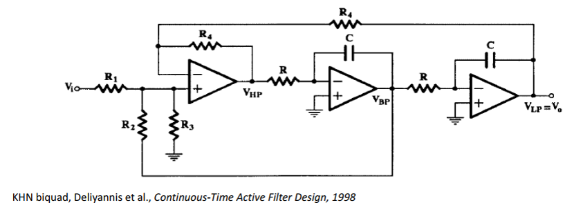
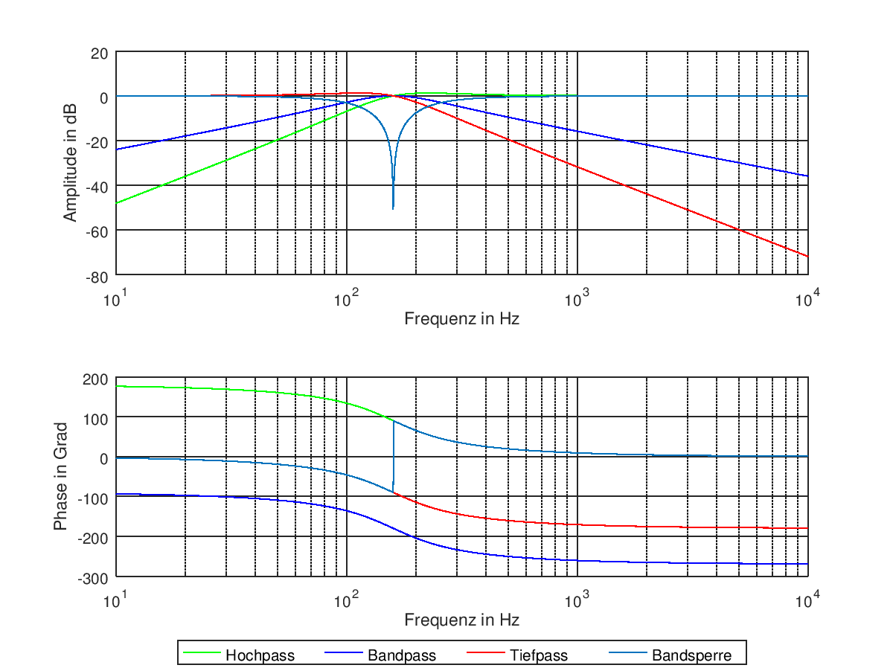
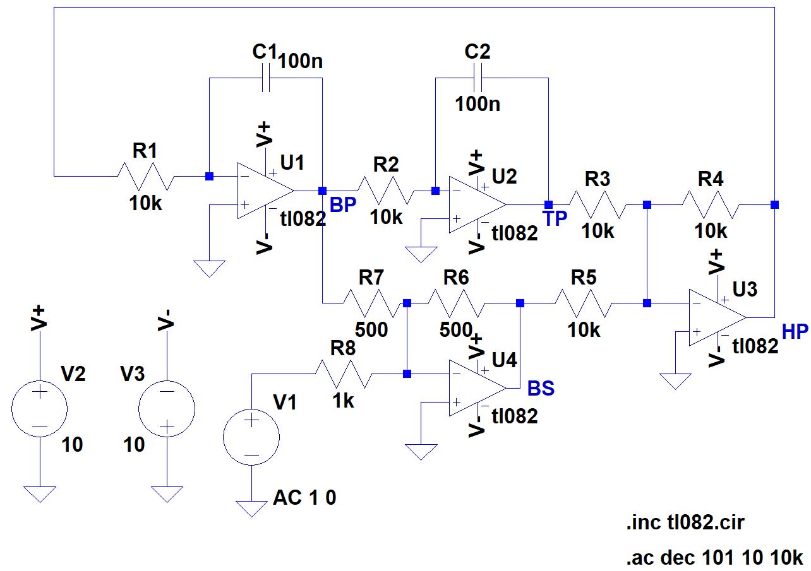
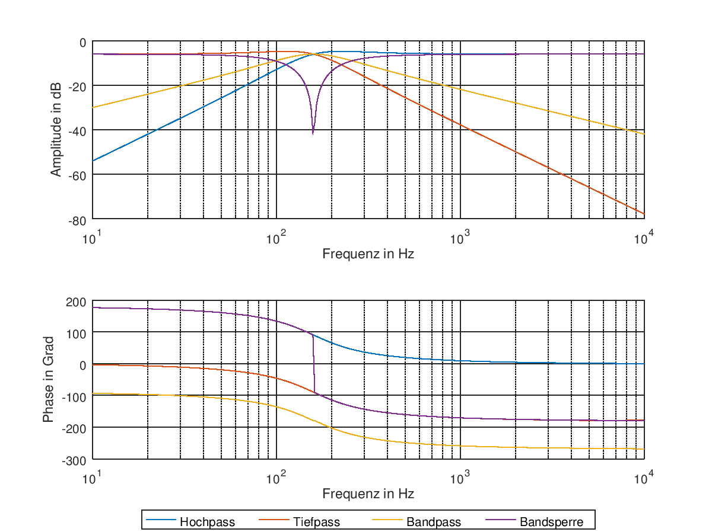
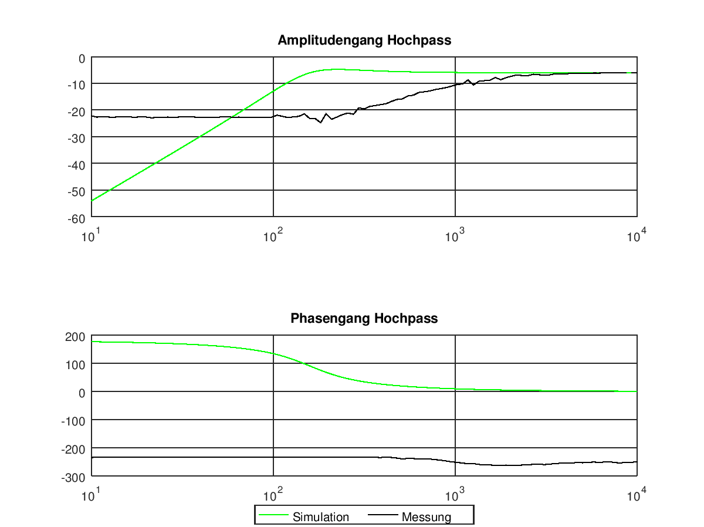
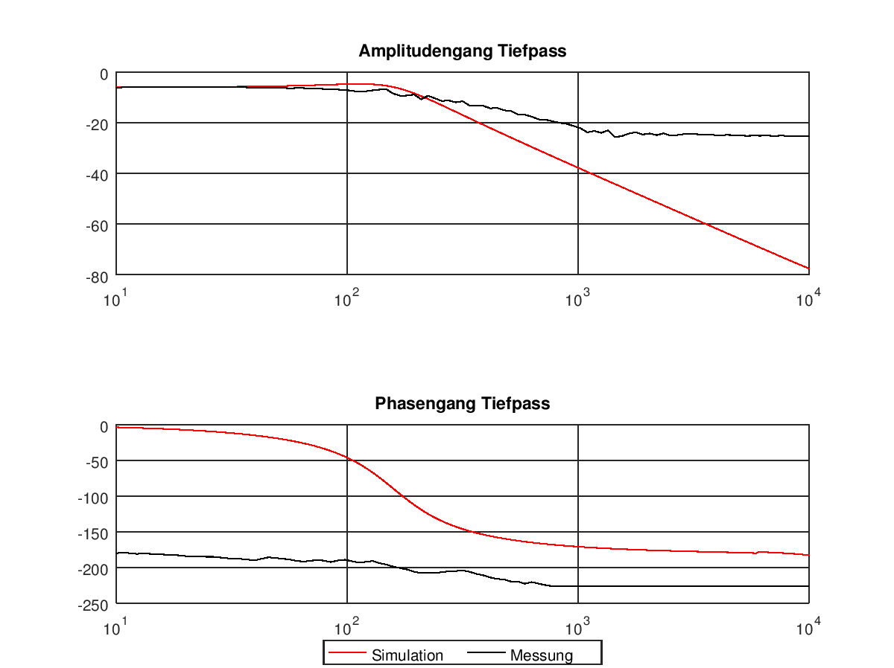

Experiment 4: Analoge Filter
============================

Kurze Theorie und Motivation
----------------------------
In der Nachrichtentechnik ist der Einsatz von Filtern unerlässlich. Gerade wenn es um den Einsatz höhergradige Filter geht, kommt es zu Problemen. 
Passive Filter, also RLC-Schaltungen, werden gerade bei höheren Frequezen aufgrund der den Spulen eigenen Eigenschaften häufig sehr groß und ungenau.
Um dem entgegenzuwirken verwendet man aktive Filter aus Operationsverstärkern, Kondensatoren und Widerständen. 
Bei diesen Bauteilen ist sowohl das Herstellen, als auch das Bestimmen ihre Werte einfacher und genauer, als das bei Spulen möglich ist. 
Die Spulen werden hierbei durch Integriererschaltungen ersetzt.

Der Universalfilter besteht aus den vier Filtern Hochpass, Tiefpass, Bandpass und Bandsperre (:numref:`04_fig_05`).
Zum leichteren Einstieg wurde zu erst der KHN-Biquad-Filter untersucht. Dieser besteht nur aus
Hochpass, Tiefpass und Bandpass. 

	 
		Schaltbild KHN-Biquad-Filter

Spezifikation
-------------

Der Filter soll mit einer Güte :math:`Q = 1` und einer Kreisfrequenz :math:`\omega = 1\,kHz` realisiert werden. Bevor die Bauteile dimensioniert wurden, wurden die 
Übertragungsfunktionen, :eq:`04_eq_01` bis :eq:`04_eq_04`, für die vier Filter mit Octave dargestellt.

.. math::
	 :label: 04_eq_01
	 
	 H_{\mathrm{HP}} = \frac{s^2 \tau^2}{1 + \frac{s}{\omega Q} + \frac{s^2}{\omega^2}}
	 
	 
.. math::
	 :label: 04_eq_02
	 
	 H_{\mathrm{BP}} = \frac{-s \tau}{1 + \frac{s}{\omega Q} + \frac{s^2}{\omega^2}}
	 
.. math::
	 :label: 04_eq_03
	 
	 H_{\mathrm{TP}} = \frac{1}{1 + \frac{s}{\omega Q} + \frac{s^2}{\omega^2}}
	 
.. math::
	 :label: 04_eq_04
	 
	 H_{\mathrm{BS}} = \frac{1 + \frac{s^2}{\omega^2}}{1 + \frac{s}{\omega Q} + \frac{s^2}{\omega^2}}
	 
Die Zeitkonstante :math:`\tau`, die in :eq:`04_eq_01` und :eq:`04_eq_02` verwendet wird, ist der Kehrwert der gewünschten Kreisfrequenz :math:`\omega`.

	 
		Übertragungsfunktionen mit :math:`Q = 1` und :math:`\omega = 1\,kHz`, berechnet mit Octave

Diese Übertragungsfunktionen dienten zur Orientierung für die Dimensionierung und die Simulationen.
  
Zur Dimensionierung der Bauteile wurden folgende Formeln verwendet:

.. math:: 
	:label: 04_eq_05
	
	\omega = \frac{1}{RC} = \frac{1}{\tau}
	
.. math:: 
	:label: 04_eq_06
	
	Q = \frac{R_1R_2 + R_1R_3 + R_2R_3}{2R_1R_3}
	
Die Kondensatoren, die die Rückkopplungswiderstände bilden, sind für das frequenzabhängige Verhalten der Schaltung verantwortlich. Die Zeitkonstante :math:`\tau` gibt an, 
wie lange der Kondensator zum Aufladen benötigt und damit, wann die maximale Ausgangsspannung erreicht ist. 

Für die meisten Bauteile mussten Werte angenommen werden. Diese Werte wurden im Verlauf der Dimensionierung immer wieder verändert, 
bis die Simulation und die berechneten Übertragungsfunktionen möglichst übereinstimmten.

Simulation
----------
Die Simulation wurde mit LTspice XVII durchgeführt.
Dafür musste zuerst das Model für den tl082 eingebunden werden. Die Schaltung wurde nach :numref:`04_fig_01` implemtiert.

.. figure:: img/Experiment_04/Exp_04_SpiceKHN.png
		:name: 04_fig_03
		:align: center
		:scale: 60%
	 
		Schaltungsaufbau des KHN-Biquad-Filter in LTspice
	 
Die :numref:`04_fig_03` zeigt Bauteilwerte, mit denen die endgültige Simulation durchgeführt wurde.

In :numref:`04_fig_04` sind die Ergebnisse dieser Simulation zu sehen.

.. figure:: img/Experiment_04/Exp_04_SimulationKHN.png
		:name: 04_fig_04
		:align: center
		:scale: 40%
	 
		Simulation Amplituden- und Phasengang KHN-Biquad-Filter

Vergleicht man die Simulation des KHN-Biquad-Filter mit den berechenten Übertragungsfunktionen, sind die Simulationsergebnisse um ungefähr :math:`-7dB` verschoben, der Verlauf ist aber der Gleiche.
Bei Simualationen mit anderen Bauteilwerten war diese Veschiebung nicht gegeben, dafür wich der Verlauf des Amplituden- und Phasengangs von den berechneten Übertragungsfunktionen erheblich ab
(z.B. starkes Überschwingen, Verschiebung auf der Frequenzachse).
 
Nach der Simulation des KHN-Biquad-Filter wurde auch der Universalfilter simuliert. Die Werte der zusätzlichen Bauteile wurden durch Ausprobieren herausgefunden.

		
		Schaltungsaufbau des Universalfilters in LTspice
	
:numref:`04_fig_05` zeigt auch hier wieder die Bauteilwerte, die bei der endgültigen Simulation verwendet wurden.
	 

	 
		Simulation Amplituden- und Phasengang Universalfilter

Beim Vergleich von :numref:`04_fig_04` und :numref:`04_fig_06` ist erkennbar, dass die Amplituden- und Phasengänge des Hochpasses, des Tiefpasses und des Bandpasses unverändert sind.
Bei der Simulation des Universalfilters wurden auch Ergebnisse erzielt, die nicht die Verschiebung um :math:`-7dB` aufwiesen. Die hier aufgeführte Simulation wurde aufgrund der besseren
Vergleichbarkeit bevorzugt. 

Messungen
---------
Für die Messungen wurde der Red Pitaya verwendet. Mit Hilfe eines Skriptes wurden Amplituden- und Phasengang für den KHN-Biquad bestimmt.
Um diese Messungen bewerten zu können, wurde mit Hilfe von Octave die Kurven für Amplituden- und Phasengang in einer Grafik dargestellt. 

.. figure:: img/Experiment_04/Vergleich_BP.png
		:name: 04_fig_07
		:align: center	 
		:scale: 40%
	 
		Vergleich Messung und Simulation für den Bandpassfilter

Gleich zu Anfang fällt auf, dass die dargestellten Kurven sich deutlich voneinander unterscheiden. Betrachtet man nur das allgemeine Verhalten, so ähneln sich die Graphen darin, 
dass sie ansteigen und wieder abfallen. Betrachtet man den Amplitudengang näher, so zeigt sich, dass das Maximum der Messung um fast 500 Hz verschoben ist. Ferner ist zu erkennen, 
dass die Bandbreite um ein Vielfaches größer ist, als in der Simulation. Für den Phasengang sind ähnliche Beobachtungen möglich. Obwohl ein Trend erkennbar ist, so stimmen die 
gemessenen Werte doch nicht mit den aus der Simulation gewonnenen überein. 

	 
		Vergleich Messung und Simulation für den Hochpassfilter

Betrachtet man den Amplitudengang des Hochpasses, so lässt sich hier das allgemeine Verhalten eines Hochpasses erkennen. Allerdings stimmt auch bei dieser Messung die
Grenzfrequenz nicht mit der Simulation überein. Ferner lässt sich keine Dämpfung größer als 23 dB messen. Auch beim Phasengang ist nur ein Trend erkennbar. 

	 
		Vergleich Messung und Simulation für den Tiefpassfilter
	 
Betrachtet man den Amplitudengang des Tiefpassfilters, so lässt sich erkennen, dass auch hier keine Dämpfung größer als 23 dB messbar war. Im Gegensatz zur vorhergegangenen 
Messung stimmen hier die Grenzfrequenzen fast überein. Der Abfall der Amplitude bei zunehmender Frequenz ist in der Messung nicht so stark wie in der Simulation.
So besteht bei einer Dämpfung von 23 dB eine Differenz von ungefähr 20 dB (bei rund 2 kHz). Betrachtet man den Phasengang, so ist ein Trend erkennbar, 
allerdings besteht eine große Diskrepanz zwischen der Simulation und der Messung.

Fazit
---------
Betrachtet man das Experiment in seiner Gesamtheit, so wird klar, dass es sich bei den Analogen Filtern um ein weites Feld handelt, dass viele Ansatzmethoden bietet.
Der Einstieg über ein zusammengesetztes Filter bietet die Möglichkeit alle grundlegenden Filterarten zu untersuchen. Mit Hilfe der Simulationen konnte man viele 
Erkenntnisse bezüglich der Güte und der Grenfrequenzen, sowie im Falle des Bandpasses und der Bandsperre zum Aufbau und Zusammenwirken von Filtern sammeln. 
Das größte Problem, dass bei unseren Messungen aufgetreten ist, ist, dass der Red Pitaya nicht sonderlich gut für diese Messung geeignet ist. Ob dies am Gerät,
dem Messaufbau oder dem Skript liegt, könnte weiter untersucht werden. Eine Alternative zum Red Pitaya wäre, die Messungen mit Funktionsgeneratoren und Oszilloskopen 
durchzuführen. Diese im Labor vorhandenen Geräte erreichen eine deutlich höhere Genauigkeit.

