#####################################################
Experiment 12: Parameterstudie eines DC-DC Konverters
#####################################################

.. |nbsp| unicode:: 0xA0
   :trim:

********
Abstract
********

Das vorliegende Experiment zeigt die Untersuchung eines DC-DC-Konverters mit dem TPS40200. Es wird das Verhalten der
Ausgangsspannung bei verschiedener Belastung sowie verschiedener Eingangsspannung gezeigt. Weiterhin wird auf den
Tastgrad des PWM-Signals eingegangen. Der Gleichstromsteller wird sowohl über Simulationen als auch im Labor
untersucht. Es wird gezeigt, dass es Abweichungen zwischen Simulation und Messung geben kann. Außerdem werden die
theoretischen Grundlagen des Experimients kurz dargestellt.

**********
Einleitung
**********

.. _DC-DC Konverter: ./Experiment_09.html

Um die Spannung über einem Verbraucher anzupassen, kann ein Spannungsteiler verwendet werden. Diese Methode erzielt
jedoch einen schlechten Wirkungsgrad. Um einen möglichst energieeffizienten Wirkungsgrad zu erzielen, erfolgt die
Spannungswandlung durch periodisch schaltende Wandler. 

Der Begriff Gleichstromsteller ist auch als DC/DC - Wandler bekannt, da durch eine geschaltete Gleichspannung - je nach
Bedarf - eine höhere, niedrigere oder sogar negative Gleichspannung entsteht. Im vorliegenden Experiment soll nun eine
Parameterstudie eines DC-DC Wandlers vorgenommen werden.

Dafür wird das On-Board-Evaluationsmodul TPS40200 auf dem ASLK PRO Kit untersucht. Es handelt sich hierbei um einen
Abwärtswandler (Step-Down-Converter). In der folgenden Schaltung wird dies durch eine Pulsweitenmodulation (PWM) mit
einer Frequenz von ca. 200 |nbsp| kHz durchgeführt. Durch unterschiedliche Puls-Pausen-Verhältnisse lassen sich
verschiedene Ausgangsspannungen erzeugen. Die jeweilige Pulsweite :math:`t_{on}` und :math:`t_{off}` beschreiben die
Ein- bzw. Ausschaltzeit des Abwärtswandlers (:cite:`Voelker`, S.109).

Zu Beginn wird die Theorie eines klassischen Abwärtswandlers in Kapitel :ref:`KapitelIII` erläutert,
um so die Eigenschaften der einzelnen Bauteile und deren Abhängigkeit zueinander zu verstehen.
Des Weiteren werden die verwendeten Eigenschaften des TPS40200 in :ref:`TPS-Eigenschaften` beschrieben.
Daraufhin folgt die theoretische Simulation des Schaltungsaufbaus unter den selben Konfigurationen, wie unter
Laborbedingungen, wie im Kapitel :ref:`KapitelIV` beschrieben. 
Im Labor wird der DC-DC Wandler bei folgenden Konfigurationen untersucht:

- bei konstanter ohmscher Last: Messen verschiedener Spannungen

- bei konstanter ohmscher Last und variierender Eingangsspannung: Untersuchung der Spannungsstabilität am Ausgang

- bei variierender ohmscher Last und fester Eingangsspannung: Messen des Ausgangsstroms

- bei variierender Eingangsspannung: Beobachtung des Tastgrads der PWM-Wellenform

Die resultierenden Ergebnisse der Messungen im Labor werden im Kapitel :ref:`KapitelV` dargelegt.
Darauf aufbauend werden in :ref:`KapitelVI` die messtechnisch ermittelten Ergebnisse mit den Simulationsdaten diskutiert.

Abweichend der üblicherweise im deutschen verwendeten Angabe des Formelzeichens U der physikalischen Größe der
elektrischen Spannung wird in Experiment 12 diese mit dem Formelzeichen V angegeben. Hierfür wurde sich entschieden, um
Verwechslungen zwischen den im Text angegebenen Quellen und diesem Dokument zu vermeiden.

.. _KapitelIII:

***************************
Theoretische Vorbetrachtung
***************************

.. _TPS40200:  http://www.ti.com/lit/ds/symlink/tps40200.pdf
.. _Schottky-Diode: https://www.elektronik-kompendium.de/sites/bau/0201102.htm
.. _P-Kanal-Leistungs-FET: http://www.sprut.de/electronic/switch/pkanal/pkanal.html
.. _Energie: https://www.leifiphysik.de/elektrizitaetslehre/elektromagnetische-induktion/grundwissen/energie-des-magnetischen-feldes
.. _Wuerth_Elektronik: https://www.we-online.de/web/de/index.php/show/media/07_electronic_components/produkte_3/digital_power/pmlk_book/TI-PMLKBUCKWE-Completeversion-RevB-April2019pdf.pdf

Das Evaluierungsmodul (EVM) mit dem nicht synchronen Abwärtswandler `TPS40200`_ ist auf dem ASLK PRO zu finden,
:numref:`Schaltnetzteil basierend auf dem TPS40200` zeigt den Schaltplan des EVM. 

Ein nicht synchroner Abwärts- oder auch Aufwärtswandler wird dadurch charakterisiert, dass eine Freilaufdiode den
weiteren Stromfluss bei nicht aktivem Schaltsignal (:math:`t_{off}` des Duty Cycles) gewährleistet. Ein synchroner
Wandler hätte hingegen einen zusätzlichen MOSFET anstatt der genannten Diode, welcher durch ein PWM-Signal gesteuert
wird. Der Vorteil eines solchen Wandlers ist der bessere Wirkungsgrad.

Die Kenndaten des `TPS40200`_ erlauben eine maximale Eingangsspannung von bis zu 52 |nbsp| V und eine maximale
Ausgangsspannung von :math:`V_{in} - 10V` bis :math:`V_{in}`. Diese variieren ebenfalls mit dem für die Ausgangsspannung
gewählten Schaltungsentwurf. Da der hier beschriebene Versuch sich auf den bereits fertigen Schaltungsentwurf  des ASLK
PRO-Boards bezieht, werden im Folgenden nur die verwendeten Spezifikationen erläutert. Der verwendete Abwärtswandler
(Buck-Konverter) hat ebenfalls Funktionen, die im Datenblatt (:cite:`TEX1`, S.11ff) beschrieben sind, allerdings wurden
diese nicht im fertigen Layout mit aufgeführt und sind somit nicht relevant für die zu betrachtende Schaltung.

Das hier verwendete EVM wird mit einer Eingangsspannung von 6 |nbsp| V bis 15 |nbsp| V betrieben. Die konstante
Ausgangsspannung kann mit Hilfe des Jumpers JP8 zwischen 3,3 |nbsp| V oder 5 |nbsp| V eingestellt werden. In beiden
Fällen beträgt der Ausgangsstrom minimal 125 |nbsp| mA und maximal 2,5 |nbsp| A. 

Grundaufbau des Abwärtswandlers
===============================

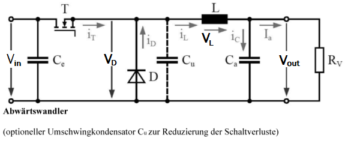

   Schaltungsaufbau eines DC-DC-Konverters (:cite:`Voelker`, S.115)

In :numref:`BasicDCDC` ist der grundlegende Aufbau eines Abwärtswandlers gezeigt. Aus der Schaltung wird schnell klar,
dass die Ausgangsspannung eines Abwärtswandlers immer im Bereich von 0 |nbsp| V bis :math:`V_{in}` liegt. Die Spule ist
eines der wichtigsten Elemente in diesem Schaltungsaufbau, denn durch sie wird zugeführte Energie gespeichert, wenn der
MOSFET leitet und die gespeicherte Energie wird abgegeben, wenn der MOSFET sperrt. Hinzu kommt, dass sie einem schnellen
Stromanstieg durch ihre Eigeninduktion entgegenwirkt, denn der Spulenstrom folgt dem Induktionsgesetz und schützt so die
Last vor hohen Stromspitzen. Die Induktivität der Speicherdrossel wird in den meisten Fällen so gewählt, dass der
geplante minimale Ausgangsstrom nicht unterschritten wird. Ebenfalls ist bei der Induktivitätswahl darauf zu achten,
dass der magnetische Sättigungsstrom der Spule nicht überschritten wird, da je nach Spulentyp mit Erreichen der
magnetischen Sättigung der Induktivitätswert abnimmt. Dies würde sich negativ auf unsere abgebende Energie der Spule
auswirken, wie die :eq:`12_eq_energiespule` bestätigt :cite:`JoachimHerzStiftung.11.06.2020`. Ein weiterer sehr
wichtiger Faktor der zu wählenden Spule ist der parasitäre Serienwiderstand (ESR), da die Verlustleistung der Spule
minimal zu halten ist, um mit einem optimierten Wirkungsgrad zu arbeiten (:cite:`Tietze.2002`, S.947).

.. math::
   :label: 12_eq_energiespule

   E &= \frac{1}{2} L I^2 \\

Die benötigte Induktivität lässt sich deshalb wie folgt ermitteln: :math:`I_{out,min}` beschreibt hier den minimalen
:math:`I_{SpitzeSpitze}` Rippelstrom, welcher das Zweifache des angegebenen minimalen Stormes beträgt
(:cite:`Tietze.2002`, S.947): 

.. math::
   :label: 12_eq_spule

   L &= T \left(1 - \frac{V_{out}}{V_{in}} \right) \frac{V_{out}}{2 I_{out,min}} \\
   L &= \frac{1}{f} \left(1 - \frac{V_{out}}{V_{in}} \right) \frac{V_{out}}{2 I_{out,min}} \\
   L &= \frac{1}{200\ kHz} \left(1 - \frac{5\ V}{15\ V} \right) \frac{5\ V}{2(2 \cdot 0,125\ A)} \\
   L &= 33,33\ \mu H

Des Weiteren ist der Glättungskondensator ebenfalls essentiell, um die Welligkeit der Ausgangsspannung einzustellen. Um
die parasitären Serienwiderstände des Kondensators gering zu halten, schaltet man meist einen oder mehrere
Elektrolytkondensatoren und keramische Kondensatoren parallel. Dies hat zur Folge, dass die Verlustleistung der
Parallelschaltung der Kondensatoren verringert wird. Die benötigte Kapazität errechnet sich nach :eq:`12_eq_cap`, wobei
:math:`\Delta U_{out}` die maximal auftretende Ausgangsrippelspannung beschreibt (:cite:`Tietze.2002`, S.947).

.. math::
   :label: 12_eq_cap

   C &= T \frac{I_{out,min}}{4 \Delta V_{out}} \\

Texas Instruments hat für dieses Layout die Ausgangskapazität anders ermittelt und gibt diese laut dem Datenblatt (:cite:`TEX1`, S.23)
mit einer Kapazität von 165 |nbsp| :math:`\mu F` an. Dies wird nicht ganz schlüssig bei einem Blick auf den Schaltplan
:numref:`Schaltnetzteil basierend auf dem TPS40200`. An dem Schaltplan wird sichtbar, dass hier durch mehrere parallel
geschaltete Kapazitäten die parasitären Widerstände gering gehalten werden. 

Die Diode des Abwärtswandlers sorgt dafür, dass die gespeicherte Energie aus der Spule abgegeben werden kann, wenn der
MOSFET nicht mehr leitet. Die Diode sollte mindestens eine Durchbruchspannung von :math:`2 V_{in}` besitzen. Zu beachten
ist, dass der maximale Ausgangsstrom und die Schwellspannung der Diode nicht zu groß sein sollten, denn wenn der MOSFET
sperrt, setzt sich die Ausgangsspannung wie folgt zusammen:

.. math::
   :label: 12_eq_diode

   V_{out} &= V_L - V_{Diode} \\

Ein weiterer wichtiger Punkt ist die Schaltfrequenz des MOSFETs. Sollte diese zu klein gewählt sein, so entsteht der so
genannte "lückende Strombetrieb". Dieser ist stets zu vermeiden. Deshalb befindet sich die übliche Schaltfrequenz
zwischen 20 |nbsp| kHz bis 200 |nbsp| kHz, um den gewollten "nicht lückenden Strombetrieb" zu erhalten.

Durch die genannten Bauteile und ihre Eigenschaften wird das Grundprinzip des Abwärtswandlers klar: Denn durch Schalten
des MOSFETs, welcher durch ein PWM-Signal angesteuert wird, ist die Ausgangsspannung ein Produkt aus dem Tastverhältnis
des PWM-Signals und der angelegten Eingangsspannung. Das Tastverhältnis beschreibt das Verhältnis der Einschaltzeit zu
der Periodendauer des PWM-Signals:

.. math::
   :label: 12_eq_duty

   V_{out} &= {V_{in}} \frac{t_{on}}{t_{on}+t_{off}} &= {V_{in}} \cdot {\ Tastgrad} \\

Somit lässt sich erkennen, dass sich die Ausgangsspannung aus dem arithmetischen Mittelwert der Eingangsspannung ergibt
(:cite:`Tietze.2002`, S.944). Anmerken lässt sich hier, dass die Ausgangsspannung bei einer festen Last als konstant
angenommen werden kann. So betrachten wir die Eingangsspannung als variabel. Umgestellt zum Tastgrad ergibt sich eine
Gleichung der Form :math:`f(x)=a/x`. Dies lässt auf einen hyperbelförmigen Verlauf des Tastgrades schließen.

.. _TPS-Eigenschaften:

Eigenschaften des TPS40200
==========================

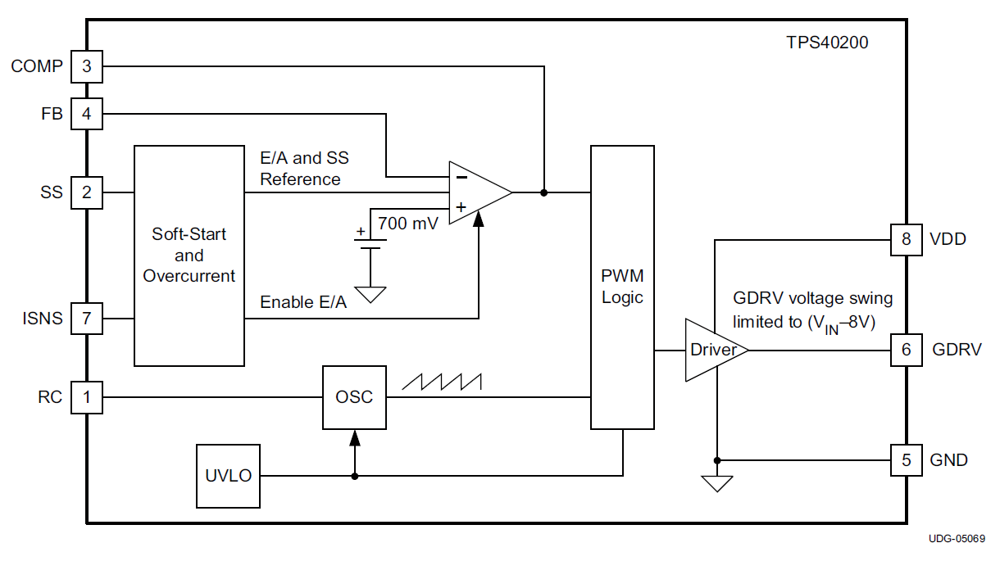

   Interner Aufbau des Abwärtswandlers (:cite:`TEX1`, S.11)

In :numref:`Block_TPS40200` ist der grundlegende Aufbau der Halbleiterschaltung schematisch dargestellt. Dieser wird im Folgenden erläutert.

Es ist zu sehen, dass der Baustein auch über eine Soft-Start-Funktion verfügt, bei der der Ausgang einer langsam
ansteigenden Soft-Start-Spannung folgt, sodass ein Überschwingen der Ausgangsspannung verhindert wird.

Die Anrampung der Ausgangsspannung kann, wie :numref:`Softstart_TPS40200` zeigt, durch entsprechende Wahl des
Kondensators :math:`C_{SS}` eingestellt werden. Da die Zeitkonstante der jeweiligen Kapazität varriert, können
verschiedene Anrampungen ermöglicht werden. Die Anlaufzeit ergibt sich aus folgender Formel :cite:`TEX1` :

.. math::
   :label: 12_eq_soft

   t_{ss} &= R_{c} C_{SS} ln\left(\frac{V_{SST}}{V_{SST} - 1,4\ V}\right) \\
   t_{ss} &= 9,5\ ms

- :math:`t_{SS}` ist die erforderliche Softstartzeit in Sekunden
- :math:`C_{SS}` ist der Wert des Softstart-Kondensators in F
- :math:`R_{c}` ist der interne Sanftanlauf-Ladewiderstand (105 :math:`k \Omega` nominal)
- :math:`V_{SST}` ist die eine interne Spannungsversorgung bis zu einem Maximum von 8 |nbsp| V

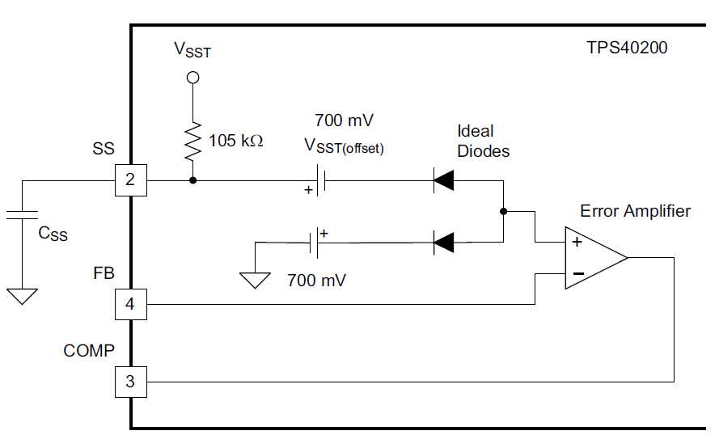

   Softstarteigenschaft des TPS40200 (:cite:`TEX1`, S.17)

Eine weitere Eigenschaft ist die maximale Strombegrenzung durch die das PWM-Signal ausgeschaltet wird, um sich und die
Platine vor Zerstörung zu schützen (:numref:`Strombegrenzung_TPS40200`). Wenn der FET eingeschaltet ist und über
:math:`R_{ILIM}` ein Abfall von :math:`V_{ILIM} = 100 mV` oder mehr vom VDD-Pin zum ISNS-Pin festgestellt wird, wird ein
Überstromzustand erklärt. In diesem Fall wird der FET abgeschaltet und ein intern integrierter Softstart-Kondensator
wird entladen. Wenn der Softstart-Kondensator einen Pegel unter 150 mV erreicht, löscht ein Komparator das
Überstrom-Zustandsflag und versucht neu zu starten. Sollte der Überstrom immer noch aktiv sein, so beginnt der Vorgang
erneut. Der maximale Spitzenstrom lässt sich über

.. math::
   :label: 12_eq_Ioc

   I_{OC} &= \frac{V_{ILIM}}{R_{ILIM}} \frac{R_{F1}+R_{F2}}{R_{F2}} \\

berechnen (:cite:`TEX1`, S.15). Der Widerstand :math:`R_{F2}` ist für den hier vorgestellten DC-DC-Wandler als unendlich
anzunehmen, wodurch die Strombegrenzung alleine von :math:`V_{ILIM}` und :math:`R_{ILIM}` abhängt. So kann bei den hier
verwendeten Parametern ein Spitzenstrom von 3,33 |nbsp| A in der Spule fließen. Von diesem sollte beim Design eine
Toleranz von 25 |nbsp| % sowie der Rippelstrom von 0,125 |nbsp| A berücksichtigt werden(:cite:`TEX1`, S.24). Für die
hier verwendeten Parameter kann somit maximal ein Strom von 2,54 |nbsp| A fließen.

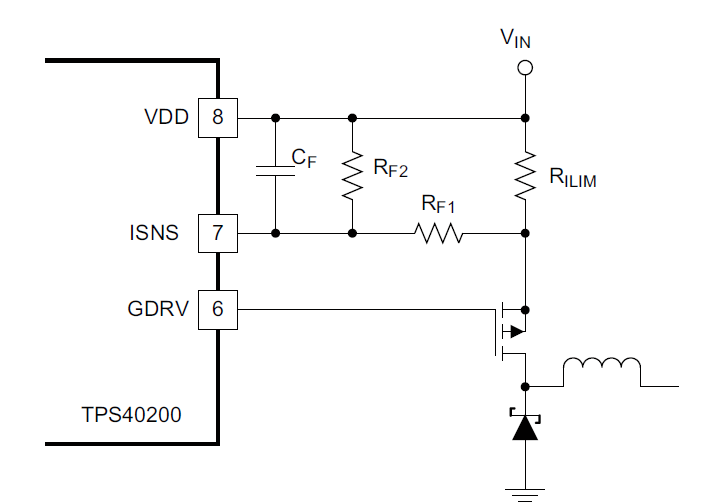

   Strombegrenzung des TPS40200 (:cite:`TEX1`, S.16)

Die Ausgangsspannung verringert sich bei steigendem Laststrom. Dies ist auf die damit verbundenen ansteigenden
Verlustleistungen von den parasitären Widerständen und die PN-Übergänge der Bauelemente zurückzuführen
(:cite:`Instruments.1999` S. 10) (:cite:`TEX2` S. 12). 

Es gibt noch weitere relevante Einstellungen, die auf dem EVM-Board bereits realisiert worden sind, wie z.B. die
Realisierung :math:`V_{CC}` Spannungsunterschreitung. Hierfür wird auf das Datenblatt des TPS40200 verwiesen
(:cite:`TEX1` S.12).

Die Betriebsfrequenz des Abwärtswandlers wird durch einen externen Widerstand :math:`R_{201}` bestimmt, der vom RC-Pin
an VDD angeschlossen ist sowie durch einen Kondensator :math:`C_{213}`, der vom RC-Pin an Masse angeschlossen ist (siehe
:numref:`Schaltnetzteil basierend auf dem TPS40200`). Diese Verbindung und die beiden Oszillatorkomparatoren im Inneren
des Geräts bestimmen die Oszillatorfrequenz nach folgender Gleichung:

.. math::
   :label: 12_eq_frequenz

   f &= \frac{1}{R_{201} C_{213} \cdot 0,105} \\
   f &= \frac{1}{100\ k\Omega \cdot 470\ pF \cdot 0,105} \\
   f &= 202,63\ kHz

Da der Abwärtswandler varrierende Lasten ermöglicht, erfordert die Ausgangsspannung eine Regelung. In
:numref:`Block_TPS40200` sieht man, dass der TPS40200 eine Referenzspannung von 700 |nbsp| mV für die Regelung der
Rückkopplungsschleife benötigt. Diese Angabe besitzt bereits eine Ungenauigkeit. So ist (:cite:`TEX1`, S.18) zu
entnehmen, dass diese bei 696 |nbsp| mV liegt.

Wie genau die Regelung funktioniert, wurde im Versuch 9: `DC-DC Konverter`_ anschaulich beschrieben. 
Dazu wird ein Spannungsteiler an die Ausgangsspannung angeschlossen und der mittlere Abgriff wird auf den PIN "FB" gelegt.
Eine Ausgangsspannung kann wie folgt über den Rückkopplungsfaktor :math:`\beta` eingestellt werden (:cite:`ASLKPro`, S.64):

.. math::
   :label: 12_eq_01

   V_{out} &= \frac{V_{ref}}{\beta} \\

.. math::
   :label: 12_eq_02

    V_{ref} &= 0,696\ V                \\

.. math::
   :label: 12_eq_03

    \beta &= \frac{R_{209||211}}{R_{209||211}+R_{207}+R_{208}} \\

    
Die Änderung der Ausgangsspannung kann über JP8 in :numref:`Schaltnetzteil basierend auf dem TPS40200` erreicht
werden. Bei Betrachtung wird auch erkenntlich, dass die Ausgangsspannung zum Regeln der Ausgangsspannung verwendet
wird. Hierbei wird das Prinzip eines nichtinvertierenden Verstärkers genutzt. Nach umstellen von :eq:`12_eq_01` zu
:math:`V_{out}` kann dies folgendermaßen berechnet werden:

.. math::
   :label: 12_eq_Vout

    V_{out} &= V_{ref} \left[1+(R_{207}+R_{208})\left(\frac{1}{R_{211}}+\frac{1}{R_{209}}\right)\right]\ \\

Der benötigte Parallelwiderstand zwischen :math:`R_{209}` und :math:`R_{211}` kann über

.. math::
   :label: 12_eq_R211209

    R_{209||211} &= \frac{V_{ref} (R_{207}+R_{208})}{V_{out}-V_{ref}} \\

ermittelt werden.

Diesbezüglich kann durch einfaches Umformen der Parallelschaltung :math:`R_{211}` errechnet werden:

.. math::
   :label: 12_eq_R211

    R_{211} &= \frac{R_{209||211} R_{209}}{R_{209}-R_{209||211}} \\

Der Rückkopplungsfaktor :math:`\beta` kann durch Änderung des Rückkopplungswiderstands :math:`R_{209}` geändert werden, um
so die Ausgangsspannung festzulegen. Es ist jedoch nicht möglich, auf dem ASLK PRO den Widerstand :math:`R_{209}` zu
ändern. Dies könnte jedoch durch den Anschluss eines externen Widerstandes zwischen der Klemme TP8 und Ground erreicht werden.

Der Ausgangsstrom darf zwischen 0,125 |nbsp| A und 2,5 |nbsp| A betragen (:cite:`TEX1`, S. 20, Tabelle 1).
Über das ohmsche Gesetz können wie folgt die Grenzwerte der ohmschen Last ermittelt werden:

.. math::
   :label: 12_eq_Rmin

   R_{min} &= \frac{V_{out}}{I_{out}} &=\frac{5\ V}{2,5\ A} = 2 \ \Omega \\

.. math::
   :label: 12_eq_Rmax

   R_{max} &= \frac{V_{out}}{I_{out}} &=\frac{5\ V}{125\ mA} = 40 \ \Omega \\

Somit wurden alle nötigen Parameter für den Schaltungsentwurf des Abwärtswandlers TPS40200 ermittelt.

.. _KapitelIV:

***************************
Simulations- und Messaufbau
***************************

.. _TINA-TI: http://www.ti.com/tool/TINA-TI

Der Versuchsaufbau gliedert sich in zwei Abschnitte. Der erste Abschnitt behandelt die Simulation der Schaltung mit
Hilfe des Programms `TINA-TI`_ und dazu nötigen Berechnungen. Der zweite Abschnitt beschäftigt sich mit dem Messaufbau
vor Ort.

Die untersuchte Schaltung kann der :numref:`Schaltnetzteil basierend auf dem TPS40200` entnommen werden. Insgesamt
wurden vier Simulationen und vier Messungen durchgeführt.

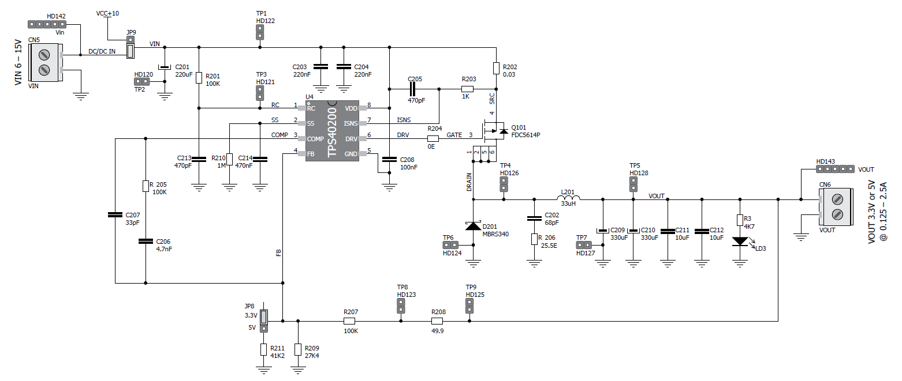

   Schaltnetzteil basierend auf dem TPS40200 (:cite:`ASLKPro`, S.64)

A. Simulation
=============

.. _Repositorium: https://github.com/mimeiners/ASLK_PRO/tree/master/spice/Experiment_12
.. _Beispiel: https://e2e.ti.com/cfs-file/__key/communityserver-discussions-components-files/234/7607.VCR_5F00_test.TSC
.. _Rev.: https://www.ti.com/lit/tsc/slvj005
.. _OnSemi: https://www.onsemi.com/support/design-resources/models?rpn=FDC654P

Größtenteils wurde für die Simulation `TINA-TI`_ in Version 9.3.200.277 SF-TI verwendet. Dabei sei angemerkt, dass mit
diesem Spice Simulator zwar das grundlegende Verhalten der Schaltung simuliert wird. Jedoch werden dabei nicht die
physikalischen Effekte des Layouts berücksichtigt. Neben den Standardbauteilen von TINA-TI wurde der TPS40200 und der
FDC5614P neu eingebunden. Für den TPS40200 verwenden wir die `Rev.`_ D, die auf der Herstellerseite von Texas Instrument
zum freien Download zur Verfügung steht. Für den FDC5614 wurde ein Spice-Modell vom Hersteller `OnSemi`_
umformatiert, sodass er in TINA-TI eingebunden werden kann. Die restlichen Bauteile wurden der Standardbibliothek von
TINA-TI entnommen. Die Simulationsdateien können dem `Repositorium`_ entnommen werden.

Für die Berechnung des benötigten Widerstandes zum Festlegen der 5 |nbsp| V Ausgangsspannung ergibt sich über
:eq:`12_eq_R211209` und :eq:`12_eq_R211` ein Widerstand :math:`R_{211}` von 40,1 |nbsp| :math:`k \Omega`. Die
verfügbaren Widerstände auf dem ASLK Pro lassen jedoch ausschließlich eine Beschaltung von 41,2 |nbsp| :math:`k \Omega`
zu.

Wellenformen
------------

Es werden vier Spannungen der Schaltung simuliert:

- Eingangsspannung, :math:`V_{in}`
- Ausgangsspannung, :math:`V_{out}`
- Oszillatorspannung, **TP3**
- PWM-Signal, **TP4**

Dafür wird die Schaltung mit einem 20 |nbsp| :math:`\Omega` – Widerstand belastet.
Die Eingangsspannung wird auf konstante 10 |nbsp| V eingestellt. Um sicherzustellen, dass die Schaltung sich im
eingeschwungenen Zustand befindet, wird nur der Zustand der Simulationszeit von 15 |nbsp| ms bis 15,1 |nbsp| ms
dargestellt. Die Ergebnisse werden jeweils als Funktion :math:`u(t)` dargestellt.

.. _my-reference-label-1:

Ausgangsspannung bei fester Last
--------------------------------

Um das Verhalten der Ausgangsspannung während einer variierenden Eingangsspannung zu untersuchen, wird die Schaltung mit
einer Last von 20 |nbsp| :math:`\Omega` simuliert. Die Eingangsspannung wird als Dreiecksspannung mit einem Offset von 12,5
|nbsp| V, einer Amplitude von 2,5 |nbsp| V sowie einer Frequenz von 10 |nbsp| Hz erzeugt. So kann ein Spannungsbereich
von 10 |nbsp| V bis 15 |nbsp| V betrachtet werden. Betrachtet wird der zeitliche Ausschnitt zwischen 75 |nbsp| ms und
125 |nbsp| ms, wodurch ein Sweep von 10 |nbsp| V bis 15 |nbsp| V erreicht wird. Dargestellt wird das Ergebnis durch
:math:`V_{out}(V_{in})`.

Ausgangsspannung und -strom bei fester Eingangsspannung und dynamischer Last
----------------------------------------------------------------------------

Die Eingangsspannung beträgt in der Simulation konstant 10 |nbsp| V. Die Last ist variabel und wird mit Hilfe eines
spannungsgesteuerten Widerstandes umgesetzt. Dieser wurde anhand vom diesem `Beispiel`_ erstellt. Die Last verändert
ihren Widerstand linear zwischen 2 |nbsp| :math:`\Omega` und 40 |nbsp| :math:`\Omega`. Dies wird mit Hilfe eines
Dreieckssignals mit einer Frequenz von 5 Hz realisiert. Betrachtet wird das Simulationsergebnis von 150 |nbsp| ms bis
250 |nbsp| ms, um so genau einmal zu beobachten, wie sich der Widerstand von 2 |nbsp| :math:`\Omega` auf 40 |nbsp|
:math:`\Omega` erhöht. Dargestellt wird das Ergebnis durch :math:`V_{out}(I_{out})`.

.. _my-reference-label-2:

Tastgrad
--------

Der Tastgrad (eng. duty cycle) kann durch :eq:`12_eq_duty` berechnet werden. Da die Ausgangsspannung über die
Widerstände :math:`R_{209}` und :math:`R_{211}` fest gewählt ist, kann angenommen werden, dass die Ausgangsspannung konstant
ist. Somit hat der Tastgrad nur eine Abhängigkeit von der Eingangsspannung.

In der Simulation ist der Tastgrad durch die Spannung TP4 dargestellt. Wie auch in Abschnitt :ref:`my-reference-label-1`
wird ein Sweep der Eingangsspannung vorgenommen. Da die Simulation von TP4 nicht genügend Stützstellen besitzt, kann anhand 
der Simulationsdaten der Tastgrad ohne größere Abweichungen nicht zuverlässig bestimmt werden. Aus diesem Grund wird der
Tastgrad über die Eingangs- und Ausgangsspannung nach  :eq:`12_eq_duty` bestimmt. Dieses Ergebnis wird durch
:math:`V_{in}` in Abhängigkeit von dem Tastgrad dargestellt.

Messaufbau
==========

Wie zuvor beschrieben, wird für die Versuche das ASLK (Analog System Lab Kit) Pro der Firma MikroElektronika für
den Messaufbau verwendet. Auf diesem befindet sich die in :numref:`Schaltnetzteil basierend auf dem TPS40200` genannte
Schaltung. Betrieben wird das Board mit einer symmetrischen Spannungsversorgung von 10 |nbsp| V. Als Messinstrument
wird ein 4-Kanal Oszilloskop verwendet. Auf dem ASLK wird der JP8 so gesteckt, dass eine Ausgangsspannung von 5
|nbsp| V zu erwarten ist. Die Darstellungsarten entsprechen in jedem Schritt der Darstellungsart in der Simulation.

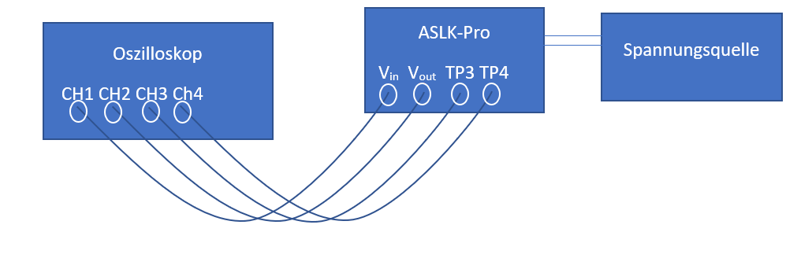

   Messaufbau der praktischen Messung

Wellenformen
------------

Der Jumper JP9 wird so gesteckt, dass die Schaltung mit konstant 10 |nbsp| V Eingangsspannung betrieben wird.
Anschließend wurde mit dem 4-Kanal-Oszilloskop die Eingangs- und Ausgangsspannung sowie TP3 und TP4 gemessen.
Die Messung erfolgt über einen Zeitraum von 100 |nbsp| :math:`\mu s`. Belastet wird die Schaltung wie in der Simulation
mit 20 |nbsp| :math:`\Omega`.

Ausgangsspannung bei fester Last
--------------------------------

Die Last bleibt unverändert. Der Jumper JP9 wird so gesteckt, dass die Schaltung extern über CN5 betrieben werden kann.
Hier wurde ein Funktionsgenerator angeschlossen. Dieser erhöht die Spannung in 0,5 |nbsp| V Schritten von 10 |nbsp| V
bis 15 |nbsp| V. Gemessen wird die Eingangs- und Ausgangsspannung. Für jeden 0,5 |nbsp| V Schritt werden jeweils 31250
Werte aufgezeichnet, woraus im Nachgang der Mittelwert gebildet wird.

Ausgangsspannung und -strom bei fester Eingangsspannung und dynamischer Last
----------------------------------------------------------------------------

Um die Ausgangsspannung und den Ausgangsstrom zu messen, werden wieder konstante 10 |nbsp| V eingespeist.
An die Last wird in Reihe ein 1 |nbsp| :math:`\Omega` Shunt-Widerstand sowie eine verstellbares Schiebepotentiometer
angeschlossen. Gemessen wird die Spannung über die gesamte Last sowie über dem Shunt-Widerstand. Das Ohm’sche Gesetz
:math:`U=R I` macht deutlich, dass in diesem Fall die gemessene Spannung über dem Shunt-Widerstand dem Ausgangsstrom
gleicht.

Tastgrad
--------

Die Bestimmung des Tastgrades erfolgt wie zuvor in Abschnitt :ref:`my-reference-label-2` aus der gemessenen Eingangs-
und Ausgangsspannung. Grund für diese indirekte Bestimmung ist, dass die im Oszilloskop integrierte Duty-Cycle-Funktion
ungenau wird, sobald die Flanken des Rechtecksignals keine lineare Steigung mehr aufweisen, sondern Spannungsspitzen
enthalten.

.. _KapitelV:

**********
Ergebnisse
**********

Im Folgenden werden die simulierten Werte mit den messtechnisch ermittelten Werten verglichen und dargestellt.

Simulierte und messtechnische Wellenformen
==========================================

.. _DC-DC Konverter: ./Experiment_09.html

Die Wellenformen sind in  :numref:`TP3TP4VoutVin` zu erkennen. Aus Darstellungsgründen wird die Ausgangsspannung
in zwei Plots aufgeteilt.

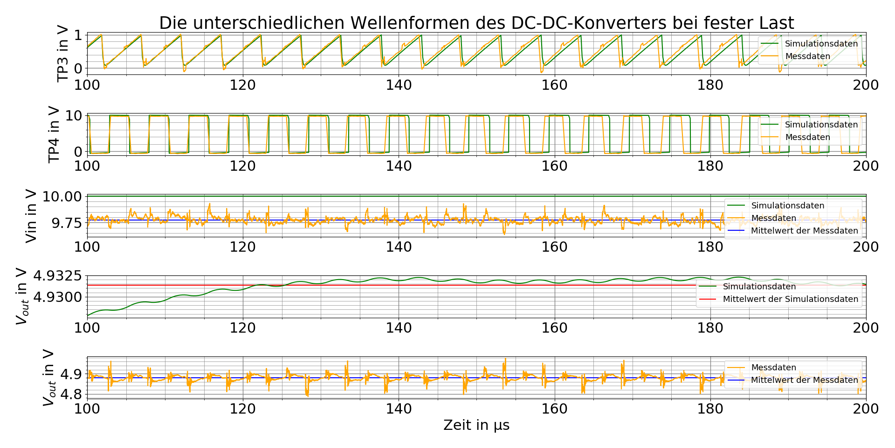

   Simulierte und messtechnisch ermittelte Wellenformen bei einer Last von 20 |nbsp| :math:`\Omega` -
   Oszillatorspannung TP3, PWM-Signal TP4 , Ausgangsspannung :math:`V_{out}` und Eingangsspannung :math:`V_{in}`

Grundlage für die folgenden Ausführungen zum TP3 und TP4 Plot sind folgende Frequenzen, die aus den jeweiligen Daten ermittelt wurden:

.. list-table:: Frequenz von TP3 und TP4 über die Zeit
   :widths: 25 25 50
   :header-rows: 1

   * - Daten
     - bei 100 :math:`\mu s`
     - bei 200 :math:`\mu s`
   * - Simulation
     - 197,03 |nbsp| kHz
     - 194,79 |nbsp| kHz
   * - Messdaten
     - 200,08 |nbsp| kHz
     - 196,42 |nbsp| kHz

Im ersten und im zweiten Plot von TP3 und TP4 ist zu erkennen, dass sich die Frequenz der Simulationsdaten am Anfang des
Plots, bei 100 :math:`\mu s`, von den der Messdaten nicht unterscheidet. Diese weisen jedoch am Ende des Plots, bei 200
:math:`\mu s`, eine Differenz zueinander von 1,63 |nbsp| kHz auf. Man kann augenscheinlich nicht erkennen, dass sich die
Frequenz der Mess- wie auch der Simulationsdaten über die Zeit ändert. Bei den Simulationsdaten ergibt sich dabei über
einen Zeitraum von 100 :math:`\mu s` eine Differenz von 2,24 kHz. Bei den Messdaten hingegen ergeben sich über den
gleichen Zeitraum 3,66 kHz.

Im dritten Plot von der Eingangsspannung :math:`V_{in}` ist ersichtlich, dass die Simulation mit einer idealen glatten
Gleichspannung von 10 |nbsp| V durchgeführt wurde. Hingegen ist bei den Messdaten zu erkennen, dass die Eingangsspannung
:math:`V_{in}` keine glatte Gleichspannung ist. Der Mittelwert dieser Spannung liegt bei 9,755 |nbsp| V. Daraus ergibt
sich eine Differenz von 0,245 |nbsp| V zwischen dem Mittelwert und der Simulationsgleichspannung.

Im vierten Plot von :math:`V_{out}` ist zu erkennen, dass die sich ergebende simulierte wellige Ausgangsspannung typisch
der eines DC-DC Wandlers ist (vgl. `DC-DC Konverter`_). Der Mittelwert dieser Spannung ergibt ca. 4,9315 |nbsp| V. Im
letzten Plot von :math:`V_{out}` sind die Messdaten zu sehen. Auffällig sind hier die Spannungsspitzen im typischen
welligen Verlauf der Ausgangsspannung. Diese Spannungsspitzen befinden sich an der Stelle, an der sich in TP4 die
Signalflanken befinden. Ansonsten ist der Mittelwert der Ausgangsspannung mit 4,88 |nbsp| V geringer als die simulierte,
was eine Differenz von 51,5 |nbsp| mV ergibt.

Simulierte und messtechnische Ausgangsspannung bei fester Last
==============================================================

Bei einer festen Last von 20 |nbsp| :math:`\Omega` wird die Eingangsspannung in einem Bereich von 10 |nbsp| V bis 15
|nbsp| V dargestellt sowie die zugehörige Ausgangsspannung. Die Ausgangsspannung variiert, weshalb zusätzlich der
Mittelwert ermittelt und dargestellt ist. Dies ist :numref:`fig:12vout`
zu entnehmen.

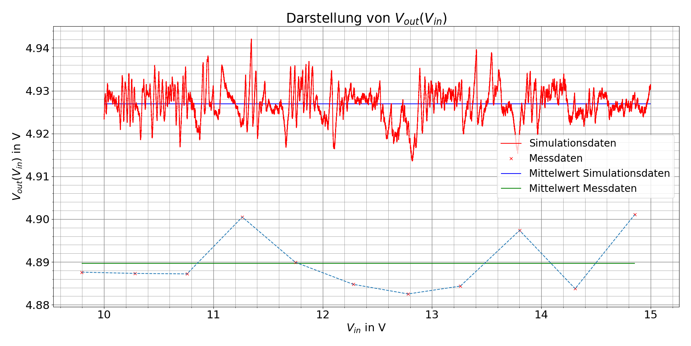

   Simulierte und messtechnisch ermittelte Ausgangsspannung :math:`V_{out}` über die Eingangsspannung :math:`V_{in}` bei einer Last von 20 |nbsp|
   :math:`\Omega`

Die simulierten und gemessenen Ausgangsspannungen sind beide bis auf ein Rauschen konstant. Die simulierte
Ausgangsspannung liegt durchschnittlich bei ca. 4,926 |nbsp| V und die messtechnisch ermittelte bei ca. 4,89 |nbsp| V.

Simulierte/r und messtechnische/r Ausgangsspannung und -strom bei fester Eingangsspannung und dynamischer Last
==============================================================================================================

:numref:`fig:12IV` stellt  die Messung :math:`V_{out}(I_{out})` dar.

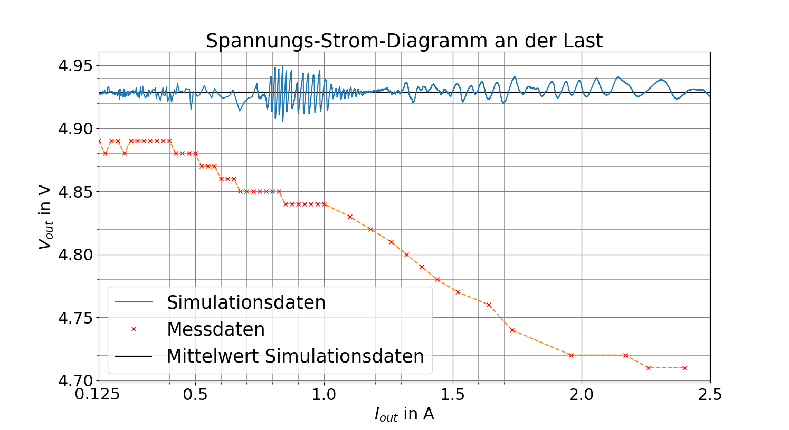

   Simulierte/r und messtechnisch ermittelte/r Ausgangsspannung und -strom

Die simulierte Ausgangsspannung oszilliert um ca. 4,928 |nbsp| V. Es ist kein Spannungsabfall bei erhöhtem Strom
zu erkennen. Die Schaltung kann laut Simulation über den gesamten Strombereich von 125 |nbsp| mA bis 2,5 |nbsp| A
betrieben werden. Bei der Messung an der Schaltung hingegen fällt die Ausgangsspannung bei steigendem Strom ab, so dass
sie anfangs bei 125 |nbsp| mA bei 4,89 |nbsp| V liegt und bei 2,4 |nbsp| A bei 4,71 |nbsp| V. Wird der Strom weiter
erhöht, so bricht die Ausgangsspannung komplett ein. Die Spannung fällt nicht linear. Es ist zu beobachten, dass die
Spannung schneller fällt, umso höher der Ausgangsstrom ist.

Simulierter und messtechnischer Tastgrad
========================================

Der aus Simulations- und Messwerten rechnerisch ermittelte Tastgrad ist in :numref:`fig:12dc` zu erkennen. Der Tastgrad 
wurde durch :eq:`12_eq_duty` berechnet.

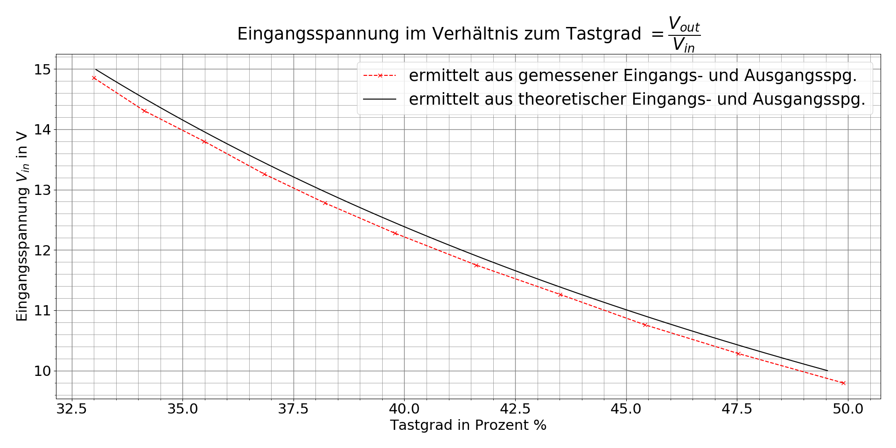

   Simulierter und messtechnisch ermittelter Tastgrad über die Eingangsspannung bei einer Last von 20 |nbsp| :math:`\Omega`

Der Verlauf zwischen Messung und Simulation ist bis auf einen Versatz von ca. 150 |nbsp| mV gleich. Es ist zu erkennen,
dass der Tastgrad bei fallender Eingangsspannung steigt. Die Graphen besitzen eine leichte Krümmung.

Die folgenden beiden Abbildungen zeigen die Messung mit dem Oszilloskop. In diesen ist zu erkennen, dass das
Rechtecksignal vom duty cycle (blau) verformt ist. Aufgrund dieser Verformung konnte die Funktion im Oszilloskop den
duty cycles nicht zuverlässig bestimmen.

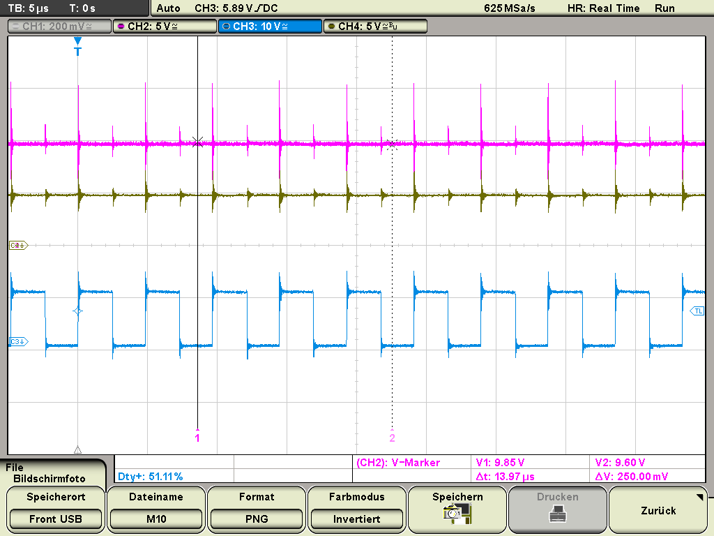

   Darstellung des Tastgrad bei einer Eingangsspannung von ca. 9,8 |nbsp| V

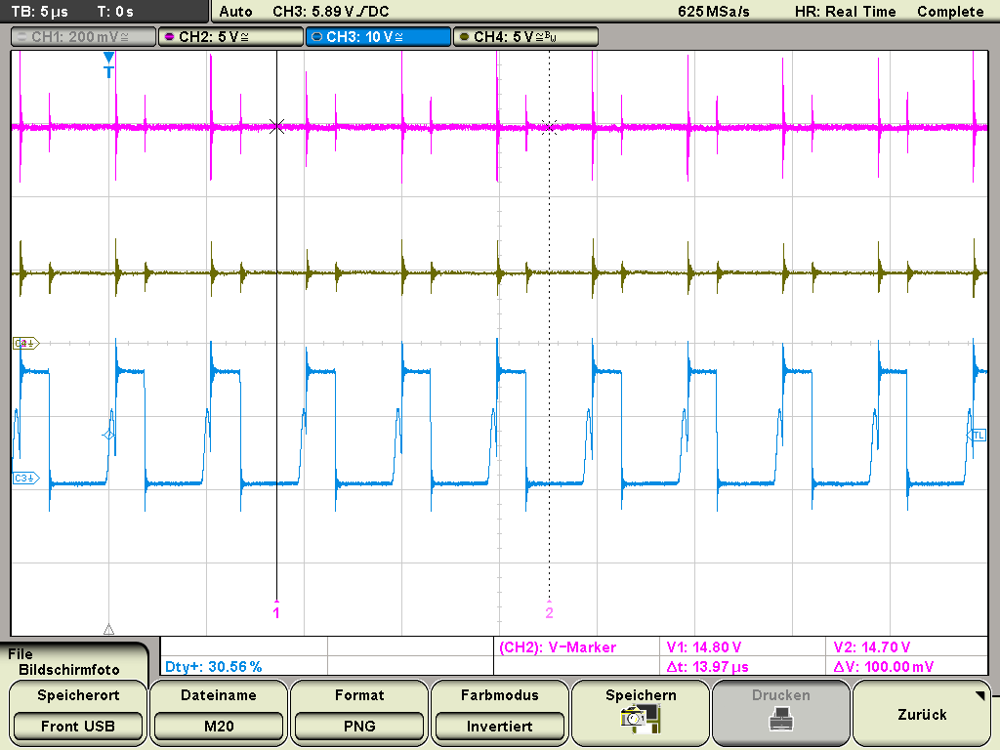

   Darstellung des Tastgrad bei einer Eingangsspannung von ca. 14,85 |nbsp| V

Wie zuvor erwähnt, weicht der Tastgrad des Messgeräts von den errechneten Werten ab.

.. _KapitelVI:

**********
Diskussion
**********

Folgend werden die Simulations- und Messergebnisse diskutiert.

.. _Wellenformen:

Wellenformen
============

Die unterschiedlichen Frequenzen der Mess- bzw. Simulationswerte können zum Teil auf die unterschiedliche
Eingangsspannung zurückgeführt werden. Ausgehend vom Datenblatt des TPS40200 (:cite:`TEX1`, S.23, Figure 7)
ist zu erkennen, dass die Frequenz des Oszillators und somit auch die PWM-Frequenz steigt, sobald die Eingangsspannung
sinkt. Im Fall der Messung wurde eine geringere Eingangsspannung als bei der Simulation gemessen. Somit müsste die
Messung eine höhere Oszillatorfrequenz aufweisen als die Simulation, was auch der Fall ist. Weiterhin könnte der Effekt
der schwankenden Frequenz bei den Messdaten auf die nicht linear verlaufende Eingangsspannung :math:`V_{in}`
zurückzuführen sein, da die Oszillatorfrequenz von der Eingangsspannung abhängt. Zu beachten ist, dass nur ein
Ausschnitt von 0,1 |nbsp| ms betrachtet wird. Das die Frequenzen in diesem Bereich sinken, wird zufällig sein, da sie
irgendwann auch wieder steigen muss, um nicht gegen null zu gehen. 

Nach :eq:`12_eq_frequenz` ergibt sich eine theoretische Oszillatorfrequenz von 202,63 |nbsp| kHz. Somit ergibt sich für
die TP3 und TP4 der simulierten Daten eine maximale Abweichung von 3,87 |nbsp| %. Für die Messdaten ergibt sich auf dem
gleichen Weg eine maximale Abweichung von 3,07 |nbsp| %. 

Die in die Schaltung eingespeisten 10 |nbsp| V Eingangsspannung konnten messtechnisch nicht nachgewiesen werden. Es wurden stattdessen
nur ca. 9,75 |nbsp| V erreicht. Dies macht eine Differenz von 0,25 |nbsp| V. Der Tastgrad - zwischen der Simulation mit
10 |nbsp| V Eingangsspannung und 4,93 |nbsp| V  Ausgangsspannung und der Messung mit 9,8 |nbsp| V Eingangsspannung und
4,88 |nbsp| V Ausgangsspannung - beträgt nach :eq:`12_eq_duty` 0,492 beziehungsweise 0,498. Dies ist rein optisch nicht
zu erkennen. Gerundet betragen jedoch beide Tastgrade 50 |nbsp| % mit einer Differenz von 0,4 |nbsp| % bzw. 1,6 |nbsp| %.

Die Ausgangsspannung weicht zwischen dem errechneten Wert von 4,928 |nbsp| V nach :eq:`12_eq_Vout` und dem simulierten Wert von
durchschnittlich 4,9315 |nbsp| V um -0,08 |nbsp| % ab. Zwischen Theorie und der gemessenen Ausgangsspannung von 4,88
|nbsp| V ergibt dies einen Unterschied von -0,97 |nbsp| %. 

Die Spannungsspitzen, die bei der gemessenen Ausgangsspannung zu sehen sind, entstehen durch Selbstinduktion
der Spule L201. Sie treten auf, weil in dem Moment, in dem bei dem PWM-Signal bspw. ein Wechsel von 10 |nbsp| V zu 0
|nbsp| V stattfindet (Flanke) eine abrupt Änderung des Stromes in der Spule erfolgt.
Da die Spannung an der Spule vom Grad der Stromänderung abhängt (:cite:`basis.2008`, S.150, 9.6), erzeugt dies kurzzeitig eine höhere Ausgangsspannung.

Da sowohl die gemessene Eingangs- und Ausgangsspannung niedriger ist als die theoretischen Werte, könnte ein Grund für die
Differenz ein Messfehler des Oszilloskops sein. Des weiteren sind Abweichungen durch Bauteiltoleranzen von Widerständen,
Spulen und Kondensatoren mit einzubeziehen. Dennoch kann die Aussage getroffen werden, dass die Simulation durch die
Messung bestätigt werden konnte, da keine größeren Abweichungen aufgetreten sind.

Ausgangsspannung bei fester Last
================================

Die Abweichung zwischen der theoretisch errechneten Ausgangsspannung durch :eq:`12_eq_Vout` und Simulation beträgt -0,01
|nbsp| %. Im Vergleich zu :ref:`wellenformen`  wurde hier über eine längere Zeit simuliert. Das Ergebnis ist näher an
der Simulation. Dies stellt sehr gut den Vergleich zwischen Theorie und Simulation dar.  Wird die Simulation als
Erwartungswert gesetzt, so weicht die gemessene Ausgangsspannung bei einer Last von 20 |nbsp| :math:`\Omega` um -0,73
|nbsp| % ab. Weiterhin ist zu erkennen, dass die Eingangsspannung im Bereich von 10 |nbsp| V bis 15 |nbsp| V die
Ausgangsspannung nicht beeinflusst. Es ist ein Schwanken um den Mittelwert zu erkennen. Dieses folgt aber keinem
erkennbaren Muster, daher wird dies auf Rauschen zurückgeführt. Die Ausgangsspannung kann somit für unterschiedliche
Eingangsspannungen im genannten Bereich als konstant angesehen werden. Bei dem Versatz von ca. 4 |nbsp| mV wird
vermutet, dass dieser durch Bauteil- und Messungenauigkeit zustande kommt.

Ausgangspannung und -strom bei fester Eingangsspannung und dynamischer Last
===========================================================================

Die Ausgangsspannung oszilliert in der Simulation bei unterschiedlichem Strom um einen Wert von ca. 4,93 |nbsp| V. In der
Messung hingegen fällt die Ausgangsspannung mit steigendem Strom ab. Um so höher der Strom wird, desto schneller fällt
die Ausgangsspannung. Hier passen Simulation und Messung nicht zusammen. Weiterhin wird die im Datenblatt angegebene
maximale Grenze des Stromes nicht erreicht. Die Spannung bricht vorher bei 2,4 |nbsp| A zusammen. Auch im unteren
Lastbereich wird die erwartete Ausgangsspannung nicht erreicht.

Dadurch, dass die Schaltung ihre Strombegrenzung bereits bei 2,4 |nbsp| A erreicht hat, zeigt sich, dass die im
Datenblatt empfohlenen 25 |nbsp| % nicht ausreichen. Trotzdem ist es gut, diese nicht zu verändern, um zu gewährleisten,
dass die 2,5 |nbsp| A nicht überschritten werden können und es so nicht zu einer Zerstörung von Bauteilen kommt. Die 2,5
|nbsp| A werden vermutlich nicht erreicht, weil die Rippel der Ausgangsspannung bei einem Strom von 2,5 |nbsp| A bis auf
60 |nbsp| mV ansteigen (:cite:`TEX1`) und dieser Effekt unterschätzt wird. Bei einem Lastwiderstand von 20
:math:`\Omega` lagen die Rippel nur bei ca. 20 |nbsp| mV. Durch die größeren Rippel steigt kurzfristig der Strom an,
wodurch früher abgeschaltet wird.

Wie angenommen, verringert sich die Ausgangsspannung bei einer niedrigeren Last und dem damit verbundenen höheren Ausgangsstrom.
In der Simualtion wird dies nicht berücksichtigt.

Tastgrad
========

Der Verlauf des Tastgrades an TP4 ist für unterschiedliche Eingangsspannungen zwischen Simulation und Praxis bis auf
einen Versatz sehr ähnlich. Der Verlauf zeigt keine Gerade. Anhand :eq:`12_eq_duty` ließ sich dies schon theoretisch
erklären. Nach :eq:`12_eq_duty` und einer angenommenen Ausgangspannung von 5 |nbsp| V sollte der Tastgrad zwischen
33,33 |nbsp| % und 50 |nbsp| % liegen. Dies stimmt mit der Simulation und der Messung überein. Kleinere Abweichungen
sind dadurch zu erklären, dass die tatsächliche Ausgangsspannung von den 5 |nbsp| V abweichen. Der Tastgrad wurde
rechnerisch bestimmt. :numref:`fig:12dcM10` und :numref:`fig:12dcM20` spiegeln dieses Verhalten aber wieder.
Der Versatz kann durch die Differenz in den Ausgangsspannungen erklärt werden. Wird :eq:`12_eq_duty` betrachtet, kann erkannt werden,
dass bei gleicher Eingangsspannung aber geringerer Ausgangsspannung der Tastgrad abnimmt.

.. _KapitelVII:

***************
Zusammenfassung
***************

Die vorliegende Arbeit stellt eine Parameterstudie eines DC-DC Konverters dar. Grundlage dafür ist der nicht synchrone
Abwärtswandler `TPS40200`_ auf dem Evaluationsmodul ASLK PRO. Dafür wurden folgende Punkte untersucht:

1. die Wellenformen der Eingangs- :math:`V_{in}` und Ausgangsspannung :math:`V_{out}` sowie die Oszillatorspannung (TP3) und das PWM-Signal (TP4)
2. die Ausgangsspannung bei fester Last
3. Ausgangsspannung :math:`V_{out}` und -strom :math:`I_{out}` bei fester Eingangsspannung und dynamischer Last
4. Tastgrad (duty cycle)

Diese Punkte wurden durch Simulationen mit dem Programm `TINA-TI`_ und Lobormessungen untersucht. Im Anschluss wurden
die Ergebnisse dargestellt und miteinander verglichen. Dabei ergaben sich einige Differenzen zwischen der gemessenen und
simulierten Oszillatorfrequenz. Weiterhin veränderten sich beide Frequenzen über die Zeit. Zur Abklärung dieser
Differenzen sind weitere Messungen zur Oszillatorfrequenz notwendig. Es kann jedoch die Aussage bei den Wellenformen
getroffen werden, dass die Simulation durch die Messung bestätigt werden konnte, da keine größeren Abweichungen aufgetreten sind.

Die Ausgangspannungen :math:`V_{out}` bei fester Last weichen im Mittelwert nur um 0,04 |nbsp| V voneinander ab. Es
wurde hier gezeigt, dass die Simulation durch die Messung bestätigt wurde. 

Bei der Betrachtung von :math:`V_{out}` und :math:`I_{out}` bei dynamischer Last wurde bei der Simulation festgestellt,
dass :math:`I_{out}` von bis zu 2,5 |nbsp| A der Schaltung entnommen werden kann, ohne, dass es Auswirkungen auf
:math:`V_{out}` hat. Die Messung hingegen hat gezeigt, dass die Schaltung nur bis 2,4 |nbsp| A liefern kann und
:math:`V_{out}` ab 0,5 |nbsp| A nicht mehr konstant  ist. Mit steigendem :math:`I_{out}` sinkt :math:`V_{out}`.

Die Behandlung der Tastgrade ergab, dass die Simulations- und Messdaten ähnliche Tastgrade ergaben. Sie unterscheiden sich augenscheinlich gar nicht.
Ohne dabei die unterschiedlichen Eingangsspannungen zu berücksichtigen. So kann auch hier abschließend festgestellt
werden, dass die Simulation durch die Messung bestätigt wurde. 

Es kann gesagt werden, dass eine Simulation einer solchen Schaltung zum großen Teil gute bis sehr gute Näherungen
bereitstellt. Jedoch ist immer auch Vorsicht geboten, wie bei der Untersuchung der Ausgangsspannung in Abhängigkeit des
Ausgangsstroms gezeigt werden konnte. Bei Wiederholungsmessungen müsste herausgearbeitet werden, woraus die niedrigere
Eingangsspannung bei den Messungen resultiert, um so ein eindeutigeres Messergebnis zu erlangen.

.. _Kapitel VIII:

********************
Literaturverzeichnis
********************

.. bibliography:: Experiment_00.bib
   :style: plain
